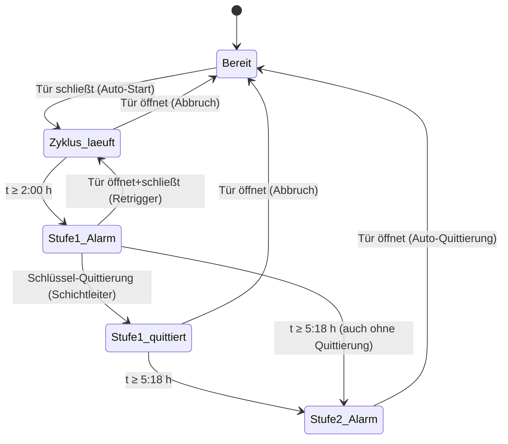
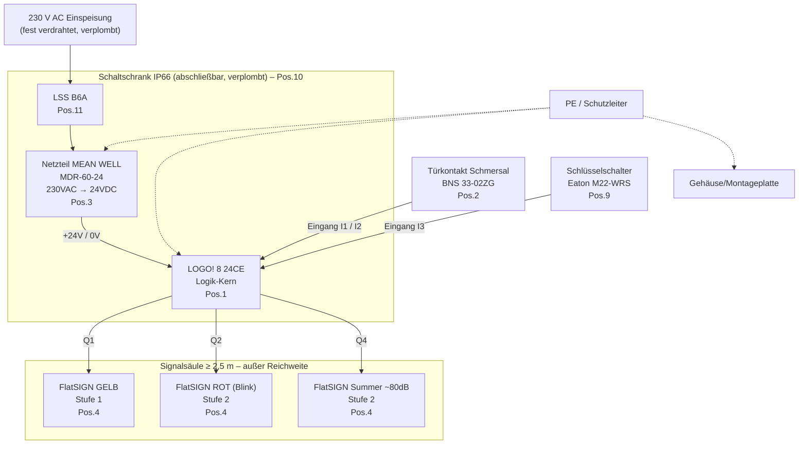
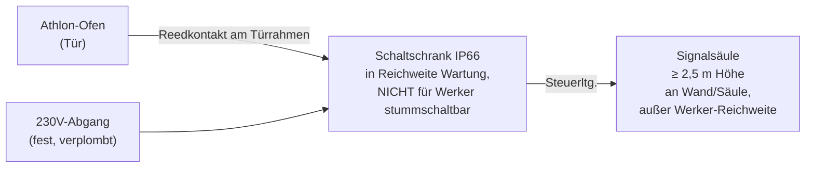
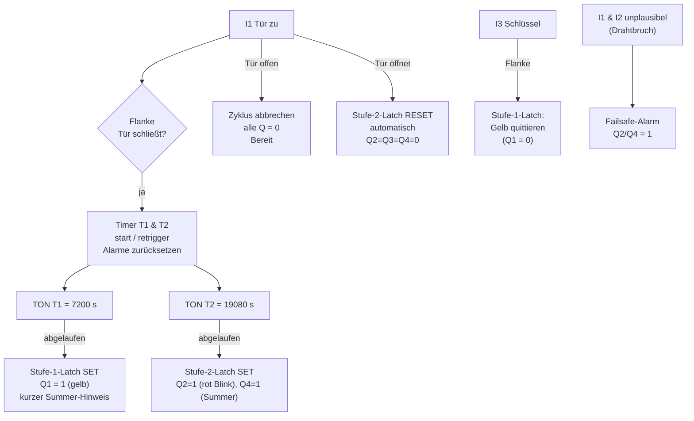
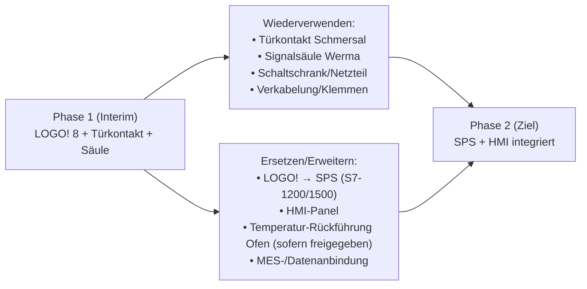

# Athlon-Ofen Sekundär-Alarm-System v1.0
### Vollständiges Konstruktions- und Übergabepaket für den internen Sondermaschinenbau

| | |
|---|---|
| **Projekt** | Athlon-Ofen Sekundär-Alarm-System (Interim-Lösung) |
| **Projektnr.** | ANNAHME: SAS-2026-001 — *bitte interne Projektnummer vor Bau ergänzen* |
| **Auftraggeber** | Marc Walde, Digital Process Engineer – Manufacturing Automation |
| **Bereich** | SHS TC PV SCM – Athlon-Strahlerproduktion, Siemens Healthineers AG, Standort Forchheim (HEP) |
| **Manager** | Tobias Grüner |
| **EHS** | Mario Ziegler |
| **Prozessgrundlage** | PPA749 FFM 004 |
| **Logik-Kern** | Siemens LOGO! 8 (Variante 24 CE), 24 V DC — *siehe Baustein 2 zur Begründung* |
| **Dokumentstand** | v1.0, 24.06.2026 |
| **Status** | Übergabefertig — Freigaben gem. Schluss-Checkliste einholen |

> **Lesehinweis für den Sondermaschinenbau:** Dieses Dokument ist so aufgebaut, dass es ohne Rückfragen abgearbeitet werden kann. Querverweise sind als „siehe Baustein X, Pos. Y" gesetzt. Alle mit **ANNAHME:** markierten Stellen sind vor Baubeginn durch den Auftraggeber zu bestätigen. Die Schluss-Checkliste am Ende fasst alle Voraussetzungen zusammen.

---

## Inhaltsübersicht

1. Lastenheft
2. Komponenten-/Einkaufsliste
3. Schaltplan (Übersicht, Klemmenplan, Beschilderung)
4. Gehäuseaufbau & Mechanik
5. Konfiguration der Logik (LOGO!-Programmierung)
6. Inbetriebnahme- & Testprotokoll
7. Risikobeurteilung für EHS
8. Übergabedokument an Sondermaschinenbau
9. Wirtschaftlichkeitsbetrachtung
10. Eskalationspfad & Übergabe an Phase 2 (SPS/HMI)
- Schluss-Checkliste „Bevor der Sondermaschinenbau anfängt"

---

# Baustein 1 — Lastenheft

## 1.1 Projektsteckbrief

Im Athlon-Ofen werden Silikonscheiben (Sahlberg, Mat.-Nr. 03119638) für die Athlon/Athlon-DS-Strahlerproduktion ausgeheizt. Der Prozess ist zeitkritisch und qualitätssensibel: Eine falsch prozessierte Scheibe verursacht einen Schaden im **fünfstelligen €-Bereich**. Die aktuelle Überwachung per manuell abschaltbarem Küchen-Timer ist unzureichend und manipulierbar.

Ziel ist eine **manipulationssichere, CE-konforme Interim-Lösung**, die den Zyklus eigenständig (per Türkontakt) startet und in zwei Eskalationsstufen alarmiert, ohne in die Ofen-Originalsteuerung einzugreifen. Die Lösung wird vom internen Sondermaschinenbau aufgebaut und überbrückt die Zeit bis zur späteren SPS/HMI-Integration (Phase 2).

### Prozessdaten (laut PPA749 FFM 004)

| Phase | Dauer | Bemerkung |
|---|---|---|
| Aufheizen | ~33 min | — |
| Ausheizen | 4,0 h bei 200 °C ±10 °C | Kernprozess |
| Abkühlen | ~45 min im Ofen | — |
| **Gesamt-Zykluszeit** | **5 h 18 min** | Referenz für Stufe-2-Alarm |
| Nachlagerung | max. 24 h im Stickstoffschrank | nach Zyklusende zügig umlagern |

## 1.2 Stakeholder

| Rolle | Person | Verantwortung |
|---|---|---|
| Auftraggeber / Fachkonzept | Marc Walde | Anforderungen, Abnahme |
| Management | Tobias Grüner | Freigabe, Budget |
| EHS / Arbeitssicherheit | Mario Ziegler | Risikobeurteilung, Freigabe Sicherheit |
| Ausführung | Interner Sondermaschinenbau | Bau, Verdrahtung, IBN |
| Betreiber | Werker / Schichtleiter Athlon-Linie | Bedienung, Quittierung |

## 1.3 Funktionsbeschreibung & Use-Cases

**Grundprinzip:** Das System ist ein vom Ofen **galvanisch/funktional entkoppelter** Sekundärwächter. Es misst keine Temperatur und greift nicht in die Ofensteuerung ein. Es erfasst ausschließlich den Türzustand (zu/offen) über einen Sicherheits-Reedkontakt und betreibt eine eigene Zeitlogik mit zweistufigem Alarm.

### Zustandsautomat (Überblick)



### Use-Cases

**UC-1 — Normaler Zyklus (Gutfall):**
Werker legt Scheiben ein, schließt die Tür → Timer startet automatisch. Nach 2:00 h erscheint Stufe-1-Alarm (gelb + Hinweis: Temperatur am Ofendisplay prüfen). Schichtleiter prüft visuell, quittiert mit Schlüssel. Nach 5:18 h erscheint Stufe-2-Vollalarm (rot Blinklicht + Summer). Werker öffnet die Tür → System quittiert automatisch und kehrt in „Bereit" zurück.

**UC-2 — Frühzeitiges Öffnen / Abbruch:**
Tür wird vor Stufe 2 geöffnet → laufender Zyklus wird abgebrochen, System geht in „Bereit". (ANNAHME: gewolltes Verhalten — beim erneuten Schließen startet ein neuer Zyklus. Bitte bestätigen, ob ein Abbruch zusätzlich protokolliert/signalisiert werden soll.)

**UC-3 — Stufe-1-Alarm bewusst nicht quittiert:**
Wird Stufe 1 nicht quittiert, läuft die Zeit dennoch weiter; bei 5:18 h folgt Stufe 2. Stufe 1 ist damit ein Aufmerksamkeits-, kein Sperrsignal.

**UC-4 — Manipulationsversuch (Werker):**
Werker kann Stufe-2-Alarm nicht stummschalten (Quittierung nur per Türöffnung, Schlüssel nur für Stufe 1, Säule außer Reichweite ≥ 2,5 m, Gehäuse verschlossen/verplombt). Siehe Manipulationsanforderungen 1.5.

**UC-5 — Stromausfall während Zyklus:**
Verhalten gem. Baustein 5 (Failsafe). Bei Spannungswiederkehr: definierter Sicherheitszustand statt „stiller Weiterlauf".

**UC-6 — Sensordefekt / Drahtbruch:**
Drahtbruch der Türleitung → Alarm (kein „stiller Tod"), siehe Baustein 5.

## 1.4 Funktionale Anforderungen (FA)

| ID | Anforderung | Norm/Bezug |
|---|---|---|
| FA-01 | Auto-Start des Zyklus-Timers beim Schließen der Ofentür über Reed-/Magnetkontakt | — |
| FA-02 | Stufe-1-Alarm nach +2:00 h: gelbes Signal + akustischer Hinweis-Impuls; Aufforderung zur visuellen Temperaturprüfung am Ofendisplay | — |
| FA-03 | Stufe-1-Quittierung ausschließlich per Schlüsselschalter (Schichtleiter) | — |
| FA-04 | Stufe-2-Alarm (Vollalarm) nach +5:18 h: rotes Blinklicht + Summer (ca. 80 dB, vom Auftraggeber akzeptiert) | EN ISO 7731 (Gefahrensignale) |
| FA-05 | Stufe-2-Quittierung ausschließlich automatisch durch Türöffnung | — |
| FA-06 | Zeitstufen retriggerbar durch Türschließen (neuer Zyklus startet sauber bei 0) | — |
| FA-07 | Failsafe bei Sensor-Drahtbruch → Alarm | DIN EN ISO 13849-1 (Grundsatz) |
| FA-08 | Definiertes Verhalten bei Stromausfall und -wiederkehr | — |
| FA-09 | Kein Eingriff in die Ofen-Originalsteuerung | CE-Erhalt Ofen |
| FA-10 | Lokale Zustandsanzeige am Schaltschrank (LOGO!-Display) | — |

## 1.5 Nicht-funktionale Anforderungen (NFA)

| ID | Anforderung | Norm/Bezug |
|---|---|---|
| NFA-01 | Elektronik in abschließbarem Gehäuse, mind. IP54 (gewählt: IP66) | DIN EN 60529 |
| NFA-02 | Tamper-evident: Plomben-Schraube am Gehäusedeckel | — |
| NFA-03 | Signalsäule in ≥ 2,5 m Höhe, außerhalb der Werker-Reichweite | — |
| NFA-04 | Stromversorgung fest verdrahtet/verplombt, kein steckbarer Netzstecker im Zugriff | DIN EN 60204-1 |
| NFA-05 | Nur CE-zertifizierte EU-Komponenten mit Hersteller-Konformitätserklärung | LVD 2014/35/EU |
| NFA-06 | EMV-Tauglichkeit Industrieumgebung | EN 61000-6-2 / -6-4 |
| NFA-07 | Verdrahtung normgerecht, Klemmen statt Lötverbindungen (wartungsfreundlich) | DIN EN 60204-1 |
| NFA-08 | Aderkennzeichnung | IEC 60757, DIN EN 60204-1 |
| NFA-09 | Schaltschrankbau nach Niederspannungs-Schaltgerätekombinationsnorm | DIN EN 61439-1/-2 |
| NFA-10 | Auffälligkeit: mehrstufige Farbcodierung (gelb Stufe 1, rot Stufe 2) | — |

## 1.6 Schnittstellen

| Schnittstelle | Typ | Beschreibung |
|---|---|---|
| **Zum Ofen** | mechanisch, berührungslos | Reed-/Magnetkontakt an Türrahmen/Türblatt. **KEINE** elektrische Verbindung zur Ofensteuerung. |
| **Zum Werker** | optisch/akustisch | Signalsäule (FlatSIGN) ≥ 2,5 m: gelb (Stufe 1), rot Blinklicht + Summer (Stufe 2) |
| **Zum Schichtleiter** | manuell | Schlüsselschalter Stufe-1-Quittierung am/neben Schaltschrank |
| **Zur Stromversorgung** | elektrisch | 230 V AC, fest verdrahtet, eigener abgesicherter Abgang. ANNAHME: 230 V AC Dauerversorgung am Aufstellort verfügbar — *bitte bestätigen.* |

## 1.7 Abnahmekriterien (Kurzfassung — Details siehe Baustein 6)

| AK | Kriterium | Erwartung |
|---|---|---|
| AK-01 | Auto-Start | Timer startet messbar beim Türschließen |
| AK-02 | Stufe-1-Timing | Gelb-Alarm bei 2:00 h (±Toleranz Baustein 5) |
| AK-03 | Stufe-2-Timing | Vollalarm bei 5:18 h (±Toleranz) |
| AK-04 | Schlüssel-Quittierung | quittiert NUR Stufe 1, nicht Stufe 2 |
| AK-05 | Tür-Quittierung | Türöffnung quittiert Stufe 2 automatisch |
| AK-06 | Drahtbruch | Leitung auftrennen → Alarm |
| AK-07 | Stromausfall | definierter Zustand nach Wiederkehr |
| AK-08 | Manipulation | Stufe 2 nicht ohne Türöffnung stummschaltbar |
| AK-09 | Lautstärke | Summer hörbar (FlatSIGN ca. 80 dB, akzeptiert) |
| AK-10 | Schutzart | Gehäuse geschlossen dicht, Plombe gesetzt |

## 1.8 Out-of-Scope (bewusst NICHT enthalten)

- Keine Temperaturmessung/-überwachung (das bleibt Aufgabe der Ofensteuerung).
- Kein Eingriff in / keine Rückmeldung von der Ofen-Originalsteuerung.
- Keine MES-/ERP-/Netzwerkanbindung in v1.0 (kommt ggf. in Phase 2, siehe Baustein 10).
- Keine Datenaufzeichnung/Protokollierung (ANNAHME: nicht gefordert — falls Audit-Trail nötig, bitte vor Bau melden; LOGO! könnte das vorbereiten).
- Keine USV/Batteriepufferung (Verhalten bei Netzausfall ist failsafe gelöst, nicht durch Pufferung).
- Keine Überwachung der 24-h-Nachlagerung im Stickstoffschrank.

---

# Baustein 2 — Komponenten-/Einkaufsliste

## 2.1 Vorbemerkung: Logik-Kern LOGO! 8 statt 2× Finder

**Entscheidung (begründet):** Als Logik-Kern wird eine **Siemens LOGO! 8 (24 CE)** eingesetzt statt zweier verketteter Finder-Zeitrelais.

| Kriterium | LOGO! 8 (gewählt) | 2× Finder 80.01 + Koppelrelais |
|---|---|---|
| Beide Zeitstufen + Retrigger + Quittierlogik | in einem Gerät, frei parametrierbar | nur mit Zusatz-Halte-/Koppelrelais und aufwändiger Verdrahtung |
| Failsafe-Drahtbruchlogik | per Programm + Querfront-Erkennung lösbar | nur mit Zusatzbeschaltung |
| Lokale Zustandsanzeige | LOGO!-Display (Hintergrund weiß/orange/rot) inklusive | keine |
| Zeitänderung (z. B. 4,0 h ↔ 5:18 h) | Parameter, in Sekunden, ohne Umbau | Drehschalter, grob, fehleranfällig |
| Beschaffung bei Siemens Healthineers | Eigenprodukt, intern verfügbar | Fremdbezug |
| Migration Phase 2 (SPS/HMI) | Programm/Logik übertragbar | keine |
| Kosten | minimal höher als 1× Finder, **günstiger als 2× Finder + Koppelrelais** | scheinbar billig, real teurer |

**Pro LOGO!:** flexibel, übersichtlich, Siemens-intern, zukunftssicher.
**Contra LOGO!:** einmalig LOGO! Soft Comfort zum Programmieren nötig; minimale Einarbeitung.
**Empfehlung:** LOGO! 8. Die Finder-Variante ist in Baustein 5, Abschnitt 5.7 als Rückfall dokumentiert.

> **ANNAHME:** Die LOGO! 24 CE (DC-Variante, 6ED1052-1CC08-0BA1 oder aktueller Nachfolger 0BA2) wird verwendet, weil das Gesamtsystem auf 24 V DC ausgelegt ist (Türkontakt, Signalsäule, Schlüsselschalter alle 24 V DC). Das vermeidet 230 V auf den Steuerstromkreisen. *Exakte Bestellnummer/Generation vor Bestellung gegen aktuellen Siemens-Katalog prüfen.*

## 2.2 Hauptkomponenten

| Pos | Bezeichnung | Hersteller | Hersteller-Art.-Nr. | Lieferant | Menge | Preis ca. (€) | CE | Funktion / Warum dieses Bauteil |
|---|---|---|---|---|---|---|---|---|
| 1 | Logikmodul LOGO! 8, 24 CE (24 V DC, mit Display, Ethernet) | Siemens | 6ED1052-1CC08-0BA1 *(Gen. prüfen)* | Siemens intern / Distributor | 1 | 110 | ✅ | Zentrale Zeit- & Alarmlogik; ein Gerät für beide Stufen, parametrierbar, Display für lokale Zustandsanzeige |
| 2 | Türkontakt Reed mit Betätigungsmagnet | Schmersal | BNS 33-02ZG-2187 | Schmersal / Distributor | 1 | 55 | ✅ | Vorgegeben; berührungsloser, manipulationsarmer Türzustand; 2 Kontakte erlauben Drahtbruch-/Zwangsöffner-Auswertung |
| 3 | Netzteil 230 V AC → 24 V DC, 60 W, Hutschiene | MEAN WELL | MDR-60-24 | RS / Conrad / Bürklin | 1 | 35 | ✅ | AC/DC-Wandlung (korrekt: MDR, **nicht** DDRH = DC/DC); 60 W mit Reserve für Säule + LOGO! + Summer |
| 4 | Signalsäule FlatSIGN, 3-stufig GN/YE/RD, **24 V AC/DC**, mit Summer/Sirene, Wandmontage, 195 mm | Werma | **691.200.55** | RS / Werma / Distributor | 1 | 105 | ✅ | **Komplettgerät statt 5 Einzelteilen** — eine Art.-Nr., 24 V DC (passt zum Konzept), 3 Lichtstufen + integrierte Akustik einzeln ansteuerbar (3 Farbeingänge + 1 Summereingang), 160°-Abstrahlwinkel, IP65; siehe Hinweis 2.7 |
| 5–8 | *— entfällt —* | — | *(früher Einzel-Leuchtelemente + Summer; jetzt in Pos. 4 enthalten)* | — | — | — | — | Positionsnummern 5–8 bleiben unbelegt, damit die Querverweise im Schaltplan (Pos. 9/10 …) stabil bleiben |
| 9 | Schlüsseltaster/-schalter 1S+1Ö, 22 mm | Eaton | M22-WRS/KC11/I *(+ Frontelement M22-I…)* | RS / Conrad | 1 | 45 | ✅ | Stufe-1-Quittierung nur durch Schichtleiter (Schlüssel) |
| 10 | Gehäuse Polycarbonat IP66, leer | Spelsberg | AKi 2-t (300×300×132 mm) | Spelsberg / RS | 1 | 60 | ✅ | Abschließbares, schlagfestes Gehäuse; IP66 > IP54 gefordert; Platz für Hutschiene + LOGO! + NT + Klemmen |

## 2.3 Schutz, Verteilung, Klemmen (Kleinmaterial)

| Pos | Bezeichnung | Hersteller | Hersteller-Art.-Nr. | Lieferant | Menge | Preis ca. (€) | CE | Funktion / Warum |
|---|---|---|---|---|---|---|---|---|
| 11 | Leitungsschutzschalter B6A, 1-polig (Primär 230 V) | Eaton | PLSM-B6/1 (FAZ-B6/1) | RS / Conrad | 1 | 12 | ✅ | Primärseitige Absicherung 230 V; B6 passend für 60-W-Netzteil |
| 12 | Hutschiene TS35, verzinkt, 35 mm, ~0,5 m | Phoenix Contact | NS 35/7,5 PERF | RS / Conrad | 1 | 6 | ✅ | Trägerschiene für alle Hutschienengeräte |
| 13 | Reihenklemmen Durchgang 2,5 mm² (grau) | Phoenix Contact | UT 2,5 | Phoenix / RS | 20 | 0,80/St | ✅ | Verdrahtungsverteilung, wartungsfreundlich (kein Löten) |
| 14 | Reihenklemmen Schutzleiter PE 2,5 mm² (gn/ge) | Phoenix Contact | UT 2,5-PE | Phoenix / RS | 4 | 1,20/St | ✅ | PE-Sammelschiene/Erdung |
| 15 | Endhalter + Endplatten für Reihenklemmen | Phoenix Contact | CLIPFIX 35 + D-UT 2,5 | Phoenix / RS | je 4 | 0,60/St | ✅ | Fixierung Klemmenblock |
| 16 | Aderendhülsen isoliert 0,5 mm² (Sortiment) | Weidmüller / WAGO | H0,5/… | RS / Conrad | 1 Pack | 8 | ✅ | Saubere, normgerechte Litzenabschlüsse Steuerleitung |
| 17 | Aderendhülsen isoliert 1,0 / 1,5 mm² (Sortiment) | Weidmüller / WAGO | H1,0 / H1,5 | RS / Conrad | 1 Pack | 9 | ✅ | Abschlüsse Last-/Versorgungsadern |
| 18 | Beschriftungs-/Markierungssystem für Klemmen & Adern | Phoenix Contact | ZB-Marker / Litzenmarkierer | Phoenix / RS | 1 Pack | 12 | ✅ | Aderkennzeichnung nach IEC 60757 / DIN EN 60204-1 |

## 2.4 Leitungen, Verschraubungen, Mechanik

| Pos | Bezeichnung | Hersteller | Hersteller-Art.-Nr. | Lieferant | Menge | Preis ca. (€) | CE | Funktion / Warum |
|---|---|---|---|---|---|---|---|---|
| 19 | Steuerleitung geschirmt 4×0,75 mm² (Türkontakt) | Lapp | ÖLFLEX CLASSIC 110 CY 4G0,75 | RS / Bürklin | ~15 m | 2,50/m | ✅ | Geschirmt für EMV; Türkontakt → Schrank, inkl. Drahtbruchader-Reserve |
| 20 | Steuerleitung 7×0,75 mm² (Signalsäule) | Lapp | ÖLFLEX CLASSIC 110 7G0,75 | RS / Bürklin | ~10 m | 2,20/m | ✅ | getrennte Adern für rot Dauer, rot Blitz, gelb, Summer, +24 V, 0 V, Reserve |
| 21 | Netzanschlussleitung 3×1,5 mm² | Lapp | ÖLFLEX CLASSIC 100 3G1,5 | RS / Bürklin | ~5 m | 1,80/m | ✅ | Feste 230-V-Zuleitung (L/N/PE) |
| 22 | Kabelverschraubung M16 + Gegenmutter | Lapp / Wiska | SKINTOP ST-M16 | RS / Conrad | 4 | 1,50/St | ✅ | Zugentlastung & IP-Erhalt an Gehäusedurchführungen |
| 23 | Kabelverschraubung M20 + Gegenmutter | Lapp / Wiska | SKINTOP ST-M20 | RS / Conrad | 2 | 1,80/St | ✅ | Größere Durchführung (Netzleitung / Säulenleitung) |
| 24 | Blindstopfen M16/M20 | Lapp | — | RS / Conrad | je 2 | 0,60/St | ✅ | Verschluss unbenutzter Durchführungen (IP-Erhalt) |
| 25 | Montageplatte für Gehäuse (falls nicht im Set) | Spelsberg | AMP i 2 | Spelsberg / RS | 1 | 12 | ✅ | Tragplatte für Hutschiene im Gehäuse |
| 26 | Wandhalter/Montage-Kit für FlatSIGN + Konsole zum Erreichen von ≥ 2,5 m | Werma / Eigenbau | Werma Montage-Kit 975 691 01 + Wandkonsole | Werma / Lokal | 1 | 40 | ✅ | FlatSIGN ist ein Wandgerät; Konsole/Auslegerblech bringt sie auf ≥ 2,5 m, außer Werker-Reichweite |
| 27 | Plomben-/Sicherungsschraube + Plombendraht | Standard | — | RS / Conrad | 2 | 5 | ✅ | Tamper-evident am Deckel (NFA-02) |
| 28 | Erdungsmaterial (PE-Bügel, Zahnscheiben, Erdungslitze 4 mm² gn/ge) | Standard | — | RS / Conrad | 1 Satz | 8 | ✅ | Schutzleiteranbindung Montageplatte/Gehäuse |

## 2.5 Beschilderung & Kennzeichnung

| Pos | Bezeichnung | Hersteller | Hersteller-Art.-Nr. | Lieferant | Menge | Preis ca. (€) | CE | Funktion / Warum |
|---|---|---|---|---|---|---|---|---|
| 29 | Warnschild „Automatischer Alarm – nicht abschalten" | Eigenfertigung Graviershild | — | intern / Conrad | 2 | 6/St | n/a | Manipulationshemmung, Bedienerhinweis |
| 30 | Schild Schlüsselschalter „Stufe-1-Quittierung (nur Schichtleiter)" | Gravierschild | — | intern | 1 | 5 | n/a | Eindeutige Bedienzuordnung |
| 31 | Typenschild / Anlagenkennzeichen (Projektnr., Baujahr, Verantwortlich) | Gravierschild | — | intern | 1 | 6 | n/a | Anlagenidentifikation, Rückverfolgbarkeit |
| 32 | Warnschild Signalsäule „Stufe 1 = Temp. prüfen / Stufe 2 = Tür öffnen" | Gravierschild | — | intern | 1 | 6 | n/a | Bedeutung der Signale für Werker eindeutig |

## 2.6 Hinweis: Signalsäule als Komplettgerät (FlatSIGN 691.200.55)

Statt fünf Einzelteilen (Sockel + 3 Leuchtelemente + separater Summer) wird die **Werma FlatSIGN 691.200.55** als fertig konfiguriertes Komplettgerät eingesetzt. Vorteile: nur eine Bestellnummer, geringerer Montageaufwand, durchgängig 24 V DC, kompaktes Wandgehäuse.

| Eigenschaft | Wert |
|---|---|
| Spannung | 24 V AC/DC (passt zum Gesamtkonzept) |
| Lichtstufen | Grün / Gelb / Rot, je Dauer- oder Blinklicht einstellbar |
| Ansteuerung | 3 getrennte Farbeingänge + 1 separater Eingang für Akustik → LOGO! kann Gelb, Rot und Summer einzeln schalten |
| Akustik | integrierter Summer (Dauerton) bzw. wahlweise 8-Ton-Sirene (24-V-Ausführung) |
| Schutzart | IP65 |
| Abstrahlwinkel | 160°, gute Sichtbarkeit auch seitlich |

**Bewusste Abweichungen vom ursprünglichen Konzept (vom Auftraggeber bestätigt):**

1. **Nur ein Rot-Element** statt „Rot Dauer + Rot Blitz" gleichzeitig. Für Stufe 2 wird das Rot-Element auf **Blinklicht** gestellt — zusammen mit dem Summer ausreichend auffällig.
2. **Lautstärke ca. 80 dB** statt der ursprünglich geforderten ≥ 95 dB. **Vom Auftraggeber akzeptiert** für diese Umgebung. *Hinweis: Falls im Realbetrieb zu leise, kann nachträglich ein separater 95-dB-Summer (z. B. Werma KombiSIGN 140.000.55) ergänzt und über denselben LOGO!-Ausgang Q4 angesteuert werden — die Verdrahtung in Baustein 3 bleibt dafür gültig.*

> **ANNAHME:** Bestellnummer 691.200.55 = transparent, Wandmontage, 24 V AC/DC, GN/YE/RD mit Akustik. *Vor Bestellung Variante (transparent vs. Metall-Design, Summer vs. 8-Ton-Sirene) im Werma-Konfigurator final bestätigen.*

## 2.7 Kostenzusammenfassung Material

| Block | Summe ca. (€) |
|---|---|
| Hauptkomponenten (Pos. 1–4, 9, 10) | ~410 |
| Schutz/Klemmen (Pos. 11–18) | ~90 |
| Leitungen/Mechanik (Pos. 19–28) | ~170 |
| Beschilderung (Pos. 29–32) | ~35 |
| **Materialsumme (netto, ca.)** | **~705** |
| Puffer Kleinteile/Verschnitt +15 % | ~105 |
| **Materialbudget gesamt (ca.)** | **~810** |

> Preise als Richtwerte Conrad/RS/Bürklin, Mitte 2026. Interne Siemens-Konditionen für LOGO! und Signaltechnik können günstiger sein. **ANNAHME:** keine Mengenrabatte berücksichtigt.

---

# Baustein 3 — Schaltplan

## 3.1 Übersichts-Blockdiagramm



**Hinweis zu den LOGO!-Ausgängen:** Die LOGO! 24CE besitzt Relaisausgänge (bzw. Transistorausgänge je nach Variante). Bei der DC-Variante mit Transistorausgängen (24CEo) sind die Lasten der Signalsäule (gesamt < 1 A) direkt schaltbar. **ANNAHME:** gewählte Variante hat ausreichende Ausgangsbelastbarkeit für die 4 Säulenelemente (typ. je 20–50 mA LED, Summer ~50 mA). Falls Relaisausgänge: identisch verdrahtbar. *Vor Bau Ausgangsstrom gegen Datenblatt der gewählten LOGO!-Variante prüfen; bei Bedarf Koppelrelais Pos. nachrüsten (Finder 34.51, siehe Reserve).*

## 3.2 Detail-Klemmenplan (Stromlaufplan in Textform)

> Konvention Aderfarben: **L = braun**, **N = blau**, **PE = grün/gelb**, **+24 V = rot**, **0 V = blau (dunkel)/weiß-blau**, **Signaladern = je Funktion markiert** (IEC 60757 / DIN EN 60204-1). Querschnitte: Last 230 V = 1,5 mm²; Steuerstromkreise 24 V = 0,75 mm².

### 3.2.1 Primärkreis 230 V AC

| Lfd. | Von (Komp./Klemme) | Nach (Komp./Klemme) | Aderfarbe | Querschnitt | Spannung | Hinweis |
|---|---|---|---|---|---|---|
| 1 | Netz L (Zuleitung Pos.21) | LSS Pos.11 / Eingang | braun | 1,5 mm² | 230 V AC | feste Einspeisung |
| 2 | LSS Pos.11 / Ausgang | Klemme X1:1 | braun | 1,5 mm² | 230 V AC | abgesicherte Phase |
| 3 | Klemme X1:1 | NT Pos.3 / L (AC-L) | braun | 1,5 mm² | 230 V AC | Versorgung Netzteil |
| 4 | Netz N (Zuleitung) | Klemme X1:2 | blau | 1,5 mm² | 230 V AC | Neutralleiter |
| 5 | Klemme X1:2 | NT Pos.3 / N (AC-N) | blau | 1,5 mm² | 230 V AC | Versorgung Netzteil |
| 6 | Netz PE (Zuleitung) | PE-Klemme X-PE | grün/gelb | 1,5 mm² | — | Schutzleiter Einspeisung |
| 7 | PE-Klemme X-PE | NT Pos.3 / ⏚ | grün/gelb | 1,5 mm² | — | Erdung Netzteil |
| 8 | PE-Klemme X-PE | Montageplatte/Gehäuse (Pos.28) | grün/gelb | 4 mm² | — | Erdung Schrankkörper |

### 3.2.2 Sekundärkreis 24 V DC – Versorgung

| Lfd. | Von | Nach | Aderfarbe | Querschnitt | Spannung | Hinweis |
|---|---|---|---|---|---|---|
| 9 | NT Pos.3 / +V (24 V) | Klemme X2:1 (+24 V Sammel) | rot | 1,0 mm² | 24 V DC | +24-V-Verteilung |
| 10 | NT Pos.3 / −V (0 V) | Klemme X2:2 (0 V Sammel) | blau | 1,0 mm² | 0 V | 0-V-Verteilung |
| 11 | Klemme X2:1 (+24 V) | LOGO! Pos.1 / L+ | rot | 0,75 mm² | 24 V DC | Versorgung LOGO! |
| 12 | Klemme X2:2 (0 V) | LOGO! Pos.1 / M | blau | 0,75 mm² | 0 V | Versorgung LOGO! |

### 3.2.3 Eingänge LOGO! (Türkontakt & Schlüssel)

| Lfd. | Von | Nach | Aderfarbe | Querschnitt | Spannung | Hinweis |
|---|---|---|---|---|---|---|
| 13 | Klemme X2:1 (+24 V) | Türkontakt Pos.2 / Kontakt A-1 | rot | 0,75 mm² | 24 V DC | Speisung Reed (über geschirmte Ltg. Pos.19) |
| 14 | Türkontakt Pos.2 / Kontakt A-2 | LOGO! Pos.1 / I1 | grau (markiert „TÜR-ZU") | 0,75 mm² | 24 V DC | Schließer: Tür zu → I1 = 1 |
| 15 | Türkontakt Pos.2 / Kontakt B-1 (2. Kreis) | LOGO! Pos.1 / I2 | weiß (markiert „TÜR-ÜBERW.") | 0,75 mm² | 24 V DC | Zweiter Kontakt für Drahtbruch-/Plausibilitätsauswertung (Failsafe, Baustein 5) |
| 16 | Schirm Ltg. Pos.19 | PE-Klemme X-PE | — | — | — | Schirm einseitig im Schrank auf PE (EMV) |
| 17 | Klemme X2:1 (+24 V) | Schlüsselschalter Pos.9 / Kontakt 13 | rot | 0,75 mm² | 24 V DC | Speisung Schlüsseltaster |
| 18 | Schlüsselschalter Pos.9 / Kontakt 14 | LOGO! Pos.1 / I3 | gelb (markiert „QUIT-S1") | 0,75 mm² | 24 V DC | Schließer: Schlüssel betätigt → I3 = 1 (quittiert Stufe 1) |

### 3.2.4 Ausgänge LOGO! (Signalsäule)

| Lfd. | Von | Nach | Aderfarbe | Querschnitt | Spannung | Hinweis |
|---|---|---|---|---|---|---|
| 19 | LOGO! Pos.1 / Q1 | FlatSIGN Pos.4 / Eingang GELB | schwarz (markiert „S1-GELB") | 0,75 mm² | 24 V DC | Stufe-1-Signal (über Ltg. Pos.20) |
| 20 | LOGO! Pos.1 / Q2 | FlatSIGN Pos.4 / Eingang ROT | schwarz (markiert „S2-ROT") | 0,75 mm² | 24 V DC | Stufe-2 Rot (am Element auf Blinklicht eingestellt) |
| 21 | LOGO! Pos.1 / Q3 | *(Reserve)* | — | — | — | Q3 frei — separates Rot-Blitz-Element entfällt bei FlatSIGN; bei Bedarf für GRÜN „Bereit" nutzbar |
| 22 | LOGO! Pos.1 / Q4 | FlatSIGN Pos.4 / Eingang SUMMER | schwarz (markiert „S2-SUM") | 0,75 mm² | 24 V DC | Stufe-2 Summer (ca. 80 dB) |
| 23 | Klemme X2:2 (0 V) | FlatSIGN Pos.4 / gemeinsamer 0-V-/N-Anschluss | blau | 0,75 mm² | 0 V | gemeinsamer Rückleiter Säule |
| 24 | Schirm Ltg. Pos.20 | PE-Klemme X-PE | — | — | — | Schirm einseitig auf PE (EMV) |

> **Gesamt-Adernzahl Säulenleitung (Pos.20):** Gelb (Q1), Rot (Q2), Summer (Q4), 0 V/N (gemeinsam) + Reserve + Schirm → 7-adrige Leitung (Pos.20) mit Reserve ausreichend.

## 3.3 Beschilderungsplan (Etikett → Ort)

| Etikett-Nr. (Pos.) | Text | Montageort |
|---|---|---|
| 29a | „Automatischer Alarm – nicht abschalten" | Außen am Schaltschrankdeckel, gut sichtbar |
| 29b | „Automatischer Alarm – nicht abschalten" | An/neben der Signalsäule (Augenhöhe) |
| 30 | „Stufe-1-Quittierung – nur Schichtleiter (Schlüssel)" | Direkt am/unter Schlüsselschalter |
| 31 | Typenschild: Projektnr. / Baujahr 2026 / Verantw. M. Walde / „Sekundär-Alarm, kein Eingriff Ofensteuerung" | Innen + außen Schaltschrank |
| 32 | „GELB = Temperatur am Ofendisplay prüfen · ROT+Summer = Tür öffnen" | Am Fuß der Signalsäule, lesbar von Bedienposition |
| — (Klemmen) | X1, X2, X-PE Klemmenbeschriftung + Adermarkierung nach 3.2 | Im Schrank an jeder Klemme/Ader |

*(Fortsetzung Bausteine 4–10 im selben Dokument.)*

---

# Baustein 4 — Gehäuseaufbau & Mechanik

## 4.1 Layout-Skizze Schaltschrank-Innenleben (Spelsberg AKi 2-t, 300×300×132 mm)

```
 ┌─────────────────────────────────────────────────┐
 │  Gehäuse-Innenraum (Montageplatte, Frontansicht) │
 │                                                  │
 │   ┌──────── Hutschiene TS35 (oben) ───────────┐  │
 │   │ [LSS B6A]   [ Netzteil MDR-60-24       ]  │  │
 │   │  Pos.11      Pos.3 (230VAC→24VDC)         │  │
 │   └───────────────────────────────────────────┘  │
 │                                                  │
 │   ┌──────── Hutschiene TS35 (Mitte) ──────────┐  │
 │   │ [   LOGO! 8  24CE  – Pos.1 (Display) ]    │  │
 │   └───────────────────────────────────────────┘  │
 │                                                  │
 │   ┌──────── Hutschiene TS35 (unten) ──────────┐  │
 │   │ X1(230V) | X2(24V) | X-PE | (Reserve)     │  │
 │   │  Reihenklemmen Pos.13/14 + Endhalter      │  │
 │   └───────────────────────────────────────────┘  │
 │                                                  │
 │   Einführungen unten:                            │
 │   (M20) Netz 230V   (M16) Türkontakt             │
 │   (M20) Säule       (M16) Schlüsselschalter      │
 └─────────────────────────────────────────────────┘
   Deckel: Plomben-Schraube Pos.27 (tamper-evident)
   Schlüsselschalter Pos.9: im Deckel ODER seitlich
```

## 4.2 Hutschienenbelegung (von links nach rechts)

| Schiene | Belegung |
|---|---|
| Oben | LSS B6A (Pos.11) → Netzteil MDR-60-24 (Pos.3) |
| Mitte | LOGO! 8 24CE (Pos.1) – mittig, Display nach vorn |
| Unten | Klemmenblock: X1 (230 V, grau), Trennsteg, X2 (+24 V/0 V, grau), X-PE (gn/ge), Endplatten + Endhalter |

## 4.3 Frontplatten-/Deckelbearbeitung

| Bearbeitung | Ø / Maß | Position | Zweck |
|---|---|---|---|
| Bohrung Schlüsselschalter | Ø 22,5 mm | Deckel, mittig unten ODER linke Seitenwand | Eaton M22 Einbau |
| Kabeleinführung M20 | Ø 20 mm | Gehäuseboden, 2× | Netz- + Säulenleitung |
| Kabeleinführung M16 | Ø 16 mm | Gehäuseboden, 2× | Türkontakt- + Schlüsselltg. (falls extern) |
| Plomben-Schraubloch | gem. Plombenschraube | Deckelecke | tamper-evident |

> **Hinweis:** Alle Bohrungen entgraten, IP66 durch korrekt angezogene Verschraubungen + Blindstopfen (Pos.24) erhalten. **ANNAHME:** Schlüsselschalter im Deckel zulässig; falls EHS eine vom Schrank getrennte Bedienposition wünscht, Schalter in kleinem Aufputzgehäuse extern setzen — *bitte mit Mario Ziegler abstimmen.*

## 4.4 Montageorte (Anlagenübersicht)



| Element | Montageort | Höhe / Hinweis |
|---|---|---|
| Türkontakt Pos.2 | Türrahmen + Magnet am Türblatt | so justiert, dass „zu" sicher erkannt wird; Spalt ≤ Herstellerangabe |
| Schaltschrank | wandnah, wartungszugänglich | abschließbar, verplombt; nicht im direkten Werker-Greifbereich nötig, aber Schlüsselschalter für Schichtleiter erreichbar |
| Signalsäule | an Wand/Stütze, gut einsehbar von Bedienposition | **Unterkante Säule ≥ 2,5 m** (NFA-03), außer Reichweite |
| 230-V-Zuleitung | fester Abgang/Klemmdose | verplombt, kein zugänglicher Stecker (NFA-04) |

---

# Baustein 5 — Konfiguration der Logik (LOGO! 8)

## 5.1 E/A-Belegung

| LOGO! Klemme | Signal | Bedeutung |
|---|---|---|
| I1 | Türkontakt Schließer (Reed A) | 1 = Tür zu |
| I2 | Türkontakt 2. Kontakt (Reed B) | Plausibilität/Drahtbruch (Failsafe) |
| I3 | Schlüsselschalter | 1 = Stufe-1-Quittierung |
| Q1 | FlatSIGN gelb | Stufe-1-Signal |
| Q2 | FlatSIGN rot (Blinklicht) | Stufe-2-Signal |
| Q3 | Reserve (frei) | optional „Bereit“-Grün |
| Q4 | FlatSIGN Summer | Stufe-2-Signal |

## 5.2 Zeitparameter

| Parameter | Wert | Sekunden | Toleranz |
|---|---|---|---|
| **T1 – Stufe-1-Verzögerung** | 2:00 h | 7 200 s | ±0,5 % LOGO!-Zeitbasis → ca. ±36 s; unkritisch |
| **T2 – Stufe-2-Verzögerung** | 5:18 h | 19 080 s | ±0,5 % → ca. ±95 s; unkritisch |
| Blitz-/Summer-Takt | LED-Blitzelement eigengetaktet; Summer-Intervall optional | — | — |

> Beide Timer werden als **Einschaltverzögerung (TON)** realisiert, gestartet/retriggert über das Tür-Zu-Signal. **ANNAHME:** Stufe 2 wird absolut ab Türschließen gemessen (5:18 h gesamt), nicht additiv nach Stufe 1. Falls additiv gewünscht, T2 = T1 + Restzeit parametrieren — *bitte bestätigen.*

## 5.3 Programmlogik (Funktionsplan-Beschreibung)



### Logik in Worten

1. **Auto-Start/Retrigger:** Positive Flanke an I1 (Tür schließt) startet T1 und T2 neu und löscht alle Alarm-Latches.
2. **Abbruch:** Geht I1 auf 0 (Tür offen) während des Zyklus, werden Timer und Alarme zurückgesetzt → „Bereit".
3. **Stufe 1:** T1 abgelaufen → SET „Stufe-1-Latch" → Q1 (gelb) = 1, optionaler kurzer Summer-Hinweisimpuls.
4. **Stufe-1-Quittierung:** Flanke an I3 (Schlüssel) → RESET nur „Stufe-1-Latch" → Q1 = 0. **I3 wirkt NICHT auf Stufe 2.**
5. **Stufe 2:** T2 abgelaufen → SET „Stufe-2-Latch" → Q2 (FlatSIGN rot, am Element auf Blinklicht eingestellt) und Q4 (Summer) = 1.
6. **Stufe-2-Quittierung:** Nur durch Türöffnung (I1 → 0) → RESET „Stufe-2-Latch" → Q2/Q4 = 0 und zugleich Zyklus-Reset.
7. **Failsafe:** Plausibilitätsfenster I1/I2; unplausibler Zustand (Drahtbruch/Manipulation) → Failsafe-Alarm (rot + Summer).

> Die Latches werden als **RS-Bausteine** (vorrangiges Setzen für Alarm) umgesetzt. Empfehlung: Stufe-2-Latch **remanent** parametrieren, damit ein Alarm einen Stromausfall „überlebt" (siehe 5.5).

## 5.4 Drahtbruch-/Sensordefekt-Erkennung (Failsafe, FA-07)

Der Schmersal BNS 33-02ZG-2187 hat zwei Kontaktkreise. Logik: Im Normalbetrieb müssen I1 und I2 ein definiertes, zueinander passendes Muster zeigen (z. B. bei „Tür zu" beide aktiv bzw. komplementär je nach Verdrahtung S/Ö). Weicht das Muster ab (eine Ader unterbrochen → unplausibel), löst die LOGO! einen **Failsafe-Alarm** aus statt stillzuschweigen.
**ANNAHME:** genaue S/Ö-Belegung des BNS 33-02ZG gegen Schmersal-Datenblatt final verdrahten; Logikfenster entsprechend parametrieren. *Vor IBN am realen Sensor verifizieren.*

## 5.5 Verhalten bei Stromausfall / Wiederkehr (FA-08)

| Ereignis | Verhalten |
|---|---|
| Netzausfall während Zyklus | LOGO! stromlos, Säule aus. |
| Netzwiederkehr, **Stufe-2-Latch remanent** | Alarm wird wieder aktiv (sicherer Zustand: lieber Fehlalarm als verpasster Alarm). |
| Netzwiederkehr ohne laufenden Alarm | LOGO! geht in „Bereit". Da der reale Türzustand „zu" sein kann, aber die verstrichene Garzeit unbekannt ist: **Sicherheitsregel** — nach Netzwiederkehr bei geschlossener Tür **sofort Stufe-1-Hinweis** ausgeben (gelb), damit der Schichtleiter den Prozess manuell bewertet. |

> **ANNAHME / Empfehlung:** Da die LOGO! die im Stromausfall verstrichene Realzeit nicht kennt, ist „nach Wiederkehr + Tür zu → gelb anfordern" die sichere Default-Regel. Falls eine echtzeitgepufferte Restlaufzeit gewünscht ist, wäre eine LOGO!-RTC-Nutzung mit Pufferung zu spezifizieren (Aufwand). *Bitte gewünschtes Verhalten bestätigen.*

## 5.6 Failsafe-Verhalten – Zusammenfassung

- Drahtbruch Türleitung → Alarm (nicht still).
- Stromausfall → remanenter Alarm bzw. erzwungener Gelb-Hinweis nach Wiederkehr.
- Werker kann Stufe 2 nicht stummschalten (nur Türöffnung quittiert; physische Hürden NFA-02/03/04).
- Defekt LOGO! selbst: ANNAHME — Restrisiko, da Einzelgerät. Für Interim akzeptiert; in Risikobeurteilung (Baustein 7) als Restrisiko geführt. Periodischer Funktionstest (Baustein 8, Prüfintervalle) mindert.

## 5.7 Rückfall-Variante 2× Finder (nur zur Dokumentation)

Falls LOGO! nicht verfügbar: Finder 80.01.0.240.0000T als Stufe-1-Timer (TON 2 h) + zweiter Finder als Stufe-2-Timer (TON 5:18 h), beide retriggert über ein vom Türkontakt gestelltes Koppelrelais (Finder 34.51). Quittier-Latch Stufe 1 über bistabiles Relais + Schlüsselschalter; Stufe-2-Latch über Selbsthalteschütz, aufgehoben durch Tür-Öffner-Kontakt. **Nachteil:** deutlich mehr Bauteile, keine Anzeige, schwerer wartbar. Daher nur Backup.

---

# Baustein 6 — Inbetriebnahme- & Testprotokoll

> Vor Test: Sichtprüfung Verdrahtung gegen Baustein 3, Isolations-/Schutzleiterprüfung gem. DIN EN 60204-1 Abschnitt 18 durchführen. Messwerte protokollieren.

| Nr | Test | Vorgehen | Erwartung | Bestanden ☐ | Bemerkung |
|---|---|---|---|---|---|
| T-01 | Schutzleiterdurchgang | Messung PE Gehäuse↔Montageplatte↔Geräte | < 0,1 Ω | ☐ | |
| T-02 | Isolationswiderstand | 500 V DC, 230-V-Kreis gegen PE | ≥ 1 MΩ | ☐ | |
| T-03 | Spannung 24 V DC | Messen an X2:1/X2:2 | 24 V ±5 % | ☐ | |
| T-04 | Auto-Start | Tür schließen | T1/T2 starten (Display/Status) | ☐ | |
| T-05 | Stufe-1-Timing | (Test mit verkürzten Zeiten, dann final) Tür zu, T1 ablaufen lassen | Gelb Q1 = 1 bei T1 | ☐ | Empfehlung: Testparameter 60 s/120 s, dann auf 7200/19080 s setzen |
| T-06 | Stufe-1-Hinweiston | bei Stufe 1 | kurzer Summer-Hinweis (falls konfiguriert) | ☐ | |
| T-07 | Schlüssel quittiert NUR Stufe 1 | Schlüssel betätigen bei aktivem Gelb | Gelb aus; Stufe-2-Kette unbeeinflusst | ☐ | |
| T-08 | Schlüssel wirkt NICHT auf Stufe 2 | Schlüssel bei aktivem Rot betätigen | Rot/Summer bleiben an | ☐ | kritischer Manipulationstest |
| T-09 | Stufe-2-Timing | T2 ablaufen lassen | Rot Blinklicht + Summer bei T2 | ☐ | |
| T-10 | Lautstärke Summer | Schallpegel 1 m messen | ca. 80 dB(A), in der Umgebung deutlich hörbar | ☐ | bei zu geringer Hörbarkeit Zusatz-Summer nachrüsten (siehe 2.6) |
| T-11 | Tür-Quittierung Stufe 2 | Tür öffnen bei Vollalarm | Rot + Summer aus (Q2/Q4 = 0), System „Bereit" | ☐ | |
| T-12 | Retrigger | Tür zu → kurz öffnen → wieder zu | Timer starten sauber neu bei 0 | ☐ | |
| T-13 | Abbruch | Tür während Zyklus öffnen (vor Stufe 2) | Zyklus-Reset, keine Alarme | ☐ | |
| T-14 | Drahtbruch Türleitung | Türader im Schrank auftrennen | Failsafe-Alarm (rot+Summer) | ☐ | danach Verdrahtung wiederherstellen |
| T-15 | Stromausfall während Stufe 2 | LSS aus bei Vollalarm, wieder ein | Alarm kehrt zurück (remanent) bzw. definierter Zustand gem. 5.5 | ☐ | |
| T-16 | Stromausfall in „Zyklus läuft" | LSS aus/ein bei laufendem Zyklus, Tür zu | nach Wiederkehr Gelb-Hinweis (5.5) | ☐ | |
| T-17 | Manipulation Säule | Versuch, Säule/Summer ohne Türöffnung zu stoppen | nicht möglich ohne Werkzeug/Türöffnung | ☐ | |
| T-18 | Plombe/Schutzart | Deckel schließen, Plombe setzen | Plombe intakt, IP66 hergestellt | ☐ | |

---

# Baustein 7 — Risikobeurteilung für EHS (Mario Ziegler)

## 7.1 Gefährdungs-/Maßnahmen-Matrix (S = Schwere 1–4, W = Wahrscheinlichkeit 1–4, R = S×W)

| Nr | Gefährdung | S | W | R (vor) | Maßnahme | S | W | R (Rest) |
|---|---|---|---|---|---|---|---|---|
| G-01 | Elektrischer Schlag 230 V bei Wartung | 4 | 2 | 8 | LSS, feste Verdrahtung, IP66, abschließbar, Arbeiten nur durch Elektrofachkraft, freischalten | 4 | 1 | 4 |
| G-02 | Berühren spannungsführender Teile (offenes Gehäuse) | 4 | 1 | 4 | Klemmenabdeckung, Gehäuse verschlossen/verplombt, Schild | 4 | 1 | 4 |
| G-03 | Gehörgefährdung durch Summer (ca. 80 dB) | 2 | 1 | 2 | Säule ≥ 2,5 m entfernt, kurze Expositionsdauer | 1 | 1 | 1 |
| G-04 | Fehlalarm/keine Reaktion → Qualitätsverlust | 3 | 2 | 6 | Failsafe-Logik, remanenter Alarm, period. Funktionstest | 3 | 1 | 3 |
| G-05 | Manipulation durch Werker | 3 | 3 | 9 | Schlüssel nur Stufe 1, Tür-Quittierung Stufe 2, Säule außer Reichweite, Plombe, Schilder | 3 | 1 | 3 |
| G-06 | Sturz/Arbeiten in Höhe bei Säulenmontage | 3 | 2 | 6 | Montage nur mit geeigneter Steighilfe/Gerüst, PSA | 3 | 1 | 3 |
| G-07 | EMV-Störung durch/zur Ofenanlage | 2 | 2 | 4 | geschirmte Steuerleitungen, Schirm auf PE, EN 61000-6-2/-4 | 2 | 1 | 2 |
| G-08 | Ausfall LOGO! unbemerkt | 3 | 2 | 6 | periodischer Funktionstest (Prüfintervall), Einzelgerät im Interim akzeptiert | 3 | 1 | 3 |

## 7.2 Hinweise PSA / Elektrosicherheit / Wartung

- Elektrische Arbeiten nur durch Elektrofachkraft, Anlage freischalten (5 Sicherheitsregeln).
- Schutzmaßnahmen gem. **DIN VDE 0100-410** (Schutz gegen elektrischen Schlag) und **DIN EN 60204-1** (elektrische Ausrüstung von Maschinen).
- Schaltschrankbau/-prüfung gem. **DIN EN 61439-1/-2**.
- Bei Säulenmontage in Höhe: Absturzsicherung/Steighilfe, ggf. PSA.
- Gehörschutz situativ bei längerem Aufenthalt nahe der Säule während Alarm.

## 7.3 Verweis auf einschlägige Vorschriften

DIN EN 60204-1 · DIN EN ISO 13849-1 (Failsafe-Grundsatz) · DIN VDE 0100-410 · DIN EN 61439-1/-2 · DIN EN 60529 (IP) · EN 61000-6-2 / -6-4 (EMV) · EN ISO 7731 (Gefahrensignale) · Niederspannungsrichtlinie 2014/35/EU · EMV-Richtlinie 2014/30/EU · Betriebssicherheitsverordnung (BetrSichV) für Betrieb/Prüfung.

> **Hinweis:** Diese Risikobeurteilung ist ein fachlicher Entwurf zur Vorlage bei EHS. Die formale Bewertung und Freigabe obliegt Mario Ziegler. ANNAHME: betriebsinterne Risikomatrix entspricht S×W 4×4 — *falls andere Matrix intern gilt, übertragen.*

---

# Baustein 8 — Übergabedokument an Sondermaschinenbau

## 8.1 Deckblatt

| Feld | Wert |
|---|---|
| Projekt | Athlon-Ofen Sekundär-Alarm-System v1.0 |
| Projektnr. | ANNAHME: SAS-2026-001 (bitte ergänzen) |
| Datum | 24.06.2026 |
| Auftraggeber | Marc Walde |
| Ausführung | Interner Sondermaschinenbau |
| EHS-Freigabe | Mario Ziegler (vor IBN) |
| Management-Freigabe | Tobias Grüner |

## 8.2 Übersichts-Stückliste mit Verweis auf Bausteine

Vollständige Stückliste siehe **Baustein 2** (Pos. 1–32). Schaltung/Klemmenplan **Baustein 3**. Mechanik/Bohrbild **Baustein 4**. Logikkonfiguration **Baustein 5**. Tests **Baustein 6**. Sicherheit **Baustein 7**.

## 8.3 Anforderungen an die Ausführung

- Verdrahtung nach **DIN EN 60204-1**.
- Aderkennzeichnung nach **IEC 60757** / DIN EN 60204-1 (siehe Adermarkierungen Baustein 3.2).
- Schaltschrank/-prüfung nach **DIN VDE 0660-600 / DIN EN 61439-1/-2**.
- Steuerleitungen geschirmt, Schirm einseitig im Schrank auf PE (EMV).
- Klemmverbindungen, keine Lötstellen (Wartbarkeit, NFA-07).
- IP66 herstellen, ungenutzte Durchführungen mit Blindstopfen.
- Plombe am Deckel setzen (tamper-evident).
- Signalsäule ≥ 2,5 m, außer Werker-Reichweite.
- 230-V-Zuleitung fest/verplombt.

## 8.4 Abnahmeprotokoll-Vorlage

| Punkt | Ergebnis | Datum | Prüfer |
|---|---|---|---|
| Sichtprüfung Verdrahtung gegen Baustein 3 | ☐ i.O. ☐ n.i.O. | | |
| Schutzleiter-/Isolationsprüfung (T-01/02) | ☐ i.O. ☐ n.i.O. | | |
| Funktionstests T-04 … T-18 vollständig bestanden | ☐ ja ☐ nein | | |
| Beschilderung vollständig (Baustein 3.3) | ☐ ja ☐ nein | | |
| Plombe gesetzt, IP66 hergestellt | ☐ ja ☐ nein | | |
| EHS-Freigabe (M. Ziegler) | ☐ erteilt | | |
| Übergabe an Betrieb | ☐ erfolgt | | |

## 8.5 Wartungs- & Prüfintervalle

| Intervall | Tätigkeit |
|---|---|
| Monatlich | Funktionstest Stufe 1 + Stufe 2 (verkürzte Testzeit über Schichtleiter), Summer-/Lichtprüfung |
| Halbjährlich | Sicht-/Verdrahtungsprüfung, Plombe prüfen, Türkontakt-Justage prüfen |
| Jährlich | Wiederkehrende elektrische Prüfung nach DGUV V3 / BetrSichV durch Elektrofachkraft |
| Bei Bedarf | Nach Stromausfall: korrektes Wiederanlaufverhalten verifizieren |

---

# Baustein 9 — Wirtschaftlichkeitsbetrachtung (Mini-Business-Case)

## 9.1 Investitionskosten

| Position | Betrag (€) |
|---|---|
| Material gesamt (Baustein 2.7, inkl. Puffer) | ~810 |
| Aufbau Sondermaschinenbau: ANNAHME 16 h × 75 €/h (interner Verrechnungssatz) | ~1.200 |
| Programmierung/IBN LOGO! (ANNAHME 6 h × 75 €/h) | ~450 |
| **Investition gesamt (ca.)** | **~2.460** |

> ANNAHME: interner Stundensatz 75 €/h und Aufwände — *bitte gegen reale Sätze ersetzen.*

## 9.2 Vermiedener Schaden & ROI

| Größe | Annahme |
|---|---|
| Schaden je falsch prozessierter Scheibe | fünfstellig → konservativ 10.000 € |
| Vermiedene Vorfälle pro Jahr | konservativ 1 Scheibe/Jahr |
| **Jährlicher vermiedener Schaden** | **≥ 10.000 €** |
| Investition | ~2.460 € |
| **Amortisation** | **< 3 Monate** (bei nur 1 vermiedener Scheibe/Jahr) |
| ROI Jahr 1 | ≈ (10.000 − 2.460) / 2.460 ≈ **300 %** |

## 9.3 Lebensdauer & TCO (5 Jahre)

| Größe | Wert |
|---|---|
| Erwartete Lebensdauer Interim-Lösung | 3–5 Jahre (bis Phase 2) |
| Investition | ~2.460 € |
| Wartung/Prüfung (ANNAHME ~150 €/Jahr × 5) | ~750 € |
| **TCO 5 Jahre (ca.)** | **~3.235 €** |
| Vermiedener Schaden 5 Jahre (1/Jahr) | ≥ 50.000 € |
| **Netto-Nutzen 5 Jahre** | **≈ +46.800 €** |

> Selbst bei nur einer vermiedenen Scheibe alle zwei Jahre bleibt der Business-Case klar positiv.

---

# Baustein 10 — Eskalationspfad & Übergabe an Phase 2 (SPS/HMI)

## 10.1 Migrationskonzept

Die Interim-Lösung ist bewusst migrationsfreundlich aufgebaut. Beim Übergang zur vollwertigen SPS/HMI-Integration (Phase 2) gilt:



## 10.2 Wiederverwendbarkeit

| Element | Phase 2 |
|---|---|
| Türkontakt Schmersal | direkt übernehmbar (als SPS-DI) |
| Signalsäule Werma 24 V DC | direkt übernehmbar (als SPS-DO) |
| Schaltschrank, Netzteil, Klemmen, Verschraubungen | übernehmbar |
| LOGO!-Logik | konzeptionell übertragbar; bei S7 neu in TIA umzusetzen, Logik aus Baustein 5 als Spezifikation nutzbar |
| Verkabelung Türkontakt/Säule | übernehmbar |

## 10.3 Eskalationspfad (Betrieb v1.0)

| Stufe | Auslöser | Aktion |
|---|---|---|
| Stufe 1 (gelb) | 2:00 h | Schichtleiter prüft Ofentemperatur visuell, quittiert mit Schlüssel |
| Stufe 2 (rot+Summer) | 5:18 h | Werker öffnet Tür → Scheiben in Stickstoffschrank umlagern |
| Failsafe-Alarm | Drahtbruch/Defekt | Schichtleiter informieren, Instandhaltung/Elektrofachkraft hinzuziehen, manuell überwachen bis Reparatur |
| Wiederholte Fehlauslösung | techn. Störung | Ticket an Instandhaltung; bis Klärung manuelle Doppelüberwachung |

---

# Schluss-Checkliste — Bevor der Sondermaschinenbau anfängt

## Material & Beschaffung
- ☐ Alle Positionen Baustein 2 (1–32) bestellt und eingetroffen
- ☐ LOGO!-Generation/Bestellnummer gegen aktuellen Siemens-Katalog verifiziert
- ☐ Ausgangsstrom der gewählten LOGO!-Variante gegen Säulenlast geprüft (ggf. Koppelrelais)
- ☐ Schmersal BNS 33-02ZG Kontaktbelegung (S/Ö) aus Datenblatt bestätigt

## Freigaben & Annahmen (zu bestätigen vor Bau)
- ☐ Interne Projektnummer vergeben
- ☐ EHS-Vorabsicht (Mario Ziegler) zur Risikobeurteilung Baustein 7
- ☐ Management-Freigabe Budget (Tobias Grüner)
- ☐ ANNAHME 230-V-Dauerversorgung am Aufstellort bestätigt
- ☐ ANNAHME Stufe-2-Zeit absolut ab Türschließen (nicht additiv) bestätigt
- ☐ ANNAHME Wiederanlaufverhalten nach Stromausfall (Gelb-Hinweis) bestätigt
- ☐ ANNAHME Abbruchverhalten bei frühem Türöffnen bestätigt
- ☐ ANNAHME Schlüsselschalter im Deckel vs. extern (mit EHS) geklärt
- ☐ Klärung, ob Audit-Trail/Protokollierung gefordert ist

## Werkstatt & Ausführung
- ☐ Werkstattplatz/Zeitfenster reserviert
- ☐ LOGO! Soft Comfort verfügbar + Programmierkabel/Ethernet
- ☐ Mess-/Prüfmittel für Schutzleiter-/Isolationsprüfung vorhanden
- ☐ Schallpegelmesser für Summer-Test (T-10) verfügbar
- ☐ Steighilfe/Gerüst für Säulenmontage ≥ 2,5 m organisiert
- ☐ Elektrofachkraft für Anschluss/Prüfung eingeplant

## Inbetriebnahme
- ☐ Testparameter (verkürzte Zeiten) für T-05/T-09 vorbereitet, danach Final-Zeiten 7200/19080 s
- ☐ Abnahmeprotokoll Baustein 6 + 8.4 ausgedruckt
- ☐ EHS-Freigabe vor produktiver Nutzung eingeholt

---

*Ende des Übergabepakets — Athlon-Ofen Sekundär-Alarm-System v1.0. Alle mit ANNAHME markierten Punkte sind vor Baubeginn zu bestätigen.*
