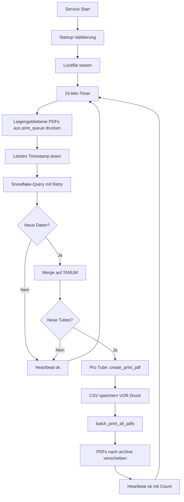

# GEIS Kit Belieferung – Technische Gesamtdokumentation

> **Automatisierter 24/7-Service zur Überwachung neuer Röhren-Transferaufträge in Snowflake und automatischem Druck von Fertigungsauftrags-Etiketten — inklusive Web-Kontrollcenter (SmartPulse) zur Live-Überwachung.**

> **Letzte Aktualisierung:** 12. Juni 2026
> **Stand:** Produktiv (Middleware seit Dezember 2025, Frontend Stand 2026-06, SHUI-PDF-Redesign 2026-06-12)

---

## Inhaltsverzeichnis

1. [Überblick](#1-überblick)
2. [Gesamtarchitektur](#2-gesamtarchitektur)
3. [Repository-Struktur](#3-repository-struktur)
4. [Teil A · Middleware](#teil-a--middleware)
   - [4. Komponenten](#4-komponenten-middleware)
   - [5. Datenfluss & Workflow](#5-datenfluss--workflow)
   - [6. Business-Logik & SQL-Filter](#6-business-logik--sql-filter)
   - [7. PDF-Layout](#7-pdf-layout)
   - [8. Druck-Prozess](#8-druck-prozess)
   - [9. Konfiguration & Umgebung](#9-konfiguration--umgebung)
   - [10. Logging & Monitoring](#10-logging--monitoring)
5. [Teil B · Kontrollcenter (SmartPulse)](#teil-b--kontrollcenter-smartpulse)
   - [11. Architektur Backend + Frontend](#11-architektur-backend--frontend)
   - [12. Frontend-Funktionen](#12-frontend-funktionen)
   - [13. Design-System](#13-design-system)
   - [14. Build & lokaler Betrieb](#14-build--lokaler-betrieb)
6. [Teil C · Betrieb & Sicherheit](#teil-c--betrieb--sicherheit)
   - [15. Sicherheits-Maßnahmen](#15-sicherheits-maßnahmen)
   - [16. Go-Live-Checkliste](#16-go-live-checkliste)
   - [17. Statistiken & Kennzahlen](#17-statistiken--kennzahlen)
   - [18. Verweise auf weitere Dokumente](#18-verweise-auf-weitere-dokumente)
   - [19. Go-Live-Anleitung (Zielmoment: 18.06.2026)](#19-go-live-anleitung-zielmoment-18062026)

---

## 1. Überblick

### 1.1 Was die Software macht

Die **GEIS Kit Belieferung** besteht aus zwei lose gekoppelten Schichten:

| Schicht | Aufgabe | Kritikalität |
|:--------|:--------|:-------------|
| **Middleware** ([source/](source/)) | Pollt Snowflake alle 15 Min auf neue Transferaufträge, erzeugt PDF-Etiketten, druckt sie auf einem Netzwerkdrucker und archiviert sie | Produktionskritisch (24/7) |
| **Kontrollcenter** ([controlcenter/](controlcenter/)) | Web-Frontend "SmartPulse" + FastAPI-Backend für Live-Überwachung (read-only) | Beobachtend, keine Auswirkung auf Druck |

### 1.2 Zweck

In der Produktion werden Kits (Röhren) von einem Lagerplatz zu Fertigungsarbeitsplätzen (HE2/HE4/HE6 XVP 6030) geliefert. Sobald ein neuer Transferauftrag im SAP/Snowflake-System erscheint, druckt die Middleware automatisch ein A4-Etikett mit dem Wortlaut:

> *Bitte die Röhre zum FAUF: `<BENUM>` entnehmen und die Entnahme im SAP quittieren mit der TA-Nummer: `<TANUM>`*

Der Fachbereich kann den Servicezustand jederzeit über das Frontend (`http://<host>:5174/`) einsehen — ohne SSH, Filesystem-Zugriff oder Snowflake-Login.

---

## 2. Gesamtarchitektur

```text
┌─────────────────────────────────────────────────────────────────────┐
│                      PRODUKTIONS-LAYER                              │
│                                                                     │
│   ┌──────────┐    ┌──────────────┐    ┌───────────────────┐         │
│   │Snowflake │───▶│ main_prod.py │───▶│ print_service.py  │         │
│   │ (Azure)  │    │ (Scheduler)  │    │ (PDF + Subprocess)│         │
│   └──────────┘    └──────┬───────┘    └────────┬──────────┘         │
│                          │                     │                    │
│                          ▼                     ▼                    │
│                  ┌──────────────┐      ┌──────────────┐             │
│                  │ data/        │      │ print_queue/ │             │
│                  │ last_query.csv│     │ (PDF-Ablage) │             │
│                  │ heartbeat.json│     └──────┬───────┘             │
│                  └──────────────┘             │                     │
│                          ▲                    ▼                     │
│                          │            ┌──────────────┐              │
│                          │            │print_pdfs.ps1│              │
│                          │            │ (GhostScript)│              │
│                          │            └──────┬───────┘              │
│                          │                   │                      │
│                          │           ┌───────▼──────┐               │
│                          │           │Netzwerkdrucker│              │
│                          │           │ (shs2302bhp) │               │
│                          │           └───────┬──────┘               │
│                          │                   │                      │
│                          │           ┌───────▼──────┐               │
│                          │           │   archive/   │               │
│                          │           └──────────────┘               │
└──────────────────────────┼──────────────────────────────────────────┘
                           │ read-only
┌──────────────────────────┼──────────────────────────────────────────┐
│                          ▼      OBSERVABILITY-LAYER                 │
│   ┌────────────────────────────────────┐                            │
│   │ controlcenter/backend (FastAPI)    │  ◀── Port 8002             │
│   │   /api/health, /status, /orders,   │                            │
│   │   /metrics, /logs   (alles GET)    │                            │
│   └─────────────────┬──────────────────┘                            │
│                     │ HTTP/REST (Polling 10–60 s)                   │
│                     ▼                                               │
│   ┌────────────────────────────────────┐                            │
│   │ controlcenter/frontend (SmartPulse)│  ◀── Port 5174 (Vite Dev)  │
│   │   React 18 · TS 5 · Tailwind 3     │                            │
│   │   @shui/core (Fonts)               │                            │
│   └────────────────────────────────────┘                            │
└─────────────────────────────────────────────────────────────────────┘
```

**Wichtige Architektur-Regel:** Das Kontrollcenter hat **keinen** Schreibzugriff
auf die Middleware. Es liest nur `heartbeat.json`, `last_query.csv`, die Logs und
das Archiv. Es startet/stoppt nichts und ändert keine Konfiguration.

---

## 3. Repository-Struktur

```text
GEIS_Kit_beliefern/
├── README.md                                  # Quickstart
├── DOKUMENTATION.md                           # Dieses Dokument
├── writer_geis_kit_belieferung_professionalisierung.md  # Audit-Trail (P0–P3-Findings)
├── requirements.txt                           # Python-Dependencies (Middleware)
├── .env.example                               # Vorlage für Middleware-.env
├── .gitignore                                 # ignoriert .env, *.pem, .npmrc, logs, archive
│
├── source/                                    # ── MIDDLEWARE ─────────────────
│   ├── main_prod.py                           # Scheduler + Snowflake-Query + Duplikat-Check
│   ├── print_service.py                       # PDF-Erstellung (ReportLab) + Druck-Aufruf
│   ├── print_pdfs.ps1                         # PowerShell-Batch-Druck via GhostScript
│   ├── getconnection.py                       # Snowflake-Verbindung (Private Key / JWT)
│   ├── data/
│   │   ├── last_query.csv                     # State für Duplikat-Erkennung (atomar)
│   │   └── heartbeat.json                     # vom Service nach jedem Zyklus geschrieben
│   ├── logs/                                  # Rotierende Tageslogs (max 30 Tage)
│   ├── print_queue/                           # PDFs zum Drucken (temporär)
│   ├── archive/                               # Erfolgreich gedruckte PDFs
│   └── Pausiert_getconnection/                # Backup-Kopie (inaktiv)
│
├── controlcenter/                             # ── KONTROLLCENTER ─────────────
│   ├── backend/                               # FastAPI · Uvicorn · Pydantic v2
│   │   ├── main.py · config.py
│   │   ├── routers/                           # health, status, metrics, orders, logs
│   │   ├── services/                          # heartbeat_reader, log_parser, …
│   │   └── models/                            # Pydantic-Schemas
│   └── frontend/                              # React · TS · Vite · Tailwind
│       ├── public/favicon.svg                 # Orange Pulse-Welle
│       ├── src/
│       │   ├── assets/siemens-healthineers.svg
│       │   ├── components/                    # Layout, StatsCard, ProcessPipeline, …
│       │   ├── pages/                         # Dashboard, Orders, Logs, Health, Management
│       │   ├── api/client.ts · hooks/usePolling.ts · types/
│       │   ├── index.css                      # Tokens + @shui/core Fonts
│       │   └── main.tsx · App.tsx
│       ├── tailwind.config.js
│       └── package.json
│
├── samples/                                   # Vorschau-PDFs (kein Druck)
│   ├── preview_etikett_shui.pdf               # AKTUELL (SHUI-Design)
│   ├── preview_etikett_shui.png               # Bildschirm-Vorschau
│   └── preview_etikett_neu.pdf                # historisch (alte rote Variante)
│
└── docs/
    └── archive/                               # Historische Planungs-MDs (nach Umsetzung)
```

---

# Teil A · Middleware

## 4. Komponenten (Middleware)

### 4.1 [source/main_prod.py](source/main_prod.py) — Scheduler & Orchestrierung

Endlosschleife, die alle 15 Minuten `process_new_tubes()` ausführt.

| Funktion | Aufgabe |
|:---------|:--------|
| `run_continuous()` | Hauptschleife mit Retry & Exception-Handling |
| `process_new_tubes()` | Voller Zyklus: Query → Diff → PDF → Druck → CSV-Save |
| `get_ta_data(last_ts)` | Snowflake-Query mit Retry-Backoff (3 Versuche) |
| `get_last_query()` / `save_last_query()` | CSV-State mit **atomarem** Write (Temp + Replace) |
| `get_new_tubes()` | Merge auf TANUM zur Duplikat-Erkennung |
| `validate_environment()` | Startup-Check (alle ENV-Vars, GhostScript, Verzeichnisse) |
| `acquire_lock()` | File-Lock verhindert Doppel-Instanzen |
| `write_heartbeat()` | Schreibt `data/heartbeat.json` nach jedem Zyklus |

### 4.2 [source/print_service.py](source/print_service.py) — PDF + Druck

| Funktion | Aufgabe |
|:---------|:--------|
| `create_print_pdf(tube_data, product_name)` | Erzeugt A4-PDF mit ReportLab in `print_queue/` |
| `batch_print_all_pdfs()` | Ruft `print_pdfs.ps1` via subprocess auf, wertet Exit-Code aus (0=OK, 2=Teilerfolg, 1=Fehler) |

Drucker-Name aus `PRINTER_NAME` (.env), Fallback auf `\\fors15ba.ad005.onehc.net\shs2302bhp`.

### 4.3 [source/print_pdfs.ps1](source/print_pdfs.ps1) — PowerShell-Druck

GhostScript-Pfad wird **dynamisch** ermittelt (`C:\Program Files\gs\*\bin\gswin64c.exe`) — kein Hardcoding mehr.

| Parameter | Default | Beschreibung |
|:----------|:--------|:-------------|
| `-PrinterName` | UNC-Pfad | Netzwerkdrucker |
| `-QueuePath` | `print_queue/` | Quelle |
| `-ArchivePath` | `archive/` | Ziel nach erfolgreichem Druck |
| `-GhostScriptPath` | auto | Override falls nötig |
| `-MaxPdfs`, `-TestMode` | – | Test-Helpers |

**Exit-Codes:** 0 = alle ok, 1 = kritischer Fehler, 2 = teilweise (wird im Python als Warning, **nicht** als Fehler behandelt).

### 4.4 [source/getconnection.py](source/getconnection.py) — Snowflake-Auth

Lädt `.env` (idempotent), validiert alle Pflichtvariablen namentlich, entschlüsselt den Private Key (PEM) mit der Passphrase, konvertiert zu PKCS8-DER und gibt einen `snowflake.connector.connect`-Connection zurück.

---

## 5. Datenfluss & Workflow



**Schlüssel-Entscheidung:** CSV wird **vor** dem Druck gespeichert. Falls der
Druck abstürzt, bleiben die PDFs in `print_queue/` und werden im **nächsten**
Zyklus zuerst gedruckt (`Q1`). So entstehen keine Duplikate.

---

## 6. Business-Logik & SQL-Filter

Die Query zieht aus den SAP-Tabellen **LTAP** (Position) und **LTAK** (Kopf) im
Snowflake-AccessLayer `ACCESSLAYER.AC_PVDP_MFG_P41.SV_P41_P_LTAP/LTAK`.

### 6.1 Gewählte Spalten

| Spalte | Bedeutung | Verwendung |
|:-------|:----------|:-----------|
| `LGNUM` | Lagernummer (Werk) | Filter: `= '301'` |
| `LGTYP` | **Lagertyp** | Etikett-Anzeige "Lagertyp:" |
| `BENUM` | Bestell-/Fertigungsauftragsnummer | Etikett-Anzeige "FAUF:" |
| `MATNR` | Materialnummer | Etikett-Anzeige "Produkt:" |
| `TANUM` | Transfer-Auftragsnummer | Duplikat-Check + Etikett-Anzeige "TA-Nummer:" |
| `WEMPF` | Warenempfänger | Ziel-Arbeitsplatz |
| `VLPLA` | Vom Lagerplatz | Etikett-Anzeige "Lagerplatz:" |
| `NLPLA` | Nach Lagerplatz | Fallback für BENUM falls leer |
| `ZSLTTIMESTAMP` | Erstellzeitstempel | Datum/Uhrzeit-Anzeige |

### 6.2 Filter-Bedingungen

| Filter | Wert | Bedeutung |
|:-------|:-----|:----------|
| `LTAP.LGNUM` | `'301'` | Lagernummer |
| `LTRIM(LTAP.MATNR, '0')` | `'10414464'` | Bestimmtes Material |
| `LTAP.NLPLA` | NOT LIKE `'%UML%ZONE%'` | Keine Umlagerungszonen |
| `LTAP.QDATU` | `'00000000'` | Qualitätsprüfung bestanden |
| `LTAK.BWART` | `'261'` | Bewegungsart: Warenausgang für Auftrag |
| `CURRENTTIMESTAMP` | `>= last_query_ts` (parametrisiert via `%s`) | Inkrementeller Pull |

**Wichtig:** Die Query nutzt **parametrisierte** SQL (`cursor.execute(QUERY, (str(last_ts),))`).
Kein `str.format()` mehr — kein SQL-Injection-Risiko über die CSV.

### 6.3 Duplikat-Erkennung

```python
merged = current.merge(last, on='TANUM', how='left', indicator=True)
new_tubes = merged[merged['_merge'] == 'left_only']
```

---

## 7. PDF-Layout

Jedes Etikett ist A4 und folgt seit dem 12. Juni 2026 dem **Siemens-Healthineers-Design (SHUI)**. Dieses Layout wird sowohl von [source/print_service.py](source/print_service.py) (Produktivbetrieb) als auch von Dry-Run-Vorschauen erzeugt — es gibt **keine** Sonderversion. Was das Frontend zeigt und was die Mitarbeiter aus dem Drucker ziehen ist identisch.

### 7.1 Design-Bausteine

| # | Element | Darstellung |
|:--|:--------|:------------|
| 1 | **Header oben links** | `GEIS KIT BELIEFERUNG` (Helvetica-Bold, Ink) + `Fertigungsauftrags-Etikett` (Muted) |
| 2 | **Header oben rechts** | Offizielles Siemens-Healthineers-Logo (SVG, proportional auf ~130 px Breite skaliert) |
| 3 | **Hairline** | Volle Breite, `#D9D9D9`, optisch trennend |
| 4 | **Accent-Bar `MAKE PV`** | 8 px breite orange Vertikal-Bar (`#EC6602`) + `MAKE PV` (18 pt Bold, Ink) + Untertitel `Röhren-Transferauftrag` (Muted) |
| 5 | **FAUF-Block** | Label `FERTIGUNGSAUFTRAG (FAUF)` (Muted) + Hinweistext + abgerundete Surface-Box `#F5F5F5` mit BENUM in **44 pt Bold Ink** zentriert |
| 6 | **TANUM-Block** | Label `QUITTIERUNG IM SAP` + Hinweistext + Surface-Box mit **44 pt Bold** TANUM und einer **orange Akzent-Bar** am linken Box-Rand |
| 7 | **Meta-Zeile (3 Spalten)** | `LAGERTYP` · `LAGERPLATZ` · `WARENEMPFÄNGER` als Label/Value-Paare (8 pt Muted Label, 13 pt Bold Ink Value) |
| 8 | **Produkt-Zeile** | Label `PRODUKT` + Materialnummer |
| 9 | **Footer** | Hairline, links `Erstellt am DD.MM.YYYY um HH:MM:SS Uhr`, rechts `Siemens Healthineers · GEIS Kit Belieferung` |

### 7.2 ASCII-Mockup (neu)

```
┌────────────────────────────────────────────────────────────────┐
│ GEIS KIT BELIEFERUNG                       SIEMENS              │
│ Fertigungsauftrags-Etikett                 Healthineers ·:·     │
│ ────────────────────────────────────────────────────────────── │
│                                                                │
│ ▌ MAKE PV     Röhren-Transferauftrag                           │
│                                                                │
│ FERTIGUNGSAUFTRAG (FAUF)                                       │
│ Bitte die Röhre zum folgenden FAUF entnehmen:                  │
│ ┌────────────────────────────────────────────────────────────┐ │
│ │                       14509214                             │ │  ← BENUM 44 pt
│ └────────────────────────────────────────────────────────────┘ │
│                                                                │
│ QUITTIERUNG IM SAP                                             │
│ Entnahme im SAP mit der folgenden TA-Nummer quittieren:        │
│ ┌────────────────────────────────────────────────────────────┐ │
│ ▌                      343294                                │ │  ← TANUM 44 pt + orange Akzent
│ └────────────────────────────────────────────────────────────┘ │
│                                                                │
│ LAGERTYP        LAGERPLATZ          WARENEMPFÄNGER             │
│ K02             K02-1103            HE6 XVP 6030               │
│ ────────────────────────────────────────────────────────────── │
│ PRODUKT                                                        │
│ Material_10562591                                              │
│                                                                │
│ ────────────────────────────────────────────────────────────── │
│ Erstellt am 12.06.2026 um 10:07:56 Uhr   Siemens Healthineers… │
└────────────────────────────────────────────────────────────────┘
```

### 7.3 Design-Tokens

Im Code (`print_service.py`) als `HexColor`-Konstanten definiert, synchron mit dem Frontend:

| Token | Wert | Verwendung |
|:------|:-----|:-----------|
| `SHUI_ORANGE` | `#EC6602` | Akzent-Bars, Marken-Highlight |
| `SHUI_INK` | `#1A1A1A` | Headlines, Zahlen |
| `SHUI_TEXT` | `#262626` | Body |
| `SHUI_MUTED` | `#6B6B6B` | Labels, Caption, Footer |
| `SHUI_HAIRLINE` | `#D9D9D9` | Trennlinien |
| `SHUI_SURFACE` | `#F5F5F5` | Hintergrund der Box-Bereiche |

### 7.4 Vorschau

- **Aktuell (SHUI):** [samples/preview_etikett_shui.pdf](samples/preview_etikett_shui.pdf) / [samples/preview_etikett_shui.png](samples/preview_etikett_shui.png) — per Dry-Run erzeugt, identisch zur Produktiv-Ausgabe.
- Die alte rot-prominente Variante (`samples/preview_etikett_neu.pdf`) ist **historisch** und wird nicht mehr genutzt.

### 7.5 Implementierungsdetails

- **SVG-Logo** wird via [`svglib`](requirements.txt) eingebettet (siehe Helper `_draw_logo_top_right` in `print_service.py`). Fehlt die Datei `source/assets/siemens-healthineers.svg`, wird das PDF trotzdem erzeugt — nur ohne Logo (Warning-Log, keine Exception).
- **Subtitel-Positionierung** der `MAKE PV`-Zeile nutzt `c.stringWidth(...)`, damit die Untertitelzeile nicht in die Headline läuft (egal wie lang der Marken-Text wird).
- **Dateiname:** `roehre_{ProductName}_{NLPLA}_{TANUM}_{Timestamp}.pdf` — TANUM macht jeden Dateinamen eindeutig (keine Überschreibung bei Sekundengleichheit).
- **Fallback:** Falls `BENUM` im Snowflake-Result leer ist, fällt der FAUF-Wert defensiv auf `NLPLA` zurück — kein leerer FAUF auf dem Etikett.

---

## 8. Druck-Prozess

```text
Python (batch_print_all_pdfs)
    │
    ▼
PowerShell (print_pdfs.ps1)
    │
    ├── Drucker-Check via Get-Printer
    ├── GhostScript dynamisch auto-detected
    │   (kein Standard-Drucker-Wechsel mehr – direkt -sOutputFile=%printer%…)
    ▼
GhostScript (gswin64c.exe)
    │
    ├── -dNOPAUSE -dBATCH -sDEVICE=mswinpr2
    ├── -sOutputFile="%printer%\\fors15ba…\shs2302bhp"
    ▼
Netzwerkdrucker
    │
    ▼
PDFs nach archive/ verschieben
```

### Fehlertoleranz

- **Max. 3 Fehler** pro Batch → Abbruch mit Exit 1
- **300 ms Pause** zwischen Druckaufträgen (Drucker-Überlastungsschutz)
- **PDFs verbleiben** bei Fehlern in `print_queue/` → werden im nächsten Zyklus retry-gedruckt
- **Standarddrucker wird NICHT mehr global geändert** (`rundll32`-Aufruf entfernt) — keine Beeinträchtigung anderer Anwendungen

---

## 9. Konfiguration & Umgebung

### 9.1 Voraussetzungen

| Software | Version | Zweck |
|:---------|:--------|:------|
| Python | 3.10+ | Middleware-Laufzeit |
| GhostScript | 10.06.0+ (oder neuer) | PDF-Druck (dynamisch erkannt) |
| PowerShell | 5.1+ | Druck-Steuerung |
| Netzwerkdrucker | `\\fors15ba.ad005.onehc.net\shs2302bhp` | Etiketten-Druck |
| Node.js | 18+ | Frontend-Build (nur für Kontrollcenter) |

### 9.2 Python-Pakete

Siehe [requirements.txt](requirements.txt):

```
pandas, snowflake-connector-python, cryptography, python-dotenv, reportlab, svglib
```

> `svglib` ist neu (seit 2026-06-12) und wird für das Einbetten des SVG-Logos im PDF benötigt.

### 9.3 Umgebungsvariablen (`source/.env`)

| Variable | Pflicht | Beschreibung |
|:---------|:--------|:-------------|
| `SNOWFLAKE_ACCOUNT` | ✓ | Snowflake Account (Azure West Europe) |
| `SNOWFLAKE_USER` | ✓ | Service-Account |
| `SNOWFLAKE_WAREHOUSE` | ✓ | Warehouse für Lesezugriff |
| `SNOWFLAKE_DATABASE` | ✓ | `ACCESSLAYER` |
| `SNOWFLAKE_ROLE` | ✓ | Lese-Rolle |
| `SNOWFLAKE_PRIVATE_KEY_PATH` | ✓ | Pfad zur PEM-Datei |
| `SNOWFLAKE_PRIVATE_KEY_PASSPHRASE` | ✓ | Passphrase |
| `PRINTER_NAME` | (optional) | Override für Drucker-UNC-Pfad |

**Beim Start prüft `validate_environment()` alle Pflicht-Variablen namentlich und beendet den Service mit klarer Fehlermeldung, falls etwas fehlt.**

### 9.4 Start

```powershell
.\venv\Scripts\Activate.ps1
cd source
python main_prod.py            # produktiv (Endlosschleife)
python main_prod.py --once     # nur ein Zyklus (CI / Smoke-Test)
python main_prod.py --dry-run  # voller Workflow OHNE Druck und CSV-Save
```

---

## 10. Logging & Monitoring

### 10.1 Log-Dateien

- **Pfad:** `source/logs/geis_kit_<USERNAME>.log` (bzw. `geis_kit.log` auf dem Service-Account)
- **Rotation:** täglich um Mitternacht, **max 30 Tage Aufbewahrung** (`TimedRotatingFileHandler`)
- **Encoding:** UTF-8
- **Ausgabe:** Datei + STDOUT

### 10.2 Heartbeat

`source/data/heartbeat.json` wird nach jedem Zyklus aktualisiert:

```json
{
  "timestamp": "2026-06-11T17:30:00.123",
  "status": "ok",
  "tubes_found": 2,
  "tubes_printed": 2,
  "error": null,
  "next_check": "2026-06-11T17:45:00.123"
}
```

**Monitoring-Empfehlung:** Alarm wenn `heartbeat.json` älter als 20 Minuten.

### 10.3 Log-Anzeige im Frontend

Das Frontend liest **nur die zuletzt geschriebene** `geis_kit*.log`. Rotierte oder Username-Varianten werden ignoriert. Das hat zwei Folgen:

- Wenn Logs auf der Festplatte gelöscht/geleert werden, **verschwinden sie sofort** aus dem Frontend.
- Filter (Level + Volltext) reagieren **sofort** auf Klick (kein 10 s-Polling-Delay mehr, Fix vom 2026-06-12).

---

# Teil B · Kontrollcenter (SmartPulse)

## 11. Architektur Backend + Frontend

| Schicht | Tech | Pfad | Port |
|:--------|:-----|:-----|:-----|
| **Backend** | FastAPI · Uvicorn · Pydantic v2 · Python 3.13 | [controlcenter/backend/](controlcenter/backend/) | 8002 |
| **Frontend** | React 18 · TS 5.6 · Vite 6 · Tailwind 3.4 · `@shui/core@1.35.0-rc.0` | [controlcenter/frontend/](controlcenter/frontend/) | 5174 (Dev) |

### 11.1 Backend-Endpoints (alle GET, read-only)

| Route | Liefert | Quelle |
|:------|:--------|:-------|
| `GET /` | Versions-Ping | – |
| `GET /api/health` | Healthcheck mit 4 Einzel-Checks | `heartbeat.json`, Filesystem |
| `GET /api/status` | `service_running`, `current_error`, `last_run`, `next_run_in_seconds` | `heartbeat.json` |
| `GET /api/metrics` | `today`, `this_week`, `this_month`, `total`, `success_rate`, `archive_count`, … | Logs + Archive aggregiert |
| `GET /api/orders?limit=N` | Letzte Aufträge mit TANUM, MATNR, WEMPF, … | `last_query.csv` |
| `GET /api/logs?level=&search=&limit=` | Letzte Log-Einträge | `geis_kit_*.log` |

### 11.2 CORS-Restriktion

Im Dev-Setup nur `http://localhost:5173/5174` erlaubt. **Vor Produktiv-Deploy:**
Reverse-Proxy oder SSO vorschalten.

---

## 12. Frontend-Funktionen

| Route | Inhalt |
|:------|:-------|
| `/` Dashboard | Greeting, Service-Status-Karte, 5 KPI-Karten (Heute/Woche/Monat/Gesamt/Erfolgsquote), Pipeline-Visualisierung, letzte 5 Aufträge |
| `/orders` Aufträge | Sortierbare Tabelle aller Aufträge mit Volltextsuche und mobiler Horizontal-Scroll-Tabelle |
| `/logs` Logs | Filter nach Level (Segmented Control) **mit sofortigem Refetch**, Volltextsuche, Copy-to-Clipboard. Liest nur die zuletzt geschriebene Logdatei. **Display ist emoji-frei** (Strip via regex über Unicode-Pictographs) |
| `/health` Healthcheck | "Jetzt prüfen"-Button, Gesamtstatus + 4 Einzel-Checks (Heartbeat, last_run, logs, archive) |
| `/management` Management | Hero-Karte, 4 Big-KPIs (mit "Stark"-Badge ab 95 %), Zeitersparnis-Highlight, Detail-Liste |

### 12.1 Auto-Refresh

Polling über `usePolling`-Hook:
- Status / Health: 30 s
- Metrics: 30 s
- Orders (Dashboard-Snippet): 60 s
- Orders-Vollansicht: 60 s
- Logs: 10 s

---

## 13. Design-System

| Aspekt | Entscheidung |
|:-------|:-------------|
| Branding | **SmartPulse** (interne Marke), echtes Siemens-Healthineers-Logo im Header |
| Fonts | Bree-Headline + Siemens Sans aus `@shui/core` (offizielles SHUI-Paket via Azure-DevOps-Registry) |
| Farben | **Orange-only** (`#EC6602` + Abstufungen 50/25/10) + Neutral-Grau-Skala (5/10/20/30/40/60/70/80/90). Status-Ampel (`#00AA6E`, `#E5A000`, `#D72339`). **Kein Petrol.** |
| Aesthetik | Dieter Rams ruhig + 2026-Web-Standards. Dezente Borders, weiche Schatten (`color-mix()`), Radii 6–18 px, Easing `cubic-bezier(0.22, 1, 0.36, 1)`. **Keine Emojis, keine Verläufe ausser einer dezenten Highlight-Karte, keine Particles, kein 3D.** |
| Responsive | Vollständig mobil (480 px) bis Desktop (1800+ px). Inline-Nav ab `lg` (1024 px), darunter horizontal scrollbare Bottom-Nav. Tabellen mit `overflow-x-auto`. Browser-Zoom 150 % getestet. |
| Accessibility | Semantische HTML-Landmarks, sichtbarer Fokus-Ring (`color-mix`), `prefers-reduced-motion` respektiert, tabular-nums für Zahlen, ARIA-Labels auf Avatar. |

---

## 14. Build & lokaler Betrieb

### 14.1 Backend

```powershell
cd controlcenter\backend
python -m venv .venv
.\.venv\Scripts\Activate.ps1
pip install -r requirements.txt
uvicorn app.main:app --host 0.0.0.0 --port 8002
```

### 14.2 Frontend

```powershell
cd controlcenter\frontend
npm install     # nutzt .npmrc mit Azure-DevOps-Registry (Token NIE committen)
npm run dev     # http://localhost:5174
npm run build   # dist/ ~ 207 KB JS gzip, 25 KB CSS gzip
```

### 14.3 Produktiv-Deploy (Empfehlung)

- Frontend-`dist/` auf IIS oder hinter Nginx/Reverse-Proxy
- Backend als Windows-Service (NSSM) auf demselben Host wie die Middleware (Filesystem-Zugriff)
- Authentifizierung (SSO / Reverse-Proxy mit Basic-Auth) vor das Frontend schalten

---

# Teil C · Betrieb & Sicherheit

## 15. Sicherheits-Maßnahmen

| Bereich | Maßnahme | Status |
|:--------|:---------|:-------|
| **SQL** | Parametrisierte Snowflake-Query (kein `str.format()`) | ✅ |
| **Secrets** | `.env`, `*.pem`, `*.key`, **`.npmrc`** in `.gitignore` | ✅ |
| **Snowflake-Auth** | Private Key (PEM) + Passphrase, kein Passwort | ✅ |
| **Konnektivität** | Retry mit exponentiellem Backoff (3 Versuche) | ✅ |
| **State** | Atomares CSV-Write (Temp + `os.replace`) | ✅ |
| **Doppelläufe** | File-Lock (`source/.geis_kit.lock`) | ✅ |
| **Kontrollcenter** | Ausschließlich `GET`-Endpoints, CORS nur localhost | ✅ |
| **PDF-Inhalt** | Korrekter Lagertyp (`LGTYP`) und neuer Wortlaut mit `BENUM`/`TANUM` | ✅ |
| **Frontend-Auth** | – | ⏳ vor Produktiv-Deploy nötig |
| **Token-Rotation** | Azure-DevOps-Token in alter `.npmrc` | ⏳ empfohlen |

Detailliertes Audit aller Findings P0–P3: [writer_geis_kit_belieferung_professionalisierung.md](writer_geis_kit_belieferung_professionalisierung.md).

---

## 16. Go-Live-Checkliste

| Bereich | Status |
|:--------|:-------|
| Findings P0–P3 alle umgesetzt | ✅ |
| Atomarer CSV-Write (P0-3) | ✅ |
| CSV vor Druck (P0-4) | ✅ |
| Parametrisierte SQL (P0-1) | ✅ |
| Retry mit Backoff (P1-1) | ✅ |
| Log-Rotation max 30 Tage (P1-6) | ✅ |
| Startup-Validierung (P1-7) | ✅ |
| File-Lock (P2-3) | ✅ |
| Dry-Run-Modus (P3-3) | ✅ |
| Heartbeat-Datei (P3-2) | ✅ |
| Kontrollcenter live & responsive | ✅ |
| PDF-Etikett: SHUI-Design + Lagertyp + neuer Wortlaut | ✅ ([Vorschau](samples/preview_etikett_shui.pdf)) |
| **`--dry-run` auf Produktivsystem** | ⏳ |
| **Snowflake-Passphrase auf Produktiv-Host validieren** | ⏳ |
| **Frontend-Auth vorgeschaltet** | ⏳ |
| **Reverse-Proxy / IIS-Konfiguration** | ⏳ |
| **Monitoring-Alert auf heartbeat.json > 20 Min** | ⏳ |
| **Azure-DevOps-Token rotiert** | ⏳ |
| **Backup-Strategie für data/ und archive/** | ⏳ |

Vollständige Bewertung: [writer_geis_kit_belieferung_professionalisierung.md, Kapitel 8](writer_geis_kit_belieferung_professionalisierung.md#8-go-live-status--checkliste).

---

## 17. Statistiken & Kennzahlen

| Metrik | Wert |
|:-------|:-----|
| In Betrieb seit | ~18. Dezember 2025 |
| Abfrage-Intervall | 15 Minuten |
| Gedruckte Etiketten (Stand 06/2026) | 313+ archiviert |
| Betriebsart | 24/7 Dauerbetrieb |
| Drucker | Netzwerkdrucker (UNC-Pfad) |
| Frontend-Bundle | 207 KB JS gzip · 25 KB CSS gzip |
| Frontend-Routen | 5 (Dashboard, Orders, Logs, Health, Management) |
| Backend-Endpoints | 6 (alle GET, read-only) |

---

## 18. Verweise auf weitere Dokumente

| Dokument | Inhalt |
|:---------|:-------|
| [README.md](README.md) | Schnellstart |
| [writer_geis_kit_belieferung_professionalisierung.md](writer_geis_kit_belieferung_professionalisierung.md) | Vollständiges Audit (P0–P3-Findings, Begründungen, Lösungen) + Go-Live-Kapitel |
| [docs/archive/](docs/archive/) | Historische Planungs-Dokumente (umgesetzt) |

---

## 19. Go-Live-Anleitung (Zielmoment: 18.06.2026)

> **TL;DR:** Die **Middleware** ist code-seitig komplett go-live-ready. Das **Kontrollcenter** läuft funktional, braucht aber noch Hosting (IIS + NSSM) und eine vorgelagerte Authentifizierung. Vor dem Stichtag müssen **drei** Sachen erledigt werden: (1) Snowflake-Passphrase auf dem Zielhost validieren, (2) Middleware als Windows-Service starten, (3) Kontrollcenter hinter IIS/NSSM hängen.

### 19.1 Status pro Komponente

| Komponente | Code-Stand | Was fehlt zum Go-Live |
|:-----------|:-----------|:----------------------|
| **Middleware** (`source/`) | ✅ produktionsreif | NSSM-Service, gültige `.env`, Smoke-Test |
| **PDF-Etikett** (SHUI-Design) | ✅ fertig + freigegeben | – |
| **Backend** (`controlcenter/backend/`) | ✅ läuft | NSSM-Service, ggf. Reverse-Proxy |
| **Frontend** (`controlcenter/frontend/`) | ✅ Build vorhanden | IIS-Hosting + SSO/Basic-Auth davor |
| **Monitoring** | ⏳ Heartbeat existiert | Alert-Regel (z. B. PRTG / SCOM) auf `heartbeat.json` |
| **Secrets** | ⚠️ Snowflake-Passphrase scheint falsch | Auf Produktiv-Host neu setzen + Azure-DevOps-Token rotieren |

### 19.2 Hot Issues (vor 18.06. zwingend lösen)

#### a) Snowflake-Passphrase ist aktuell falsch

In den letzten Logs steht durchgehend:

```
WARNING - Snowflake-Verbindung fehlgeschlagen (Versuch 3/3): Incorrect password, could not decrypt key
```

Das ist **kein Code-Fehler**, sondern eine falsche `SNOWFLAKE_PRIVATE_KEY_PASSPHRASE` in der `.env` der aktuellen Test-Umgebung. **Vor Go-Live auf dem Produktivhost neu setzen** und mit `python main_prod.py --once` verifizieren (in der Konsole muss "Snowflake-Verbindung erfolgreich" stehen).

#### b) Azure-DevOps-Token rotieren

Das alte Token war versehentlich in einer `.npmrc` und ist zwar nie ins Remote gelangt (rechtzeitig in `.gitignore` aufgenommen), gilt aber als kompromittiert. Vor Go-Live in Azure DevOps **neu generieren** und nur lokal in `~/.npmrc` ablegen.

### 19.3 Schritt-für-Schritt-Deployment

#### Schritt 1 · Produktivhost vorbereiten

Auf dem Ziel-Windows-Server installieren:

| Software | Mindestversion | Quelle |
|:---------|:---------------|:-------|
| Python | 3.10+ | python.org |
| Node.js | 18+ | nodejs.org *(nur falls Frontend dort gebaut wird; sonst nur `dist/` deployen)* |
| GhostScript | 10.06.0+ | ghostscript.com |
| NSSM | aktuell | nssm.cc |
| IIS | mit URL-Rewrite + ARR (für Reverse-Proxy auf 8002) | Server-Manager |

Netzwerkdrucker `\\fors15ba.ad005.onehc.net\shs2302bhp` aus diesem Server erreichbar machen (`Test-Path` oder `Get-Printer`).

#### Schritt 2 · Repository klonen und konfigurieren

```powershell
# Repository klonen
cd C:\Services
git clone https://dev.azure.com/SHS-TE-PV-SE/PV%20Strahlertransport%20(AGV)/_git/GEIS-Kit-belieferung GEIS_Kit_beliefern
cd GEIS_Kit_beliefern

# Python-venv
python -m venv venv
.\venv\Scripts\Activate.ps1
pip install -r requirements.txt

# Middleware-.env aus Template
Copy-Item source\.env.example source\.env
notepad source\.env       # alle SNOWFLAKE_*-Werte + PRINTER_NAME setzen

# Private Key (PEM) sicher ablegen (z. B. C:\Services\secrets\snowflake.pem)
# Pfad in SNOWFLAKE_PRIVATE_KEY_PATH eintragen
```

#### Schritt 3 · Middleware testen (ohne Druck)

```powershell
cd source
python main_prod.py --once --dry-run
```

Erwartet: Log-Zeilen "Snowflake-Verbindung erfolgreich", "X neue Transferaufträge gefunden" (oder "Keine neuen Tubes"), keine ERROR/CRITICAL.

Wenn ok, einmal **mit** Druck testen:

```powershell
python main_prod.py --once
```

Ein Etikett im neuen SHUI-Design sollte aus dem Drucker kommen.

#### Schritt 4 · Middleware als Windows-Service registrieren (NSSM)

```powershell
nssm install GEIS_Kit_Middleware
# Application Path:  C:\Services\GEIS_Kit_beliefern\venv\Scripts\python.exe
# Arguments:         main_prod.py
# Startup directory: C:\Services\GEIS_Kit_beliefern\source
# Service-Name:      GEIS_Kit_Middleware
# Startup type:      Automatic
# Log on as:         dedizierter Service-Account mit Drucker-Zugriff

nssm set GEIS_Kit_Middleware AppStdout C:\Services\GEIS_Kit_beliefern\source\logs\service.stdout.log
nssm set GEIS_Kit_Middleware AppStderr C:\Services\GEIS_Kit_beliefern\source\logs\service.stderr.log
nssm set GEIS_Kit_Middleware AppRotateFiles 1
nssm set GEIS_Kit_Middleware AppRotateBytes 10485760

nssm start GEIS_Kit_Middleware
nssm status GEIS_Kit_Middleware
```

Verifikation: `source/data/heartbeat.json` wird innerhalb von 30\u202fs aktualisiert.

#### Schritt 5 · Backend (Kontrollcenter) als Windows-Service

```powershell
cd controlcenter\backend
python -m venv .venv
.\.venv\Scripts\Activate.ps1
pip install -r requirements.txt
deactivate

nssm install GEIS_Kit_Backend
# Application Path:  C:\Services\GEIS_Kit_beliefern\controlcenter\backend\.venv\Scripts\python.exe
# Arguments:         -m uvicorn main:app --host 127.0.0.1 --port 8002
# Startup directory: C:\Services\GEIS_Kit_beliefern\controlcenter\backend
# Startup type:      Automatic

nssm start GEIS_Kit_Backend
```

Verifikation: `Invoke-RestMethod http://127.0.0.1:8002/api/health` liefert JSON mit `status: "healthy"`.

#### Schritt 6 · Frontend bauen und auf IIS deployen

```powershell
cd controlcenter\frontend
npm install
npm run build
# -> erzeugt dist/ (~ 207 KB JS gzip)

# Inhalt von dist/ nach IIS-Wwwroot kopieren:
Copy-Item -Recurse dist\* C:\inetpub\wwwroot\smartpulse\
```

**IIS-Konfiguration:**

1. Neue Site `SmartPulse` anlegen (Port 80 oder 443 mit TLS-Zertifikat)
2. `web.config` für **SPA-Fallback** (alle Routen → `index.html`) und **Reverse-Proxy** auf das Backend hinzufügen:

```xml
<?xml version="1.0" encoding="UTF-8"?>
<configuration>
  <system.webServer>
    <rewrite>
      <rules>
        <rule name="API-Proxy" stopProcessing="true">
          <match url="^api/(.*)" />
          <action type="Rewrite" url="http://127.0.0.1:8002/api/{R:1}" />
        </rule>
        <rule name="SPA-Fallback" stopProcessing="true">
          <match url=".*" />
          <conditions logicalGrouping="MatchAll">
            <add input="{REQUEST_FILENAME}" matchType="IsFile" negate="true" />
            <add input="{REQUEST_FILENAME}" matchType="IsDirectory" negate="true" />
          </conditions>
          <action type="Rewrite" url="/" />
        </rule>
      </rules>
    </rewrite>
  </system.webServer>
</configuration>
```

3. **Authentifizierung** vor die Site schalten — entweder Windows-SSO (NTLM/Kerberos) auf IIS aktivieren oder Basic-Auth über das Active Directory.

4. Im Frontend muss `VITE_API_BASE_URL` (falls gesetzt) entfernt werden, damit `/api` relativ aufgelöst wird und über den Reverse-Proxy läuft.

#### Schritt 7 · Monitoring-Alert einrichten

Heartbeat-Check (PowerShell-Snippet für PRTG / SCOM / Cronjob):

```powershell
$path = "C:\Services\GEIS_Kit_beliefern\source\data\heartbeat.json"
$age = (Get-Date) - (Get-Item $path).LastWriteTime
if ($age.TotalMinutes -gt 20) { exit 2 } else { exit 0 }
```

Exit 2 = Alarm. Empfehlung: alle 5 Minuten ausführen, Alarm-Empfänger eintragen.

### 19.4 Checkliste für den 18.06.

| # | Aufgabe | Verantwortlich | Status |
|:--|:--------|:---------------|:-------|
| 1 | Snowflake-Passphrase im Produktiv-`.env` korrigiert + getestet | Owner | ⏳ |
| 2 | Azure-DevOps-Token rotiert | Owner | ⏳ |
| 3 | Produktiv-Host vorbereitet (Python, GhostScript, NSSM, IIS) | IT | ⏳ |
| 4 | Repo geklont, venv + Dependencies installiert | IT | ⏳ |
| 5 | `python main_prod.py --once --dry-run` ohne Fehler | Owner | ⏳ |
| 6 | `python main_prod.py --once` druckt 1 Testetikett | Owner | ⏳ |
| 7 | NSSM-Service `GEIS_Kit_Middleware` läuft + Heartbeat aktiv | IT | ⏳ |
| 8 | NSSM-Service `GEIS_Kit_Backend` läuft + `/api/health` ok | IT | ⏳ |
| 9 | Frontend-Build deployed, IIS-Site mit Reverse-Proxy live | IT | ⏳ |
| 10 | SSO/Basic-Auth vor IIS-Site aktiv | IT | ⏳ |
| 11 | Monitoring-Alert auf Heartbeat > 20\u202fmin aktiv | IT | ⏳ |
| 12 | Backup für `source/data/` und `source/archive/` eingerichtet | IT | ⏳ |
| 13 | Fachbereich auf neues SHUI-Etikett hingewiesen | Owner | ⏳ |

### 19.5 Rollback-Plan

Falls am 18.06. etwas schiefläuft:

1. `nssm stop GEIS_Kit_Middleware` — Druckvorgang wird sofort gestoppt
2. PDFs in `source/print_queue/` bleiben liegen und werden beim nächsten Start automatisch gedruckt
3. Vorherigen Stand wiederherstellen: `git checkout <vorheriger-tag>` + `nssm start GEIS_Kit_Middleware`

Empfehlung: vor Go-Live einen Git-Tag setzen, z. B.

```powershell
git tag -a v1.0-golive -m "Produktiv-Start 18.06.2026"
git push origin v1.0-golive
```

### 19.6 Fazit

**Was bereits steht (kein zusätzlicher Code nötig):**
- Komplette Middleware mit allen Sicherheits- und Robustheitsfindings umgesetzt
- SHUI-PDF-Etikett im finalen Design
- Funktionsfähiges Kontrollcenter (Backend + Frontend)
- Saubere Dokumentation + Demo-Logs für Schulungszwecke

**Was du in den nächsten 6 Tagen organisieren musst:**
- Snowflake-Passphrase korrigieren (10 Min)
- Azure-DevOps-Token rotieren (5 Min)
- Produktivhost mit NSSM + IIS aufsetzen (1–2 h zu zweit mit IT)
- Smoke-Test + Cutover (30 Min)

Damit ist der 18.06. ein realistischer Zieltermin.

---

*Zuletzt aktualisiert: 12. Juni 2026 · Konsolidiert aus DOKUMENTATION.md, KONTROLLCENTER_IMPLEMENTIERUNG.md und FRONTEND_OVERHAUL_PLAN.md · ergänzt um SHUI-PDF-Redesign + Go-Live-Anleitung*
