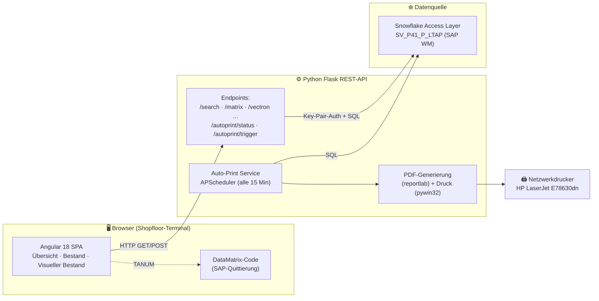

# Digitale Röhrenentnahme MAKE

### Vom verlierbaren Papierzettel zum papierlosen, auditsicheren Step-by-Step-Prozess

> **Referenzprojekt** · Eigenentwicklung einer browserbasierten Fertigungs-Anwendung
> mit Live-Anbindung an SAP-Daten (über Snowflake), DataMatrix-Quittierung und
> automatisiertem Druckdienst.
>
> *Idee #005521 im HPS Idea Management · Status: Angenommen · Produktivitätspotenzial ≥ 10.000 EUR/Jahr*

---

## 1. Management Summary

In der Fertigung werden jährlich rund **18.000 Röntgenröhren** aus einem Paternoster-Lager
entnommen. Bisher wurde jede Entnahme über einen **handgeschriebenen bzw. ausgedruckten
Papierzettel** beauftragt, der Materialnummer, Lagerort und TA-Nummer enthielt. Diese Zettel
gingen regelmäßig verloren (Verlustquote **2–5 %**, also **360–900 Zettel pro Jahr**) und mussten
anschließend **aufwändig manuell in SAP recherchiert und neu zugeordnet** werden. Der Prozess war
nicht digital, nicht nachverfolgbar und nicht auditfähig.

Die Lösung ist eine **browserbasierte Webanwendung**, die den kompletten Entnahmeprozess
digital, schrittweise (Step-by-Step) und papierlos abbildet. Mitarbeitende geben die
Auftragsnummer (FAUF/NLPLA) ein oder scannen sie, sehen sofort alle relevanten Stammdaten in
**Echtzeit** und erhalten einen generierten **DataMatrix-Code zur direkten SAP-Quittierung**.
Zusätzlich überwacht ein **automatischer Druckdienst** im Hintergrund neue Röhren und stellt
Belege bereit – vollständig dokumentiert und revisionssicher.

**Kernnutzen auf einen Blick:**

| Dimension | Vorher (Papier) | Nachher (digitale Lösung) |
|---|---|---|
| Beauftragung | Handzettel, leicht verlierbar | Browser, scannbar, kein Medienbruch |
| Verlustquote | 2–5 % (360–900 Zettel/Jahr) | **0 %** – nichts geht mehr verloren |
| Nachverfolgbarkeit | keine | **lückenlos & auditsicher** |
| Datenquelle | gedruckte Momentaufnahme | **Echtzeit aus SAP** |
| Fehlentnahmen | erhöhtes Risiko | standardisiert minimiert |
| Papierverbrauch | ~18.000 Ausdrucke/Jahr | **papierlos** |
| Geschätzter Nutzen | – | **ca. 8.700–13.200 EUR/Jahr** |

---

## 2. Ausgangslage & Problemstellung

### 2.1 Der bisherige Prozess

Die Kolleginnen und Kollegen in der Röhrenentnahme wurden über einen **Papierzettel** mit der
Entnahme beauftragt. Auf diesem Zettel standen die unstrukturierten Ausdrucksdaten zu:

- **Materialnummer** (welches Produkt / welche Röhre)
- **Lagerort** im Paternoster
- **TA-Nummer** (Transportauftrag / SAP-Beleg)

Dieser Zettel begleitete die physische Entnahme und diente als Beleg für die spätere
Quittierung im SAP-System.

### 2.2 Die konkreten Schmerzpunkte

1. **Zettelverlust:** Bei 18.000 Röhren pro Jahr und einer Verlustquote von 2–5 % gingen
   **360–900 Beauftragungen jährlich verloren**. Ein verlorener Zettel bedeutete, dass die
   Zuordnung der bereits entnommenen Röhre nicht mehr eindeutig war.
2. **Aufwändige Nacharbeit:** Jeder Verlust zog eine **zeitintensive, manuelle SAP-Recherche**
   nach sich, um die Röhre korrekt zuzuordnen und den Vorgang zu „reparieren“.
3. **Kein digitaler Prozess / Medienbruch:** Papierprozesse sind nicht durchgängig abbildbar.
   Es fehlte **volle Transparenz** und eine saubere **Anbindung an die führenden Systeme (SAP)**.
4. **Keine lückenlose Nachverfolgbarkeit:** Für Audits und regulatorische Anforderungen
   (Medizintechnik-Umfeld) fehlte eine revisionssichere, durchgängige Dokumentation.
5. **Fehlentnahme-Risiko:** Uneinheitliche, handschriftliche Daten erhöhten das Risiko von
   Fehlentnahmen mit potenziellen **Produktionsverzögerungen und Folgekosten**.
6. **Nachhaltigkeit:** Der hohe Papier- und Tonerverbrauch widersprach den Digitalisierungs-
   und Nachhaltigkeitszielen des Unternehmens.

---

## 3. Lösungsidee & Mehrwert

Die Anwendung digitalisiert den Entnahmeprozess **end-to-end** und ersetzt den Papierzettel
durch einen **klar geführten Step-by-Step-Workflow im Browser**.

### 3.1 Funktionaler Kern

- **Direkteingabe oder Scan** der Auftrags-/Fertigungsnummer (FAUF / NLPLA).
- **Automatische Anzeige aller relevanten Daten** zur Röhre in Echtzeit (Material, Lagerort,
  TA-Nummer, Datum/Uhrzeit der Einlagerung, Quittierungsstatus).
- **Generierung eines DataMatrix-Codes** direkt aus der TA-Nummer für die **sofortige
  SAP-Quittierung** per Scan – kein manuelles Abtippen mehr.
- **Bestandsübersicht je Produkt** (Matrix, Vectron, Athlon, Megalix Cat, Megalix Cat+, Gigalix)
  mit spaltenweiser Filterung.
- **Visueller Lagerbestand** des Paternosters mit farblicher Status-Kennzeichnung
  (frei / belegt / Liegezeit überschritten).
- **Automatischer Druckdienst**, der im Hintergrund alle 15 Minuten neue Röhren erkennt und
  Belege erzeugt – als Übergangs- und Komfortlösung ohne manuelles Eingreifen.

### 3.2 Der Mehrwert im Detail

**1. Qualität & Stabilität**
- Einheitliche, fehlerfreie Datendarstellung reduziert Falschentnahmen.
- Verlustquote der Entnahmeinformationen wird auf **0 %** gesenkt – digitale Daten gehen nicht
  „verloren“.
- Vollständige Erfüllung interner Compliance- und Audit-Anforderungen.
- Standardisierte Arbeitsschritte verhindern Abweichungen.

**2. Risikoreduktion**
- Vermeidung teurer Produktionsunterbrechungen durch fehlerhafte Entnahmen.
- Rückverfolgbarkeit jeder Entnahme für regulatorische Sicherheit.
- Zentrale, revisionssichere Datenhaltung statt verstreuter Zettel.

**3. Nachhaltigkeit**
- Einsparung von über **18.000 Papierausdrucken pro Jahr** (~90.000 Blatt in 5 Jahren).
- Reduzierter Ressourcenverbrauch (Papier, Toner, Druckerwartung).
- Direkter Beitrag zur Digitalisierungs- und Nachhaltigkeitsstrategie.

**4. Produktivität (prozessübergreifend)**
- Wegfall von **360–900 Such- und Korrekturvorgängen pro Jahr**.
- Stabiler Materialfluss ohne Unterbrechungen.
- Schnellere Reaktionszeiten bei Rückfragen und Audits.

### 3.3 Wirtschaftlicher Nutzen

| Einsparposten | Berechnung | Ersparnis / Jahr |
|---|---|---|
| Papier- & Druckkosten | 18.000 Zettel × 0,15 € | **~2.700 €** |
| Verlustbedingte Nacharbeit | 360–900 Vorfälle × 10 Min × 50 €/h | **~3.000–7.500 €** |
| Vermiedene Produktionsverzögerungen | 5 Fälle × 500 € | **~2.500 €** |
| Reduzierter Schulungsaufwand | – | **~500 €** |
| **Gesamtnutzen** | | **~8.700–13.200 €/Jahr** |

> **Multiplikatoreffekt:** Die Plattform ist bewusst skalierbar gebaut. Bei einem Rollout auf
> weitere Material- und Lagerprozesse oder zusätzliche Standorte vervielfacht sich der Nutzen.

---

## 4. Systemarchitektur

Die Anwendung folgt einer klassischen **Drei-Schichten-Architektur** mit klarer Trennung von
Präsentation (Angular-Frontend), Logik/Integration (Flask-Backend) und Datenquelle
(SAP-Daten über Snowflake). Ein eigenständiger Hintergrunddienst übernimmt das automatisierte
Drucken.



### 4.1 Komponentenübersicht

| Schicht | Technologie | Aufgabe |
|---|---|---|
| **Frontend** | Angular 18.2 (Standalone Components, SSR), TypeScript, ag-Grid, Angular Material | Bedienoberfläche, Step-by-Step-Workflow, Filter, DataMatrix-Anzeige |
| **Backend** | Python, Flask, Flask-CORS | REST-API, Geschäftslogik, SAP-/Snowflake-Anbindung |
| **Datenanbindung** | snowflake-connector-python, Key-Pair-Authentifizierung (RSA, cryptography) | Sicherer, lesender Zugriff auf den SAP Access Layer |
| **Druckdienst** | APScheduler, reportlab, pywin32 | Zeitgesteuerte Erkennung neuer Röhren, PDF-Erstellung, Netzwerkdruck |
| **Deployment** | IIS (Windows), Windows-Dienst, dediziertes Python-venv | Bereitstellung im Produktionsnetz |

---

## 5. Frontend (Angular 18)

Das Frontend ist eine **Single-Page-Application** auf Basis von **Angular 18.2** mit
Server-Side-Rendering (SSR via `@angular/ssr`) und modernen **Standalone Components**. Die
Oberfläche ist responsive, erfordert **keine Client-Installation** und ist damit sofort auf
jedem Shopfloor-Terminal einsatzbereit.

### 5.1 Module / Routen

| Route | Komponente | Funktion |
|---|---|---|
| `/uebersicht` | `UebersichtComponent` | **Step-by-Step-Kernworkflow**: Eingabe/Scan der Auftragsnummer → Anzeige der Treffer im Modal → Generierung des DataMatrix-Codes zur SAP-Quittierung. |
| `/bestand` | `BestandComponent` | Tabellarische **Bestandsübersicht je Produkt** (Matrix, Vectron, Athlon, Megalix Cat/Cat+, Gigalix) mit spaltenweiser Live-Filterung. |
| (intern) | `VisuellerBestandComponent` | **Visuelle Belegungsanzeige** des Paternosters (50 Plätze) mit Ampel-Logik: grün (entschieden), rot (offen), gelb (Liegezeit > 7 Arbeitstage). |

### 5.2 Beispiel: DataMatrix-Quittierung

Aus der TA-Nummer (`TANUM`) eines Treffers wird ein scanbarer DataMatrix-Code erzeugt, der die
**direkte Quittierung in SAP** ermöglicht – der zentrale Hebel, der das manuelle Abtippen und
damit Übertragungsfehler eliminiert:

```typescript
createDataMatrixUrl(data: any): string {
  // Nur die TA-Nummer wird im DataMatrix-Code kodiert
  let combined = `${data.TANUM}`;
  return `https://barcode.tec-it.com/barcode.ashx`
       + `?data=${encodeURIComponent(combined)}&code=DataMatrix`;
}
```

### 5.3 Konfiguration nach Umgebung

Die Backend-URL ist über Angular-Environments sauber getrennt (Entwicklung vs. Produktion),
sodass dasselbe Frontend ohne Codeänderung in beiden Umgebungen läuft:

```typescript
// environment.prod.ts
export const environment = {
  production: true,
  backendUrl: 'http://10.81.67.131:5001'
};
```

---

## 6. Backend (Python / Flask)

Das Backend stellt eine **REST-API** bereit, die als Vermittler zwischen Frontend und den
SAP-Daten im Snowflake Access Layer fungiert. Es kapselt die komplette Abfragelogik, sodass
das Frontend nur einfache, produktspezifische Endpoints aufruft.

### 6.1 API-Endpoints

| Methode | Endpoint | Beschreibung |
|---|---|---|
| `GET` | `/search?number={NLPLA}` | Sucht eine konkrete Röhre anhand der Auftragsnummer (Kern des Entnahme-Workflows). |
| `GET` | `/matrix` | Offene Bestände des Produkts **Matrix**. |
| `GET` | `/vectron` | Offene Bestände **Vectron**. |
| `GET` | `/athlon` | Offene Bestände **Athlon**. |
| `GET` | `/megalixcatplus` | Offene Bestände **Megalix Cat+** (mehrere Materialnummern). |
| `GET` | `/megalixcat` | Offene Bestände **Megalix Cat**. |
| `GET` | `/giagalix` | Offene Bestände **Gigalix**. |
| `GET` | `/autoprint/status` | Status & nächste Laufzeit des Auto-Print-Dienstes. |
| `POST` | `/autoprint/trigger` | Manuelles Auslösen einer Druckprüfung. |

### 6.2 Datenmodell (SAP WM Transportaufträge)

Datenquelle ist die SAP-Tabelle der Lagerverwaltung (LTAP – Transportauftragspositionen),
bereitgestellt über den Snowflake Access Layer `ACCESSLAYER.AC_PVDP_MFG_P41.SV_P41_P_LTAP`.
Relevante Felder:

| Feld | Bedeutung |
|---|---|
| `LGNUM` | Lagernummer (gefiltert auf `301`) |
| `MATNR` | Materialnummer (führende Nullen entfernt) |
| `TANUM` | Transportauftragsnummer → Basis des DataMatrix-Codes |
| `WEMPF` | Warenempfänger (gefiltert auf `HE%`) |
| `VLPLA` / `NLPLA` | Quell- / Zielplatz bzw. Auftragsnummer |
| `QDATU` | Quittierungsdatum (`00000000` = noch offen) |
| `ZSLTTIMESTAMP` | Zeitstempel der Einlagerung → Datum & Uhrzeit |

Die Abfragen liefern gezielt nur **offene, noch nicht quittierte** Positionen
(`QDATU = '00000000'`), sortiert nach Einlagerzeitpunkt – also exakt die Röhren, die noch zur
Entnahme anstehen.

### 6.3 Sichere SAP-Anbindung

Der Zugriff auf Snowflake erfolgt **passwortlos über RSA-Key-Pair-Authentifizierung**. Der
private Schlüssel wird zur Laufzeit geladen, entschlüsselt und in das von Snowflake erwartete
DER/PKCS8-Format überführt. Zugangsdaten (Account, User, Warehouse, Rolle, Schlüssel-Pfad und
Passphrase) liegen ausschließlich in Umgebungsvariablen (`.env`), nicht im Quellcode:

```python
def get_connection():
    key_path = os.getenv("SNOWFLAKE_PRIVATE_KEY_PATH")
    with open(key_path, "rb") as key_file:
        p_key = serialization.load_pem_private_key(
            key_file.read(),
            password=os.getenv("SNOWFLAKE_PRIVATE_KEY_PASSPHRASE").encode(),
            backend=default_backend()
        )
    pkb = p_key.private_bytes(
        encoding=serialization.Encoding.DER,
        format=serialization.PrivateFormat.PKCS8,
        encryption_algorithm=serialization.NoEncryption()
    )
    return snowflake.connector.connect(
        account=os.getenv("SNOWFLAKE_ACCOUNT"),
        user=os.getenv("SNOWFLAKE_USER"),
        private_key=pkb,
        warehouse=os.getenv("SNOWFLAKE_WAREHOUSE"),
        database=os.getenv("SNOWFLAKE_DATABASE"),
        role=os.getenv("SNOWFLAKE_ROLE")
    )
```

---

## 7. Automatischer Druckdienst (Auto-Print Service)

Als Komfort- und Übergangsfunktion enthält das System einen eigenständigen
**Hintergrunddienst**, der neue Röhren automatisch erkennt und Belege erzeugt – ohne dass
jemand manuell drucken muss.

### 7.1 Funktionsweise

1. **Zeitsteuerung:** Ein `APScheduler`-`BackgroundScheduler` prüft **alle 15 Minuten**
   automatisch alle sechs Produkttypen.
2. **Delta-Erkennung:** Die zuletzt gesehenen TA-Nummern werden in
   `last_tubes_data.json` persistiert. Nur **wirklich neu hinzugekommene** Röhren werden
   gedruckt – keine Dubletten.
3. **PDF-Erzeugung:** Für jede neue Röhre wird mit `reportlab` ein strukturiertes A4-PDF mit
   allen relevanten Daten erstellt und in `print_queue/` abgelegt.
4. **Netzwerkdruck:** Über `pywin32` wird das PDF an den Netzwerkdrucker
   (`HP Color LaserJet MFP E78630dn`) gesendet.
5. **Kontrolle per API:** Status und manuelles Auslösen sind über `/autoprint/status` und
   `/autoprint/trigger` steuerbar.

```python
# Produktkonfiguration: ein Eintrag pro Röhrentyp mit zugehörigen Materialnummern
PRODUCTS = {
    'matrix':         {'name': 'Matrix',        'matnr': ['8402062']},
    'vectron':        {'name': 'Vectron',       'matnr': ['10414464']},
    'athlon':         {'name': 'Athlon',        'matnr': ['11020390']},
    'megalixcatplus': {'name': 'Megalix Cat+',  'matnr': ['10144177', '10144179', '10145087']},
    'megalixcat':     {'name': 'Megalix Cat',   'matnr': ['3800005', '3800351']},
    'giagalix':       {'name': 'Gigalix',       'matnr': ['10562591', '10562590']},
}
```

Der Dienst startet automatisch mit dem Flask-Server und läuft robust weiter, selbst wenn der
Druckteil einmal nicht verfügbar ist (Fehlertoleranz statt Totalausfall).

---

## 8. Technologie-Stack

| Bereich | Technologien |
|---|---|
| **Frontend** | Angular 18.2, TypeScript 5.5, RxJS, Angular Material 17, ag-Grid 33, Angular SSR, Zone.js |
| **Backend** | Python, Flask 2.0, Flask-CORS, python-dotenv |
| **Datenanbindung** | snowflake-connector-python 3.13, cryptography (RSA Key-Pair) |
| **Druck/Automation** | APScheduler 3.10, reportlab 4.0, pywin32 306 |
| **Datenquelle** | Snowflake Access Layer auf SAP WM-Daten (LTAP) |
| **Betrieb** | IIS (Windows), Windows-Dienst, dediziertes Python-venv (`.venv_py311`) |
| **Tooling** | Angular CLI, Karma/Jasmine (Unit-Tests), Git |

---

## 9. Deployment & Betrieb

- **Frontend:** wird per `ng build` gebaut und über **IIS** im Produktionsnetz ausgeliefert.
- **Backend:** läuft als Flask-Anwendung in einem dedizierten Python-Virtual-Environment
  (`.venv_py311`) unter `C:\inetpub\wwwroot\roehrenentnahme-backend`.
- **Druckdienst:** wird als **Windows-Dienst** (`sc create AutoPrintService …`) registriert und
  startet automatisch mit dem Server.
- **Umgebungstrennung:** Entwicklung und Produktion sind über getrennte Ports und
  Angular-Environments sauber entkoppelt; ein Deployment-Skript
  (`deploy_to_production.bat`) automatisiert das Ausrollen inkl. Erstellung eines
  Initial-Snapshots der bereits vorhandenen Röhren.

---

## 10. Ergebnis & Wirkung

| Kennzahl | Wirkung |
|---|---|
| **Verlustquote Entnahmeinformationen** | von 2–5 % auf **0 %** |
| **Entfallene Such-/Korrekturvorgänge** | **360–900 pro Jahr** |
| **Papiereinsparung** | **> 18.000 Ausdrucke/Jahr** (~90.000 Blatt in 5 Jahren) |
| **Nachverfolgbarkeit** | von „keine“ auf **lückenlos & auditsicher** |
| **Datenaktualität** | von gedruckter Momentaufnahme auf **SAP-Echtzeit** |
| **Wirtschaftlicher Nutzen** | **ca. 8.700–13.200 €/Jahr** (Produktivitätspotenzial ≥ 10.000 €) |

Das Projekt wurde im **HPS Idea Management (Idee #005521)** eingereicht und mit dem Status
**„Angenommen“** bewertet.

---

## 11. Ausblick & Skalierbarkeit

Die Architektur wurde bewusst **modular und erweiterbar** angelegt:

- **Weitere Produkte/Materialien** lassen sich durch einen einzigen Konfigurationseintrag
  (Materialnummer → Produkt) ergänzen – ohne strukturelle Änderungen.
- **Weitere Lager- und Materialprozesse** oder zusätzliche Standorte können dieselbe Plattform
  nutzen (**Multiplikatoreffekt** auf den Nutzen).
- **Mögliche Weiterentwicklungen:** parametrisierte SQL-Abfragen (Prepared Statements) für
  zusätzliche Robustheit, Authentifizierung/Autorisierung der API, zentrales Logging/Monitoring
  des Druckdienstes sowie ein revisionssicheres Audit-Log als persistente Historie.

---

*Diese Dokumentation beschreibt ein real umgesetztes Digitalisierungsprojekt: die Ablösung eines
fehleranfälligen, papierbasierten Prozesses durch eine moderne, echtzeitfähige und auditsichere
Webanwendung mit direkter SAP-Integration.*
