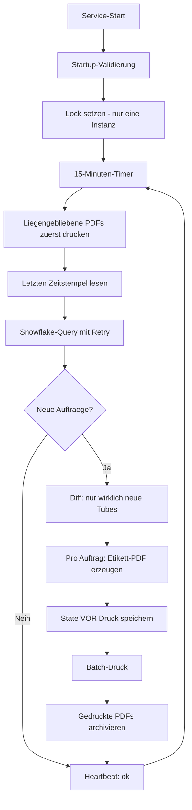

# Referenzprojekt · Automatisierte Kit-Belieferung in der Strahler-Fertigung

> **Vom manuellen Such- und Zuordnungsprozess zum vollautomatischen 24/7-Service –
> mit messbarer Zeit- und Kostenersparnis im fünfstelligen Bereich pro Jahr.**

**Branche:** Medizintechnik / Hightech-Fertigung (Röntgenröhren / Strahler)
**Projektart:** Prozessautomatisierung · Industrie-Middleware · Web-Monitoring
**Rolle:** Konzeption, Architektur, Entwicklung, Inbetriebnahme (End-to-End)
**Status:** Produktiv im 24/7-Dauerbetrieb · 300+ Etiketten automatisch erzeugt

---

## 1. Management Summary

In der Strahler-Fertigung eines Medizintechnik-Standorts mussten Mitarbeitende für
jedes produzierte Produkt manuell ermitteln, welche Röhre (Kit) zu welchem
Fertigungsauftrag gehört, diese Information im SAP-System nachschlagen und ein
passendes Begleit-Etikett erstellen. Dieser Vorgang war **fehleranfällig,
zeitintensiv und nicht skalierbar**.

Die entwickelte Lösung – **„GEIS Kit Belieferung"** – überwacht das SAP-Datenlager
(über Snowflake) rund um die Uhr, erkennt neue Transferaufträge automatisch und
druckt **ohne menschliches Zutun** ein korrektes, eindeutig zugeordnetes
Fertigungsauftrags-Etikett. Ein begleitendes Web-Kontrollcenter („SmartPulse")
macht den Betriebszustand jederzeit transparent.

### Das Ergebnis in Zahlen

| Kennzahl | Vorher (manuell) | Nachher (automatisiert) |
|:---------|:-----------------|:------------------------|
| Aufwand pro Produkt | **10–15 Minuten** Suchen & Zuordnen | **0 Minuten** (vollautomatisch) |
| Fehlerhafte Zuordnungen | regelmäßig, mit Folgekosten | praktisch ausgeschlossen |
| Verfügbarkeit | nur zu Arbeitszeiten | **24/7** |
| Nachvollziehbarkeit | keine | vollständiges Log + Archiv |
| **Eingesparte Arbeitszeit** | – | **≈ 500–750 Std./Jahr** |
| **Eingesparte Kosten** | – | **≈ 50.000–75.000 € / Jahr** |

---

## 2. Die Ausgangslage – warum das Projekt notwendig war

### 2.1 Der manuelle Prozess „vorher"

Vor der Automatisierung lief die Kit-Belieferung als **manueller, repetitiver
Suchprozess** ab. Für jeden neuen Fertigungsauftrag mussten Mitarbeitende:

1. **erkennen**, dass überhaupt ein neuer Transferauftrag vorliegt (kein aktiver
   Trigger – es musste regelmäßig manuell „nachgesehen" werden),
2. im **SAP-System** die zusammengehörigen Informationen heraussuchen
   (Fertigungsauftragsnummer, Transfer-Auftragsnummer, Lagerplatz,
   Warenempfänger, Material),
3. diese Daten **manuell einander zuordnen** – die fehleranfälligste Stelle,
4. ein **Etikett erstellen** und ausdrucken,
5. die Röhre korrekt dem richtigen Arbeitsplatz (HE2 / HE4 / HE6) zuordnen.

### 2.2 Die konkreten Schmerzpunkte

| Problem | Auswirkung |
|:--------|:-----------|
| **Hoher Suchaufwand** | 10–15 Minuten Mehraufwand **pro Produkt**, gebunden an teure Fachkräftezeit |
| **Fehlerhafte Zuordnung** | Falsche Röhre am falschen Arbeitsplatz → Produktionsfehler, Nacharbeit, Verzögerung |
| **Keine Rund-um-die-Uhr-Abdeckung** | Aufträge außerhalb der Schicht blieben liegen |
| **Keine Nachvollziehbarkeit** | Kein Protokoll, wer wann was zugeordnet/gedruckt hat |
| **Nicht skalierbar** | Mehr Produktion = linear mehr manueller Aufwand |

> **Kernproblem:** Eine hochqualifizierte, teuer bezahlte Fachkraft verbrachte
> einen relevanten Teil ihrer Zeit mit stupidem Nachschlagen und Abtippen –
> Tätigkeiten ohne Wertschöpfung, dafür mit hohem Fehlerrisiko.

---

## 3. Der Mehrwert – Wirtschaftlichkeit klar gerechnet

Der Business Case lässt sich anhand der realen Betriebsparameter eindeutig
quantifizieren.

### 3.1 Eingangsgrößen

| Parameter | Wert |
|:----------|:-----|
| Manueller Mehraufwand pro Produkt | 10–15 Minuten |
| Produzierte Strahler pro Jahr | **3.000 Stück** |
| Durchschnittlicher Stundensatz (vollkostenbasiert) | **100 € / Stunde** |

### 3.2 Eingesparte Arbeitszeit pro Jahr

$$
\text{Zeit}_{\min} = 3.000 \text{ Produkte} \times (10 \text{ bis } 15) \text{ min}
$$

| Szenario | Rechnung | Eingesparte Zeit |
|:---------|:---------|:-----------------|
| Konservativ (10 min) | 3.000 × 10 min = 30.000 min | **500 Stunden / Jahr** |
| Mittel (12,5 min) | 3.000 × 12,5 min = 37.500 min | **625 Stunden / Jahr** |
| Hoch (15 min) | 3.000 × 15 min = 45.000 min | **750 Stunden / Jahr** |

### 3.3 Eingesparte Kosten pro Jahr

$$
\text{Ersparnis}_{\text{€}} = \text{Stunden} \times 100\ \text{€/Std.}
$$

| Szenario | Rechnung | **Jährliche Ersparnis** |
|:---------|:---------|:------------------------|
| Konservativ | 500 Std. × 100 € | **50.000 € / Jahr** |
| Mittel | 625 Std. × 100 € | **62.500 € / Jahr** |
| Hoch | 750 Std. × 100 € | **75.000 € / Jahr** |

> **Wirtschaftlicher Kern:** Allein die eingesparte Fachkräftezeit entspricht
> einer jährlichen Entlastung von **50.000 € bis 75.000 €** – bei einmaligem
> Entwicklungsaufwand. Die Lösung amortisiert sich damit innerhalb **weniger
> Wochen** und liefert anschließend **dauerhaft** Wert.

### 3.4 Mehrwert jenseits der reinen Zeit

Der monetäre Wert ist nur ein Teil. Hinzu kommen qualitative Effekte mit
ebenfalls hoher betrieblicher Relevanz:

- **Eliminierung von Fehlzuordnungen** → keine Folgekosten durch falsch
  belieferte Arbeitsplätze, weniger Nacharbeit, höhere Prozesssicherheit.
- **24/7-Verfügbarkeit** → Aufträge werden auch nachts und am Wochenende sofort
  verarbeitet; keine Staus zu Schichtbeginn.
- **Vollständige Nachvollziehbarkeit** → jedes Etikett ist protokolliert und
  archiviert (Audit-Trail / Qualitätssicherung).
- **Entlastung der Mitarbeitenden** → Fachkräfte konzentrieren sich auf
  wertschöpfende Tätigkeiten statt auf Datensuche.
- **Skalierbarkeit** → steigende Stückzahlen verursachen **keinen** zusätzlichen
  manuellen Aufwand.

---

## 4. Die Lösung im Überblick

### 4.1 Was das System tut

Sobald in der Produktion ein neuer Transferauftrag für eine Röhre im
SAP-/Snowflake-System erscheint, erzeugt die Software **vollautomatisch** ein
A4-Etikett und druckt es auf einem Netzwerkdrucker. Das Etikett weist den
Mitarbeitenden klar an, welche Röhre zu welchem Fertigungsauftrag gehört und wie
die Entnahme im SAP zu quittieren ist:

> *„Bitte die Röhre zum Fertigungsauftrag `<FAUF>` entnehmen und die Entnahme im
> SAP mit der TA-Nummer `<TANUM>` quittieren."*

Der gesamte vormals manuelle Such-, Zuordnungs- und Druckprozess entfällt damit
vollständig.

### 4.2 Zwei Schichten – klar getrennt

```text
┌───────────────────────────────────────────────────────────┐
│  PRODUKTIONS-LAYER (kritisch, 24/7)                        │
│                                                           │
│  Snowflake ──▶ Scheduler ──▶ PDF-Erzeugung ──▶ Druck      │
│  (SAP-Daten)   (Python)      (ReportLab)        (Netzwerk)│
│                    │                                      │
│                    ▼                                      │
│              State + Heartbeat + Archiv                   │
└───────────────────────────┬───────────────────────────────┘
                            │ read-only
┌───────────────────────────▼───────────────────────────────┐
│  OBSERVABILITY-LAYER (beobachtend, ohne Eingriff)         │
│                                                           │
│  FastAPI-Backend ──▶ React-Frontend „SmartPulse"          │
│  (REST, nur GET)      (Live-Dashboard im Browser)         │
└───────────────────────────────────────────────────────────┘
```

**Architektur-Prinzip:** Das Monitoring-Frontend hat **keinen** Schreibzugriff
auf den Produktionsprozess. Es liest ausschließlich Statusdaten. Damit kann die
Überwachung den kritischen Druckprozess unter keinen Umständen stören – eine
bewusste Sicherheitsentscheidung.

---

## 5. Technische Umsetzung (für die fachliche Tiefe)

### 5.1 Technologie-Stack

| Komponente | Technologie | Begründung |
|:-----------|:------------|:-----------|
| **Middleware** | Python 3.10+ | Robuste Datenverarbeitung, breites Ökosystem |
| **Datenquelle** | Snowflake (SAP-AccessLayer) | Zentrale, performante Sicht auf SAP-Bewegungsdaten |
| **Datenverarbeitung** | Pandas | Effiziente Diff-/Duplikat-Erkennung |
| **PDF-Erzeugung** | ReportLab + svglib | Pixelgenaues, markenkonformes Etikett-Layout |
| **Druck** | GhostScript + PowerShell | Zuverlässiger Druck auf Netzwerk-Etikettendrucker |
| **Backend (Monitoring)** | FastAPI · Uvicorn · Pydantic v2 | Schnelle, typsichere read-only REST-API |
| **Frontend (Monitoring)** | React 18 · TypeScript 5 · Vite 6 · Tailwind 3 | Modernes, responsives Live-Dashboard |
| **Betrieb** | Windows-Service (NSSM) · IIS Reverse-Proxy | Stabiler Dauerbetrieb in der Windows-Infrastruktur |

### 5.2 Funktionsweise des Kernprozesses

Der Service arbeitet in einem **15-Minuten-Takt** und durchläuft pro Zyklus
einen klar definierten, fehlertoleranten Ablauf:



### 5.3 Engineering-Entscheidungen, die Robustheit garantieren

Das System wurde nicht als „Proof of Concept" gebaut, sondern als
**produktionskritische Industrie-Software**. Entsprechend wurden gezielt
Robustheits- und Sicherheitsmaßnahmen umgesetzt:

| Maßnahme | Problem, das es verhindert |
|:---------|:---------------------------|
| **Parametrisierte SQL-Queries** | SQL-Injection (OWASP A03) – keine String-Verkettung |
| **Atomares Schreiben des States** (Temp + Rename) | Korrupte Statusdatei bei Absturz/Stromausfall |
| **State wird *vor* dem Druck gespeichert** | Keine Doppeldrucke nach einem Crash |
| **Retry mit exponentiellem Backoff** | Transiente Netzwerk-/Snowflake-Aussetzer |
| **File-Lock** | Verhindert versehentliche Doppel-Instanzen (Doppeldruck) |
| **Dynamische GhostScript-Erkennung** | Druck bricht nicht bei Drucker-/Tool-Update |
| **Kein globaler Standarddrucker-Wechsel** | Keine Beeinträchtigung anderer Anwendungen |
| **Log-Rotation (max. 30 Tage)** | Festplatte läuft nicht voll |
| **Startup-Validierung** | Fehlkonfiguration wird sofort beim Start erkannt |
| **Heartbeat-Datei** | Externes Monitoring kann Ausfälle alarmieren |
| **Dry-Run-Modus** | Gefahrloses Testen des kompletten Workflows ohne Druck |
| **Eindeutige Dateinamen über TANUM** | Keine Überschreibung bei Sekundengleichheit |

> Diese Maßnahmen entstanden aus einem strukturierten **Code-Audit** mit
> priorisierten Findings (P0 = kritisch bis P3 = Wartbarkeit), die vollständig
> abgearbeitet wurden – Software-Engineering nach Lehrbuch statt „läuft schon
> irgendwie".

### 5.4 Korrektheit der fachlichen Zuordnung

Das Herzstück des Mehrwerts ist die **korrekte automatische Zuordnung**, die
vorher manuell und fehleranfällig war. Die Lösung filtert die SAP-Bewegungsdaten
präzise (Lagernummer, Material, Bewegungsart, Qualitätsstatus) und übernimmt den
tatsächlichen **Warenempfänger** (Arbeitsplatz HE2/HE4/HE6) direkt aus dem
Datensatz auf das Etikett – statt eines hartkodierten Werts. Damit ist
ausgeschlossen, dass eine Röhre dem falschen Arbeitsplatz zugeordnet wird.

---

## 6. Das Web-Kontrollcenter „SmartPulse"

Damit der Fachbereich den Service jederzeit ohne IT-Kenntnisse überwachen kann,
wurde ein modernes Web-Dashboard entwickelt – erreichbar im Browser, ohne
Server-Login, Snowflake-Zugang oder Dateisystem-Zugriff.

| Ansicht | Inhalt |
|:--------|:-------|
| **Dashboard** | Service-Status, KPIs (heute/Woche/Monat/gesamt), Erfolgsquote, Prozess-Pipeline, letzte Aufträge |
| **Aufträge** | Sortier- und durchsuchbare Tabelle aller verarbeiteten Aufträge |
| **Logs** | Live-Logs mit Filter nach Level und Volltextsuche |
| **Health** | Gesamtstatus + Einzel-Checks (Heartbeat, letzter Lauf, Logs, Archiv) |
| **Management** | Big-KPIs + **Zeitersparnis-Highlight** für die Geschäftsleitung |

Das Frontend folgt einem ruhigen, professionellen Design-System (Corporate-CI,
volle Responsivität von Mobil bis Großbildschirm, Barrierefreiheit). Es macht den
**Mehrwert sichtbar** – inklusive einer Live-Kennzahl zur eingesparten
Arbeitszeit.

---

## 7. Betrieb & Nachhaltigkeit

- **Dauerbetrieb** als Windows-Service (NSSM) – startet automatisch mit dem
  Server, läuft unbeaufsichtigt rund um die Uhr.
- **Monitoring** über Heartbeat-Datei: Ein externer Alarm schlägt an, wenn der
  Service länger als 20 Minuten kein Lebenszeichen gibt.
- **Self-Healing** beim Druck: Schlägt ein Druck fehl, bleiben die PDFs in der
  Warteschlange und werden im nächsten Zyklus automatisch nachgedruckt – **kein**
  Verlust, **keine** Duplikate.
- **Vollständige Dokumentation** (Architektur, Betrieb, Go-Live-Runbook,
  Rollback-Plan) für reibungslose Übergabe und Wartbarkeit.

---

## 8. Projektergebnis auf einen Blick

| Dimension | Ergebnis |
|:----------|:---------|
| **Zeitersparnis** | ≈ 500–750 Std./Jahr (10–15 min × 3.000 Produkte) |
| **Kostenersparnis** | ≈ **50.000–75.000 € / Jahr** (bei 100 €/Std.) |
| **Qualität** | Fehlzuordnungen praktisch eliminiert |
| **Verfügbarkeit** | Von Schichtbetrieb auf **24/7** |
| **Transparenz** | Vollständiges Live-Monitoring + Audit-Trail |
| **Skalierbarkeit** | Stückzahlsteigerung ohne Mehraufwand |
| **Amortisation** | Innerhalb weniger Wochen |

> **Fazit:** Ein klar umrissener manueller Engpass wurde durch eine robuste,
> sicherheitsorientiert entwickelte Automatisierungslösung ersetzt. Das Projekt
> verbindet **messbaren wirtschaftlichen Nutzen** (fünfstellige jährliche
> Einsparung) mit **technischer Exzellenz** (produktionskritische Robustheit,
> sauberes Engineering, modernes Monitoring) – ein Musterbeispiel für
> wertschöpfende Digitalisierung in der Fertigung.

---

*Referenzprojekt-Dokumentation · Stand 2026 · Zahlen auf Basis realer
Betriebsparameter (3.000 Produkte/Jahr, 10–15 min Mehraufwand/Produkt,
100 €/Std. vollkostenbasierter Stundensatz).*
