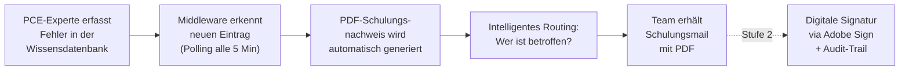
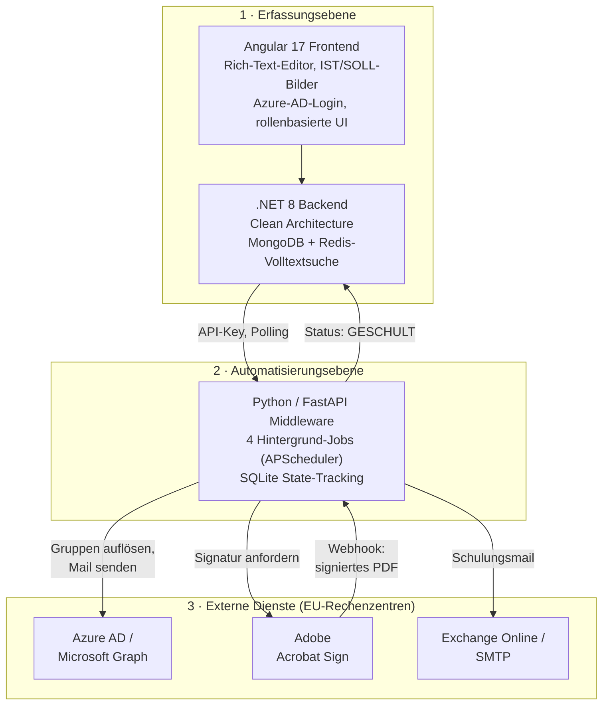

# Referenzprojekt: Handlingsfehler- & One-Point-Lesson-Plattform

> **Automatisierte Wissensverteilung und revisionssichere Schulungsnachweise für die Medizintechnik-Produktion**

**Kurzprofil:** Vollautomatisiertes System, das Produktionsfehler in strukturiertes Wissen überführt, dieses innerhalb von Minuten an die richtigen Teams verteilt und – auf Wunsch – rechtsverbindlich per digitaler Signatur nachweist.

| | |
|---|---|
| **Rolle** | Konzeption, Architektur & Full-Stack-Entwicklung |
| **Branche** | Medizintechnik / Produktion (regulierter GxP-Bereich) |
| **Projekttyp** | Eigenständige Produktentwicklung von der Idee bis zum Pilotbetrieb |
| **Status** | End-to-End verifiziert, Pilotbetrieb vorbereitet |
| **Tech-Stack** | Python · FastAPI · Angular 17 · .NET 8 · MongoDB · SQLite · Azure AD / Microsoft Graph · Adobe Acrobat Sign · Playwright |

---

## 1. Das Problem – warum dieses Projekt entstanden ist

In einer Produktion mit Schichtbetrieb passieren Handlingsfehler: Eine Dichtung wird gequetscht, ein Bauteil falsch herum montiert, ein Prüfschritt übersprungen. Solche Fehler sind oft klein – ihre Folgen sind es nicht.

Der bisherige Umgang damit hatte mehrere strukturelle Schwächen:

- **Die richtigen Kollegen wurden oft nicht erreicht.** Informationen über Fehler liefen über Aushänge, mündliche Weitergabe in Schichtübergaben oder vereinzelte E-Mails. Wer gerade nicht im Dienst war, im Urlaub oder in einer anderen Schicht, bekam die Information schlicht nicht.
- **Wissen ging verloren.** Erfahrene Mitarbeiter wussten oft genau, wie ein bestimmter Fehler zu vermeiden ist – aber dieses Wissen war nicht dokumentiert. Bei Schichtwechsel, Personalfluktuation oder Renteneintritt verschwand es mit der Person.
- **Keine Nachvollziehbarkeit.** Es ließ sich nicht belegen, wer wann über welchen Fehler informiert bzw. geschult wurde. Für Audits in einem ISO-13485-regulierten Umfeld ist das ein ernsthaftes Risiko.
- **Hoher manueller Aufwand.** Qualitäts- und PCE-Kollegen verbrachten erhebliche Zeit damit, Dokumente zu erstellen, auszudrucken, zu verteilen und nachzuhalten.

**Kurz gesagt:** Das Wissen war da, aber es floss nicht dorthin, wo es gebraucht wurde – und schon gar nicht schnell genug.

---

## 2. Die Lösung – Wissen auf den Punkt, automatisch verteilt

Das System überführt jeden erfassten Fehler in eine **One Point Lesson (OPL)** – ein kompaktes, visuelles Schulungsdokument mit genau einem Lernpunkt:

| IST – „so nicht" | SOLL – „so richtig" |
|---|---|
| Foto des Fehlers, rot markiert | Foto der korrekten Ausführung, grün markiert |

Auf einen Blick verständlich – auch ohne langen Text, auch sprachübergreifend.

### Der automatisierte Ablauf



**Durchlaufzeit vom Erkennen des Eintrags bis zur zugestellten Mail: unter einer Minute.**

Der Mitarbeiter, der die OPL erstellt, muss nichts weiter tun, als sein Wissen einmal sauber zu erfassen. Den Rest – Dokumentenerstellung, Empfängerermittlung, Versand, Nachweisführung – erledigt das System.

---

## 3. Architektur – wie es aufgebaut ist

Das System folgt einer klar getrennten Drei-Schichten-Architektur. Jede Komponente hat eine eindeutige Verantwortung und kommuniziert über definierte Schnittstellen.



### Die drei Bausteine im Detail

**1. Knowledge-Management-Plattform (Angular 17 + .NET 8 + MongoDB)**
Die Oberfläche, in der PCE-Experten Fehler erfassen. Rollenbasiert (Reader / Expert / Admin), mit Azure-AD-Single-Sign-On, Rich-Text-Editor, Bild-Upload und Volltextsuche über Redis. Das .NET-Backend folgt Clean Architecture (Domain → DAL → Services → API).

**2. Automatisierungs-Middleware (Python 3.11 + FastAPI + SQLite)**
Das Herzstück. Sie pollt die Wissensdatenbank, erkennt neue Einträge, generiert PDFs, ermittelt Empfänger, versendet Mails, orchestriert die digitale Signatur und führt den Audit-Trail. Vier Hintergrund-Jobs halten das System ohne menschliches Zutun am Laufen:

| Job | Intervall | Aufgabe |
|---|---|---|
| `poll_and_process` | 5 Min | Neue Fehler erkennen und verarbeiten |
| `check_open_agreements` | 30 Min | Signatur-Status prüfen |
| `retry_failed` | 10 Min | Fehlgeschlagene Fälle automatisch wiederholen |
| `sync_verteiler` | 24 h | Azure-AD-Gruppenmitglieder synchronisieren |

**3. Externe Dienste (alle in EU-Rechenzentren)**
Microsoft Graph (Authentifizierung, Gruppenauflösung, Mailversand) und Adobe Acrobat Sign (rechtsverbindliche, FDA-konforme E-Signaturen) – beides als Auftragsverarbeiter mit bestehenden Konzernverträgen.

### Intelligentes Routing – das System „denkt mit"

Eine Besonderheit: Die OPL muss nicht manuell einem Empfängerkreis zugewiesen werden. Die Struktur in der Wissensdatenbank bestimmt das automatisch.

```
OPL im Sub-Space "End-Montage", Tag "Vectron"
   → Bereich = Montage, Produkt = Vectron
   → Mail geht NUR an das Vectron-Montage-Team

OPL in "End-Montage" ohne Produkt-Tag
   → Mail geht an die gesamte Montage

OPL direkt auf oberster Ebene
   → Mail geht an alle relevanten Bereiche
```

So erhält jeder genau die Information, die für seinen Arbeitsplatz relevant ist – nicht mehr, nicht weniger. Das verhindert „E-Mail-Müdigkeit" und hält die Relevanz hoch.

---

## 4. Zwei-Stufen-Konzept – Pragmatismus trifft Compliance

Ein bewusster Architekturentscheid war die Trennung in zwei Ausbaustufen. Das ermöglicht einen schnellen Start bei gleichzeitiger Erfüllung regulatorischer und mitbestimmungsrechtlicher Anforderungen.

| Aspekt | Stufe 1 – „PDF-Mailer" | Stufe 2 – „Signaturnachweis" |
|---|---|---|
| Versand an Bereichs-Verteiler | ✅ | ✅ |
| PDF-Schulungsdokument | ✅ | ✅ |
| Personenbezogene Daten | ❌ nur Gruppenverteiler | ✅ Name, E-Mail, Signatur |
| Digitale Signatur | ❌ | ✅ Adobe Acrobat Sign |
| Individuelles Tracking | ❌ | ✅ pro Person, mit Zeitstempel |
| Betriebsrat | ℹ️ Information genügt | ✅ formale Vereinbarung |

**Stufe 1** verarbeitet bewusst keine personenbezogenen Daten – Mails gehen ausschließlich an funktionale Gruppen-Verteiler. Dadurch ist kein aufwändiges Datenschutzverfahren nötig und der Pilot kann sofort starten.

**Stufe 2** liefert den rechtsverbindlichen Nachweis „gelesen und verstanden" pro Person – relevant für ISO 13485, 21 CFR Part 11 und lückenlose Audit-Trails.

Dieser stufenweise Ansatz reduziert das Projektrisiko erheblich: Der Nutzen wird früh sichtbar, ohne dass die regulatorisch anspruchsvollen Teile den Start blockieren.

---

## 5. Der Mehrwert – konkret und messbar

### 5.1 Qualitative Verbesserungen

| Dimension | Vorher | Mit dem System |
|---|---|---|
| **Reaktionszeit** | Tage bis Wochen | < 5 Minuten |
| **Reichweite** | abhängig von Schicht/Anwesenheit | 100 % – jeder im Verteiler |
| **Dokumentation** | keine oder uneinheitlich | automatisch, auditierbar |
| **Wissenssicherung** | geht bei Schichtwechsel verloren | einmal erfasst → dauerhaft verfügbar |
| **Aufwand Qualitätsteam** | drucken, verteilen, nachfassen | nur noch OPL erstellen |
| **Nachweisbarkeit** | nicht belegbar | rechtsverbindlich (Stufe 2) |

### 5.2 Wirtschaftlicher Nutzen – die Einsparungsrechnung

Der zentrale Werttreiber ist die **Vermeidung von Wiederholungsfehlern**. Schon ein kleiner, nicht kommunizierter Handlingsfehler kann in der Medizintechnik teuer werden – durch Nacharbeit, Ausschuss, Materialverlust, Verzögerungen, im schlimmsten Fall durch Rückläufer aus dem Feld oder Abweichungen im Audit.

> **Annahme:** Ein einzelner, durch fehlende Information verursachter Handlingsfehler kann je nach Bauteil und Prozessstufe einen Schaden von bis zu **10.000 €** verursachen (Nacharbeit, Ausschuss, Prüfaufwand, Verzug).

**Konservative Beispielrechnung (Pilotbereich):**

| Position | Annahme | Wert |
|---|---|---|
| Vermeidbare Wiederholungsfehler pro Monat | 2 Fälle | – |
| Durchschnittlicher Schaden pro Fall | 5.000 € (Hälfte des Maximums) | 10.000 €/Monat |
| **Vermiedener Schaden pro Jahr** | × 12 | **120.000 €** |
| Zeitersparnis Qualitätsteam | ~30 Min/Fall, ~40 Fälle/Monat | ~240 h/Jahr |
| Zeitersparnis monetär (bei 60 €/h Vollkosten) | 240 h × 60 € | **~14.400 €/Jahr** |
| **Gesamteinsparung p. a. (konservativ)** | | **≈ 134.000 €** |

Dem stehen **praktisch keine zusätzlichen Kosten** gegenüber: Das System läuft auf bestehender Infrastruktur, nutzt bereits lizenzierte Dienste (Microsoft 365, Adobe Sign als Siemens-Standard) und benötigt keine zusätzliche Hardware.

Selbst wenn nur **ein einziger** 10.000-€-Fehler pro Jahr verhindert wird, hat sich das System bereits mehrfach amortisiert.

> **Hebelwirkung:** Der Wert skaliert linear mit der Zahl der Teams und Standorte. Was im Pilotbereich 134.000 € spart, vervielfacht sich bei standortweiter Ausrollung – ohne proportional steigenden Aufwand, da das System vollautomatisch arbeitet.

### 5.3 Schwer bezifferbarer, aber realer Zusatznutzen

- **Audit-Sicherheit:** Lückenlose Nachweisführung reduziert das Risiko teurer Audit-Findings und Nachbearbeitungen.
- **Schnelleres Onboarding:** Neue Mitarbeiter erhalten kuratiertes Praxiswissen sofort – nicht erst nach Monaten „Learning by Doing".
- **Kulturwandel:** Fehler werden zu Lernchancen statt zu Schuldzuweisungen. Wissen wird geteilt statt gehortet.

---

## 6. Optimierungs- und Ausbaupotenzial

Das System ist als Plattform konzipiert. Aus Entwicklersicht bieten sich folgende Erweiterungen an, um den Nutzen weiter zu steigern:

### 6.1 Kurzfristig – „Quick Wins"

- **Compliance-Dashboard:** Live-Überblick, wer welche OPL gelesen/signiert hat – inklusive Erinnerungs-Funnel für ausstehende Signaturen.
- **Lesebestätigung light (Stufe 1.5):** Ein einfacher „Verstanden"-Button per Tracking-Link – ohne vollen Signatur-Overhead, aber mit Quote pro Team.
- **Azure-AD-Dynamic-Groups:** Neue Mitarbeiter landen automatisch im richtigen Verteiler (nach Abteilungs-Attribut) – kein manuelles Pflegen mehr.
- **Mehrsprachigkeit:** Automatische Übersetzung der Texte (Bilder bleiben sprachneutral) für internationale Standorte.

### 6.2 Mittelfristig – Wirkungssteigerung

- **Wirksamkeitsmessung (Closed Loop):** Verknüpfung der OPLs mit Fehlerdaten aus dem MES/QM-System. Sinkt die Fehlerrate nach Versand einer OPL? Damit wird der ROI nicht nur geschätzt, sondern **gemessen**.
- **KI-gestützte OPL-Erstellung:** Ein LLM schlägt aus einer kurzen Fehlerbeschreibung + Foto automatisch IST/SOLL-Texte, Titel und passende Produkt-Tags vor. Senkt die Erfassungshürde drastisch.
- **Duplikat- & Ähnlichkeitserkennung:** Semantische Suche (Embeddings) warnt: „Zu diesem Fehler existiert bereits eine OPL" – verhindert Wildwuchs und erhöht Konsistenz.
- **Eskalationslogik:** Häuft sich ein Fehlertyp trotz OPL, wird automatisch eine tiefere Ursachenanalyse (8D/Ishikawa) angestoßen.

### 6.3 Langfristig – strategische Plattform

- **Mobile-First / Shopfloor-Terminals:** OPLs direkt am Arbeitsplatz auf Tablets oder Terminals, statt im E-Mail-Postfach.
- **Integration in Trainings-/LMS-Systeme:** Schulungsnachweise fließen automatisch in die Personalentwicklungsakte.
- **Predictive Quality:** Auswertung, in welchen Bereichen/Produkten sich Fehler häufen → proaktive Schulung, bevor der Fehler erneut auftritt.
- **Multi-Tenant-Fähigkeit:** Ausrollung als konzernweite Plattform über mehrere Standorte mit getrennten Mandanten.

---

## 7. Technische Highlights – worauf ich besonderen Wert gelegt habe

### Sicherheit (OWASP Top 10)
Durchgängig adressiert: parametrisierte Queries (kein SQL-Injection-Risiko), Jinja2-Auto-Escaping + HTML-Sanitierung gegen XSS, OAuth2/JWT-Authentifizierung über Azure AD, Secrets ausschließlich in Umgebungsvariablen, Webhook-Verifikation gegen Spoofing, Prinzip der minimalen Rechte über alle Schnittstellen.

### Datenschutz by Design
Die Zwei-Stufen-Architektur ist gelebte Datenminimierung: Stufe 1 kommt komplett ohne personenbezogene Daten aus. In Stufe 2 werden nur die zwingend nötigen Daten (Name, dienstliche E-Mail, Signatur-Zeitstempel) verarbeitet – ausschließlich in EU-Rechenzentren, mit klarer Rechtsgrundlage und Verarbeitungsverzeichnis.

### Robustheit
Idempotentes Polling (kein Eintrag wird doppelt verarbeitet), automatische Retry-Logik für fehlgeschlagene Fälle, vollständiges State-Tracking pro Fall und pro Person, Betrieb als dauerhafter Windows-Service (NSSM) mit strukturiertem Logging.

### Dokumentenerzeugung
PDF-Generierung pixelgenau aus HTML-Templates via Playwright/Chromium – mit eingebetteten IST/SOLL-Bildern, CI-konformem Design und vorbereiteten Adobe-Sign-Textmarken für die spätere Signatur. Zusätzlich Management-Reports als PowerPoint (python-pptx).

### Regulatorische Eignung
Konzipiert für ISO 13485 (QM Medizinprodukte), 21 CFR Part 11 (elektronische Signaturen, FDA-konform via Adobe Sign) und lückenlose, rechtsgültige Audit-Trails.

---

## 8. Ergebnis

Ein eigenständig konzipiertes und entwickeltes System, das ein konkretes, teures Produktionsproblem löst:

- **Wissen geht nicht mehr verloren** – jeder Fehler wird zu dauerhaft verfügbarem Praxiswissen.
- **Die richtigen Leute werden erreicht** – automatisch, in unter einer Minute, flächendeckend.
- **Nachweisbar und auditsicher** – auf Wunsch mit rechtsverbindlicher digitaler Signatur.
- **Wirtschaftlich überzeugend** – sechsstelliges Einsparpotenzial pro Jahr bei nahezu null Zusatzkosten.

Das Projekt zeigt die gesamte Bandbreite moderner Software-Entwicklung: von der Anforderungsanalyse im regulierten Umfeld über die Mehrschicht-Architektur (Angular, .NET, Python), die Integration komplexer Drittsysteme (Azure AD, Microsoft Graph, Adobe Sign) bis hin zu Sicherheit, Datenschutz und produktivem Betrieb.

---

*Technologien: Python · FastAPI · APScheduler · SQLite · Angular 17 · Angular Material · .NET 8 · ASP.NET Core · MongoDB · Redis · Azure Active Directory · Microsoft Graph API · Adobe Acrobat Sign · Playwright · Jinja2 · python-pptx · OAuth2 / JWT*
