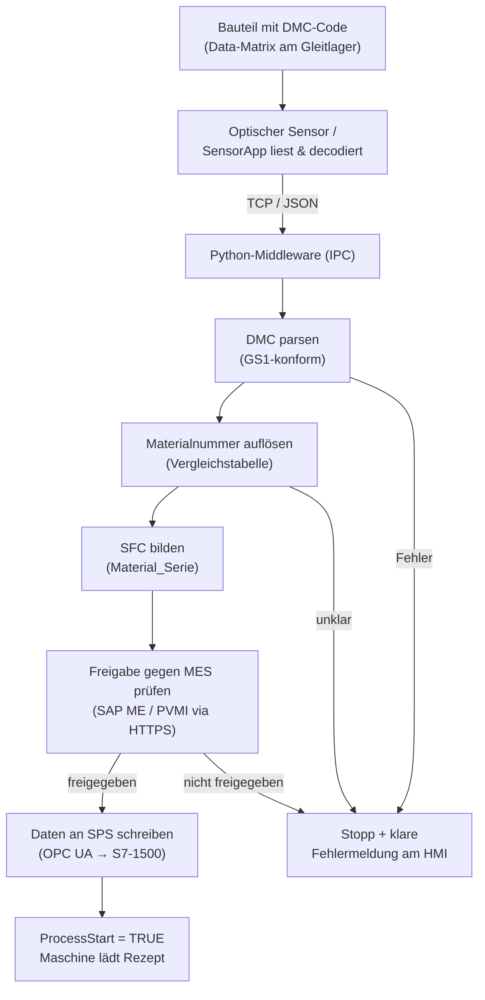
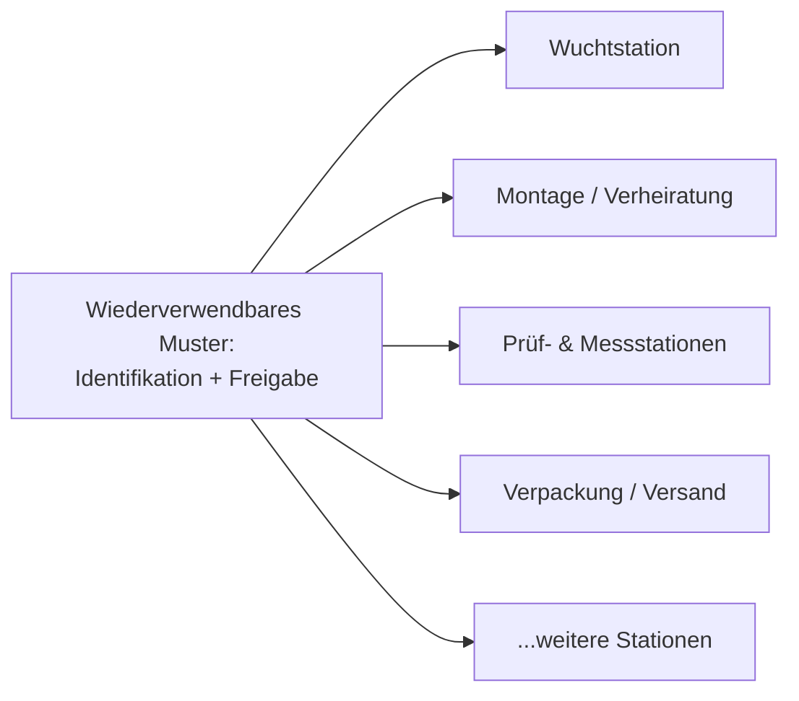

# Vom handgeschriebenen Begleitschein zur fehlersicheren Maschine

### Automatisierte Bauteil-Identifikation an einer Wuchtstation in der Röntgenröhren-Fertigung

> **Referenzprojekt – Sensor- & Industrie-Software**
> Eine fehleranfällige, manuelle Identifikationsprüfung wurde durch eine
> durchgängig automatisierte, auditierbare und produktionssichere
> Software-Middleware ersetzt – vom optischen Code am Bauteil bis zur
> Freigabe an der Maschine.

---

## Auf einen Blick

| Kennzahl | Wert |
|---|---|
| **Domäne** | Medizintechnik-Fertigung (Röntgenröhren / Anodenbaugruppen) |
| **Ersetzter Prozess** | Manueller Sicht- und Datenabgleich durch den Werker |
| **Neuer Prozess** | Vollautomatische DMC-Identifikation + MES-Freigabe in < 1 Sekunde |
| **Qualitätsklasse** | DHR-relevant / qualitätsrelevant (Device History Record) |
| **Kerntechnologien** | Optische Code-Erfassung (DMC/GS1), Python-Middleware, SAP ME/MES-Anbindung, OPC UA, S7-1500 |
| **Einsparpotenzial** | **≈ 28.000 – 67.000 € pro Jahr und Station** (siehe Wirtschaftlichkeit) |
| **Skalierung** | Als Blaupause auf viele vergleichbare Stationen im Konzern übertragbar |

---

## Worum geht es?

In der Fertigung von **Anodenbaugruppen** für Röntgenröhren (u. a. Produktlinien
wie MCT, Vectron, GIGALIX, Athlon und Megalix) wird jede Baugruppe an einer
**Wuchtstation** dynamisch ausgewuchtet. Damit das richtige Wuchtprogramm
(„Rezept") geladen wird, muss die Maschine **zweifelsfrei wissen, welches
Bauteil gerade vor ihr liegt** – und ob dieses Bauteil im Fertigungssystem
überhaupt für genau diesen Schritt freigegeben ist.

Genau diese Identifikation war bisher **Handarbeit**. Und Handarbeit an einem
qualitätsrelevanten, dokumentationspflichtigen Medizinprodukt ist der Punkt,
an dem Prozesssicherheit, Rückverfolgbarkeit und Wirtschaftlichkeit
gleichzeitig auf dem Spiel stehen.

---

## Die Ausgangslage: ein manueller Prozess aus einer anderen Zeit

Der ursprüngliche Ablauf war vollständig vom Werker getragen:

1. Die ungewuchtete Anodenbaugruppe kommt **mit einem Papier-Begleitschein** an
   die Station.
2. Der Werker wählt **von Hand** den passenden Bauteilträger aus und rüstet die
   Maschine.
3. Er gleicht **per Auge** Material- und Seriennummer des Bauteils mit dem
   Begleitschein ab.
4. Er scannt bzw. tippt die Nummern vom Begleitschein ab.
5. Die Maschine lädt anhand der eingegebenen Materialnummer das Rezept.

Das funktioniert – aber es hat strukturelle Schwächen, die in einer modernen,
regulierten Fertigung nicht mehr akzeptabel sind:

| Schwachstelle | Konsequenz |
|---|---|
| **Manueller Sichtabgleich** | Zahlendreher und Verwechslungen sind menschlich – und teuer |
| **Papier-Begleitschein als „führende Quelle"** | Keine Echtzeit-Verbindung zum Fertigungssystem (MES) |
| **Keine Freigabeprüfung** | Ein bereits abgeschlossenes oder gesperrtes Bauteil kann fälschlich weiterlaufen |
| **Lückenhafte Rückverfolgbarkeit** | Wer hat wann was bestätigt? Im DHR-Kontext ein echtes Risiko |
| **Werkerbindung** | Hochqualifiziertes Personal verbringt Zeit mit stupidem Abtippen |

Kurz: Der Prozess war **fehleranfällig, langsam und nicht auditierbar** – und
band Personal an einer Stelle, an der eine Maschine zuverlässiger ist als jeder
Mensch.

---

## Die Lösung: eine fehlersichere Software-Middleware

Im Zentrum steht eine schlanke, robuste **Python-Middleware auf einem
Industrie-PC (IPC)**, die als „Übersetzer und Schiedsrichter" zwischen Sensor,
Fertigungssystem und Maschinensteuerung arbeitet. Sie führt in unter einer
Sekunde aus, wofür ein Mensch vorher Minuten brauchte – und protokolliert dabei
**jeden einzelnen Schritt unveränderbar**.

### Der neue Ablauf

In Klartext: **Der Code am Bauteil ist die einzige Wahrheit.** Der Mensch muss
nichts mehr abgleichen, abtippen oder erraten. Und vor allem: **Die Maschine
startet nur dann, wenn das Bauteil im Fertigungssystem nachweislich freigegeben
ist.**

---

## Technische Tiefe (das, was den Unterschied macht)

Was nach „Code scannen" klingt, ist in Wahrheit ein präzise abgestimmtes
Zusammenspiel mehrerer Industrie-Welten. Genau hier liegt die eigentliche
Ingenieursleistung:

### 1. Robuste optische Erfassung & GS1-Parsing
Der Data-Matrix-Code (DMC) ist nach **GS1-Standard** aufgebaut (Application
Identifier für GTIN, Materialnummer, Seriennummer, Charge). Die Middleware
zerlegt ihn **deterministisch und versioniert** – gleiche Eingabe ergibt immer
dasselbe Ergebnis, jede Parser-Version ist nachvollziehbar.

### 2. Intelligente Disambiguierung
Eine besondere Knacknuss: Mehrere Bauteile teilen sich dieselbe
Gleitlager-Materialnummer (z. B. die 2F-/3F-Varianten einzelner Baureihen). Eine
naive 1:1-Tabelle würde hier **falsch zuordnen**. Die Lösung prüft beide
möglichen Kandidaten gegen das MES – nur der real existierende Fertigungsauftrag
„gewinnt". So wird Mehrdeutigkeit **systematisch aufgelöst statt geraten**.

### 3. Echtzeit-Freigabe gegen das MES (SAP ME / PVMI)
Bevor irgendetwas startet, fragt die Middleware das Manufacturing Execution
System: *„Existiert dieser Fertigungsauftrag, und hat er den richtigen Status?"*
Nur die Status **InQueue** oder **Active** sind zulässig. Bereits erledigte,
gesperrte, verschrottete oder ungültige Aufträge werden **zuverlässig
abgewiesen**.

### 4. Sichere Maschinenanbindung über OPC UA
Die freigegebenen Daten werden über **OPC UA** in einen Datenbaustein der
**Siemens S7-1500** geschrieben – mit zwingender Reihenfolge (erst Daten, dann
Statusbits) und **Readback-Bestätigung**. Es gilt eine formal nachweisbare
Sicherheitsregel:

$$\text{ProcessStart} = \text{TRUE} \;\Longrightarrow\; \text{DataValid} = \text{TRUE} \;\wedge\; \text{Success} = \text{TRUE}$$

Die Maschine kann also **systembedingt nicht** mit ungeprüften Daten starten.

### 5. Sauberes Zustandsmodell & Fehlerbehandlung
Jeder Zyklus durchläuft eine klar definierte **State Machine** (Empfang →
Parsing → Mapping → SFC-Bildung → MES-Prüfung → Schreiben → Freigabe). Jeder
Fehler hat einen eindeutigen Code, eine klare Werker-Rückmeldung am HMI und
definierte Recovery-Pfade. Kein „undefinierter Zustand", keine stille
Fehlfunktion.

---

## Prozesssicherheit & Qualität – nicht verhandelbar

In einem **DHR-relevanten** (Device-History-Record-pflichtigen) Umfeld zählt
nicht nur, *dass* etwas funktioniert, sondern dass man es **lückenlos beweisen**
kann. Die Architektur ist von Grund auf darauf ausgelegt:

- **Append-only Audit-Trail:** Kein Datensatz wird je überschrieben. Was gelesen,
  wie interpretiert und wodurch freigegeben wurde, bleibt **unveränderbar
  nachvollziehbar** (inkl. Hash-Sicherung).
- **Trennung von Roh-, transformierten und freigegebenen Daten:** Jede Stufe ist
  getrennt dokumentiert.
- **Vollständige Versionierung:** Parser-Version, Tabellenversion, API-Version,
  Payload-Version – alles wird mitgeführt.
- **Vollständige Archivierung der MES-Antwort** inkl. Latenzmessung.
- **Genau ein aktiver Zyklus:** Kein paralleles Durcheinander, keine Race
  Conditions, keine doppelten Scans.

Das Ergebnis ist ein Prozess, der **nicht nur schneller, sondern beweisbar
sicherer** ist als die menschliche Variante.

---

## Wirtschaftlichkeit: Was bringt das in Euro?

> Die folgende Rechnung ist bewusst **transparent und konservativ** gehalten.
> Alle Annahmen sind offengelegt und können an reale Werte angepasst werden.

### Annahmen

| Parameter | Wert | Bemerkung |
|---|---|---|
| Jahresvolumen | **5.000 Anodenbaugruppen** | identifizierte Baugruppen pro Jahr und Station |
| Vollkostensatz Werker | **80 € / Stunde** | = 1,33 € / Minute |
| Manueller Identifikations- & Abgleichaufwand | **≈ 3,5 – 5,5 Min / Baugruppe** | Rüstabgleich, Sichtprüfung, Abtippen, Korrekturen |
| Automatisierter Aufwand | **≈ 0,5 Min / Baugruppe** | nahezu freihändig, parallel zur Maschine |
| Netto-Zeitersparnis | **≈ 3 – 5 Min / Baugruppe** | aus realer Beobachtung an der Station |

### 1. Direkte Personalkosten-Einsparung

| Szenario | Ersparnis / Stück | Stunden / Jahr | **Ersparnis / Jahr** |
|---|---|---|---|
| Konservativ (3 Min) | 3 Min | ≈ 250 h | **≈ 20.000 €** |
| Realistisch (4 Min) | 4 Min | ≈ 333 h | **≈ 26.700 €** |
| Hoch (5 Min) | 5 Min | ≈ 417 h | **≈ 33.300 €** |

> Rechenweg (realistisch): 5.000 Stück × 4 Min = 20.000 Min ≈ 333 h × 80 € ≈ **26.700 €/Jahr**.

### 2. Vermiedene Fehlerkosten (der eigentliche Hebel)

Ein manueller Zahlendreher kann zu **falschem Wuchtprogramm, Nacharbeit,
Verschrottung einer hochwertigen Anodenbaugruppe oder einer
Qualitätsabweichung im DHR** führen – im Medizinproduktekontext potenziell sehr
teuer.

| Parameter | Konservativ | Realistisch |
|---|---|---|
| Angenommene manuelle Fehlerquote | 0,5 % | 1,0 % |
| Fehlerfälle / Jahr (von 5.000) | 25 | 50 |
| Kosten je Fehlerfall (Nacharbeit/Scrap/Klärung) | 300 € | 800 € |
| **Vermiedene Fehlerkosten / Jahr** | **≈ 7.500 €** | **≈ 40.000 €** |

### 3. Gesamtpotenzial pro Station

| | Konservativ | Realistisch |
|---|---|---|
| Personalkosten | ≈ 20.000 € | ≈ 26.700 € |
| Fehlerkosten | ≈ 7.500 € | ≈ 40.000 € |
| **Summe pro Jahr & Station** | **≈ 27.500 €** | **≈ 66.700 €** |

**Plus** schwer bezifferbare, aber reale Effekte: höhere Anlagenverfügbarkeit,
Entlastung qualifizierter Werker, schnellere Audits, geringeres
Reputationsrisiko und durchgängige Rückverfolgbarkeit.

---

## Skalierung über Siemens: aus einem Projekt wird eine Blaupause

Der eigentliche Wert liegt nicht in dieser **einen** Station. Das Muster
„**optischer Code → Software-Middleware → MES-Freigabe → sichere
Maschinenfreigabe**" ist **branchen- und produktneutral** und lässt sich auf
zahllose vergleichbare Prozesse übertragen, in denen heute noch manuell
identifiziert, abgeglichen oder abgetippt wird.

Eine konservative Hochrechnung verdeutlicht den Hebel:

| Anzahl vergleichbarer Stationen | Potenzial / Jahr (konservativ 27,5 k€) | Potenzial / Jahr (realistisch 66,7 k€) |
|---|---|---|
| 5 Stationen | ≈ 137.000 € | ≈ 333.000 € |
| 10 Stationen | ≈ 275.000 € | ≈ 667.000 € |
| 20 Stationen | ≈ 550.000 € | ≈ 1.334.000 € |

Da die Architektur **modular** ist (austauschbare Vergleichstabelle, generische
MES- und OPC-UA-Schicht), bedeutet jede weitere Station vor allem
**Konfiguration statt Neuentwicklung** – die Investition amortisiert sich mit
jeder Wiederverwendung schneller.

---

## Technologie-Stack

| Ebene | Eingesetzte Technologie |
|---|---|
| **Bauteil-Identifikation** | Data-Matrix-Code (DMC), GS1-Application-Identifier |
| **Optische Erfassung** | Industrieller Code-Sensor / SensorApp (TCP/JSON-Anbindung) |
| **Middleware** | Python (typsichere Domänenmodelle, klare State Machine, Exception-Hierarchie) |
| **MES-Anbindung** | SAP ME / MES-REST-API über HTTPS |
| **Maschinensteuerung** | OPC UA Client → Siemens S7-1500 (zertifikatsbasiert) |
| **Qualität & Betrieb** | Append-only Audit-Trail, Recovery-Logik, Health-Monitoring |
| **Absicherung** | Umfangreiche Unit- & End-to-End-Tests, versionierte Konfiguration |
| **Deployment** | Offline-Bundle für Industrie-PC, reproduzierbare Installation als Windows-Dienst |

---

## Was dieses Projekt über meine Arbeitsweise aussagt

- **Ich denke vom Prozess her, nicht nur vom Code.** Bevor eine Zeile entsteht,
  steht das Verständnis des realen Werker-Alltags und der Qualitätsanforderungen.
- **Ich verbinde Welten:** Sensorik, Industrie-IT, MES/ERP und SPS-Automatisierung
  sprechen normalerweise nicht dieselbe Sprache – meine Middleware übersetzt
  zuverlässig zwischen ihnen.
- **Ich baue für regulierte Umgebungen:** Auditierbarkeit, Rückverfolgbarkeit und
  formale Sicherheitsregeln sind keine Nachgedanken, sondern Fundament.
- **Ich baue Lösungen, die skalieren:** aus einem konkreten Problem wird eine
  wiederverwendbare Blaupause mit echtem, rechenbarem Geschäftswert.

> **Aus einem fehleranfälligen Handgriff wird ein beweisbar sicherer,
> auditierbarer und wirtschaftlicher Automatisierungsbaustein – das ist die Art
> von Software, die ich baue.**

---

Diese Referenz beschreibt Konzept, Architektur und Nutzen anhand eines real
umgesetzten Industrieprojekts. Vertrauliche Detaildaten (interne Systeme,
Schlüssel, personenbezogene Angaben) sind bewusst nicht enthalten. Alle
Wirtschaftlichkeitszahlen sind als nachvollziehbare, anpassbare Modellrechnung
zu verstehen.
