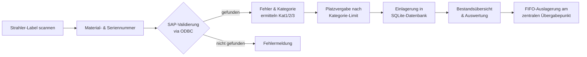
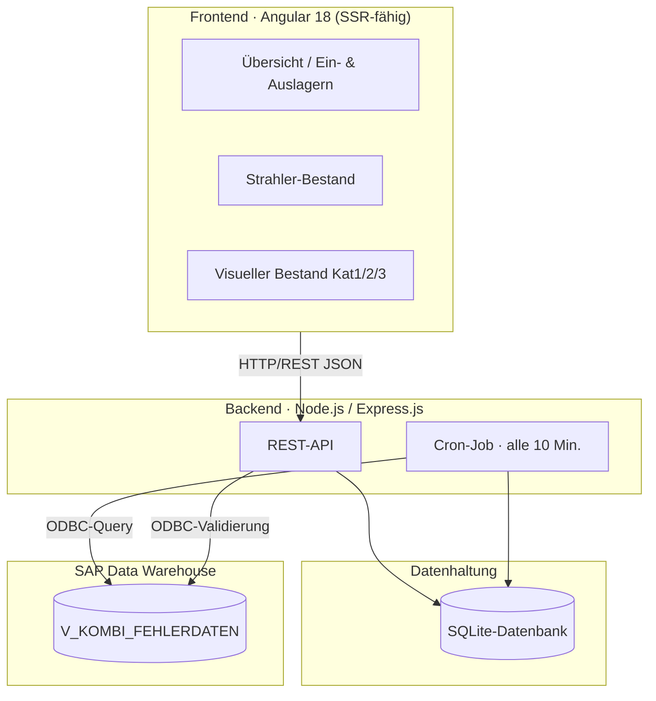

# Referenzprojekt: Digitale Lagerverwaltung & Inventarisierung defekter Strahler

> **Zukunftsfähige Softwarelösung zur Inventarisierung defekter Strahler und Optimierung des Produktivitäts-Trackings**
> Idea-Management-ID 004618 · Wirkbereich SHS TC PV SCM FOR-M-VP CF · Produktivitätspotenzial ≥ 10.000 EUR/Jahr

---

## 1. Management Summary

Die **Lagerverwaltung CF** ist eine produktiv eingesetzte Web-Applikation, die einen bislang manuellen, fehleranfälligen und personalintensiven Inventarisierungsprozess für defekte Röntgenstrahler vollständig digitalisiert und automatisiert.

Vor der Einführung wurden defekte Strahler in handgepflegten Excel-Listen erfasst. Die jährliche Inventur band mehrere Mitarbeiter über Tage, und die tägliche Suche nach defekten Produkten kostete die Bereiche **PCE** und **CF** kontinuierlich Zeit. Es existierte keine systematische, zentral nachvollziehbare Inventarisierungslogik.

Die entwickelte Lösung verbindet ein modernes **Angular-Frontend** mit einem **Express.js-Backend** und einer **SQLite-Datenbank**. Über eine **ODBC-Schnittstelle zum SAP-Data-Warehouse** werden Material- und Seriennummern in Echtzeit validiert und um Fehler- sowie Entscheidungsdaten angereichert. Ein **zweistufiges Scan-Verfahren** garantiert die eindeutige Identifikation jedes Strahlers, eine **kategoriebasierte Platzlogik** und ein **First-in-First-out-Prinzip** minimieren den Suchaufwand.

**Quantifizierter Mehrwert:** rund **35.400 – 37.450 EUR Einsparung pro Jahr** (siehe Abschnitt 8), bei gleichzeitiger Eliminierung von Erfassungsfehlern und durchgängiger Inventur-Transparenz.

---

## 2. Ausgangslage & Problemstellung

| Problemfeld | Beschreibung | Auswirkung |
|---|---|---|
| **Keine systematische Inventarisierung** | Defekte Strahler wurden nicht strukturiert erfasst | Kein verlässlicher Bestandsüberblick |
| **Hoher manueller Inventuraufwand** | Jährliche Inventur band mehrere Mitarbeiter über Tage | Hohe Personalkosten, Produktionsausfall |
| **Zeitintensive Suchprozesse** | PCE und CF suchten täglich manuell nach Produkten | Wiederkehrender, nicht wertschöpfender Aufwand |
| **Excel-basiertes Tracking** | Produktivität wurde in manuell gepflegten Tabellen abgebildet | Fehleranfällig, kein zentraler Zugriff, kein Audit-Trail |
| **Fehlende Rückverfolgbarkeit** | Keine Verknüpfung zu SAP-Fehler- und Entscheidungsdaten | Doppelte Datenpflege, Inkonsistenzen |

**Kernproblem:** Ein wertschöpfungsfremder, fehleranfälliger Prozess band hochbezahlte Fachkräfte (CF: 80 EUR/h, PCE: 100 EUR/h) in repetitive Such- und Dokumentationstätigkeiten.

---

## 3. Lösungsüberblick

Die Anwendung bildet den kompletten Lebenszyklus eines defekten Strahlers digital ab:

**Leitprinzipien der Lösung:**

- **Single Source of Truth** – SAP bleibt führendes System, die Applikation reichert an und dokumentiert.
- **Automatisierung statt Handarbeit** – periodischer Datenabgleich, automatische Kategorisierung, automatische Platz-/Bestandslogik.
- **Dezentraler Zugriff** – web-basiert, im Corporate Design, für autorisierte Nutzer von überall erreichbar.
- **Prozesssicherheit** – Validierung an jeder Systemgrenze (Scan, SAP-Abgleich, Platzgrenzen).

---

## 4. Systemarchitektur

### 4.1 Architekturüberblick

### 4.2 Technologie-Stack

| Schicht | Technologie | Begründung |
|---|---|---|
| **Frontend** | Angular 18, Standalone Components, TypeScript 5.5 | Wartbares, komponentenbasiertes UI; moderne, langzeitstabile Plattform |
| **UI-Komponenten** | Angular Material, AG Grid Community | Performante, filter-/sortierbare Datentabellen für große Bestände |
| **Server-Side Rendering** | @angular/ssr, Express-Renderer | Schnellere Erstanzeige, robustes Deployment |
| **Backend** | Node.js, Express.js 4 | Schlanke, etablierte REST-Schicht mit großem Ökosystem |
| **Datenbank** | SQLite (sqlite3) | Wartungsarm, dateibasiert, ideal für dedizierten Standort-Server |
| **Unternehmensanbindung** | ODBC-Treiber (`odbc`) | Direkter, validierter Zugriff auf das SAP-Data-Warehouse |
| **Automatisierung** | node-cron / cron | Zeitgesteuerter, automatischer SAP-Abgleich |
| **Export** | ExcelJS | Standardkonforme Excel-Reports für Inventur & Auswertung |
| **Betrieb** | IIS + iisnode, PM2, HTTPS-Variante | Produktiver Windows-Server-Betrieb mit Prozess-Monitoring |
| **CI/CD** | Azure Pipelines | Automatisierte Build- und Deployment-Pipeline |

---

## 5. Fachliche Kernfunktionen

### 5.1 Zweistufiges Scan-Verfahren

Das Strahler-Label wird über einen Handscanner erfasst. Die Anwendung erkennt automatisch das vom Scanner gelieferte Trennzeichen (`ß` bzw. `?`) und zerlegt den Code zuverlässig in **Materialnummer** und **Seriennummer**. Anschließend wird der Fokus automatisch auf das Platznummern-Feld gesetzt – ein durchgängiger, tastaturfreier Workflow für den Lagermitarbeiter.

> Robustheit: Die Scanner-Logik behandelt beide am Standort vorkommenden Tastatur-Layouts/Trennzeichen und ist gegen Leereingaben und unvollständige Codes abgesichert.

### 5.2 Echtzeit-Validierung gegen SAP

Jede Erfassung wird über ODBC gegen die View `V_KOMBI_FEHLERDATEN` im SAP-Data-Warehouse geprüft. Nur tatsächlich existierende Material-/Seriennummern-Kombinationen werden zugelassen. Aus den SAP-Daten werden **Kommentar**, **Entscheidung**, **Fehler** und **Fehler-Cluster** übernommen – Doppelerfassung entfällt vollständig.

### 5.3 Automatische Fehlerkategorisierung (Kat1 / Kat2 / Kat3)

Eine regelbasierte Logik leitet aus dem SAP-Feld `FehlerCluster` bzw. aus dem Fehlertext die Bearbeitungskategorie ab. Die Kategorie steuert anschließend Zielort und verfügbare Lagerplätze:

| Kategorie | Zielbereich | Lagerplätze | Bedeutung |
|---|---|---|---|
| **Kat1** | Visueller Bestand | 1–50 (50 Plätze) | Standardfall |
| **Kat2** | Bestand Kat 2 | 1–15 (15 Plätze) | Erweiterte Nacharbeit |
| **Kat3** | Strahler Bestand Kat 3 | 1–15 (15 Plätze) | Spezialfall / höchste Stufe |

Die Platzvergabe wird serverseitig gegen das jeweilige Kategorie-Limit validiert – ungültige Plätze werden mit einer klaren Fehlermeldung abgewiesen.

### 5.4 Produkterkennung

Anhand der Materialnummer ordnet das Backend den Strahler automatisch der korrekten **Produktfamilie** zu (u. a. *Vectron, Impact, Gigalix, Athlon, Megalox CAT Plus, Matrix, Straton*). Damit wird der Bestand nicht nur nummerisch, sondern fachlich lesbar dargestellt.

### 5.5 First-in-First-out (FIFO) & zentraler Übergabepunkt

Die Auslagerung folgt einem FIFO-Prinzip über das erfasste **Einlagerdatum**. In Kombination mit einem **zentralen Übergabepunkt** entfällt das manuelle Suchen – der älteste passende Strahler wird gezielt bereitgestellt.

### 5.6 Status- & Bestandsmanagement

Jeder Strahler durchläuft nachvollziehbare Status:

- **Offen ohne Entscheid** – noch keine SAP-Entscheidung vorhanden
- **Offen mit Entscheid** – Entscheidung liegt vor, Bearbeitung ausstehend
- **Bearbeitet** – abgeschlossen (Häkchen im Status)

Die Bestandsübersichten bieten globale Suche, Spaltenfilter, Sortierung, Pagination und einen kompakten/detaillierten Tabellenmodus.

### 5.7 Automatischer Datenabgleich (Cron-Job)

Ein **Cron-Job läuft alle 10 Minuten** und synchronisiert für alle bestehenden Datensätze die aktuellen SAP-Werte (Kommentar, Entscheidung, Fehler, Kategorie). So bleibt der lokale Bestand kontinuierlich mit der SAP-Wahrheit konsistent, ohne manuelles Zutun. Ein manueller Trigger-Endpunkt steht zusätzlich zur Verfügung.

### 5.8 Excel-Export

Über ExcelJS lassen sich Bestände und Auswertungen als standardkonforme Excel-Dateien exportieren – kompatibel zu bestehenden Inventur- und Reporting-Prozessen.

---

## 6. API-Überblick (Backend)

| Methode | Endpunkt | Funktion |
|---|---|---|
| `POST` | `/api/validate-category` | Kategorie & Fehler einer Material-/Seriennummer aus SAP ermitteln (ohne Einlagerung) |
| `POST` | `/api/data` | Strahler einlagern (inkl. SAP-Validierung & Platzprüfung) |
| `GET` | `/api/data` | Gesamtbestand abrufen |
| `PUT` | `/api/data/:id` | Datensatz aktualisieren (Status, Platz, Entscheid …) |
| `DELETE` | `/api/data/:id` | Datensatz entfernen (Auslagerung) |
| `GET` | `/api/test-update` | SAP-Abgleich manuell auslösen |

Datenmodell (SQLite, Tabelle `data`): `Materialnummer`, `serialNumber`, `Produktname`, `description`, `Entscheid`, `placeNumber`, `Einlagerdatum`, `Status`, `FehlerCluster`, `Fehler` – mit Eindeutigkeits-Constraint über `(Materialnummer, serialNumber)`.

---

## 7. Qualitäts-, Sicherheits- & Betriebsaspekte

- **Validierung an Systemgrenzen:** Scan-Eingabe, SAP-Abgleich und Platzgrenzen werden serverseitig geprüft; ungültige Eingaben werden mit aussagekräftigen HTTP-Statuscodes abgewiesen.
- **Datenkonsistenz:** Unique-Constraint verhindert Doppel­erfassungen; Defaults (z. B. `Kat1`) sichern robustes Verhalten bei unvollständigen SAP-Daten.
- **Trennung der Verantwortlichkeiten:** Frontend (Darstellung/Interaktion), Backend (Logik/Validierung), Datenhaltung (SQLite) und Unternehmensdaten (SAP) sind sauber entkoppelt.
- **Konfigurierbarkeit:** API-Endpunkte werden über Angular-Environments (`environment.ts` / `environment.prod.ts`) gesteuert – getrennte Konfiguration für Entwicklung und Produktion.
- **Produktiver Betrieb:** Bereitstellung über IIS/iisnode und PM2 (Prozess-Überwachung, Auto-Restart); zusätzlich existiert eine HTTPS-Variante des Backends.
- **CI/CD:** Build und Auslieferung sind über Azure Pipelines automatisiert.

> Sicherheitshinweis aus dem Review: Datenbank-/ODBC-Zugangsdaten sollten künftig aus dem Quellcode in Umgebungsvariablen bzw. einen Secret-Store ausgelagert und der CORS-Zugriff auf bekannte Origins eingeschränkt werden. Dies ist als nächste Härtungsmaßnahme empfohlen.

---

## 8. Wirtschaftlicher Mehrwert

### 8.1 Qualitativer Nutzen

- **Drastische Reduktion des Suchaufwands** durch FIFO-Logik und zentralen Übergabepunkt.
- **Eliminierung manueller Excel-Pflege** und der damit verbundenen Erfassungsfehler.
- **Lückenlose, zentrale Dokumentation** mit dezentralem Zugriff und stets aktuellem Bestandsbild.
- **Automatisierte SAP-Anreicherung** statt doppelter Datenpflege.
- **Skalierbare, zukunftsfähige Basis** für weitere Standorte und Bestandstypen.

### 8.2 Quantifizierte Einsparung (Beispielkalkulation)

**Annahmen:** ca. 50 defekte Strahler/Woche in CF; je 5 Min. Ein-/Auslagern + 5 Min. Suchen = 10 Min./Strahler. Zusätzlich 5–10 Strahler/Woche in PCE mit je 5 Min. Suchaufwand. Stundensätze: CF 80 EUR, PCE 100 EUR.

| Position | Berechnung | Kosten/Woche |
|---|---|---|
| **CF (50 Strahler)** | 50 × 10 Min = 500 Min ≈ 8,33 h × 80 EUR | ≈ **666 EUR** |
| **PCE – Variante A (5 Strahler)** | 5 × 5 Min = 25 Min ≈ 0,42 h × 100 EUR | ≈ 42 EUR |
| **PCE – Variante B (10 Strahler)** | 10 × 5 Min = 50 Min ≈ 0,83 h × 100 EUR | ≈ 83 EUR |

| Szenario | Einsparung/Woche | Hochrechnung (50 Wochen) |
|---|---|---|
| **Variante A** | ≈ 708 EUR | **≈ 35.400 EUR/Jahr** |
| **Variante B** | ≈ 749 EUR | **≈ 37.450 EUR/Jahr** |

> **Produktivitätspotenzial: ≥ 10.000 EUR/Jahr** (offiziell bewertet) – die Beispielkalkulation zeigt ein realistisches Potenzial von **35.000–37.000 EUR/Jahr**.

---

## 9. Eingesetzte Skills & Kompetenznachweis

Dieses Projekt demonstriert die durchgängige, eigenständige Umsetzung einer produktiven Unternehmensanwendung – von der Prozessanalyse bis zum Betrieb:

- **Full-Stack-Entwicklung:** Angular 18 (Frontend) + Node.js/Express (Backend) + SQLite (Persistenz)
- **Systemintegration:** ODBC-Anbindung an ein SAP-Data-Warehouse mit Echtzeit-Validierung
- **Prozessautomatisierung:** zeitgesteuerter Datenabgleich, regelbasierte Kategorisierung, FIFO-Logik
- **Hardware-Integration:** Anbindung industrieller Barcode-/QR-Scanner mit robuster Eingabeverarbeitung
- **UI/UX im Corporate Design:** performante Datentabellen (AG Grid), responsive Oberfläche, geführter Scan-Workflow
- **DevOps & Betrieb:** IIS/iisnode-Deployment, PM2-Prozessmanagement, HTTPS, Azure-Pipelines-CI/CD
- **Wirtschaftliches Denken:** klar quantifizierter ROI und nachhaltige Effizienzsteigerung

---

## 10. Fazit

Die Lagerverwaltung CF überführt einen manuellen, fehleranfälligen Prozess in eine **automatisierte, datenbasierte und zentral nachvollziehbare Lösung**. Sie verbindet moderne Web-Technologie mit tiefer Integration in die bestehende SAP-Landschaft, liefert einen **klar messbaren wirtschaftlichen Nutzen von über 35.000 EUR pro Jahr** und schafft eine **skalierbare Grundlage** für die weitere Digitalisierung der Bestandsführung. Das Projekt steht damit exemplarisch für die erfolgreiche Verbindung von **technischer Exzellenz, Prozessverständnis und wirtschaftlichem Mehrwert**.
