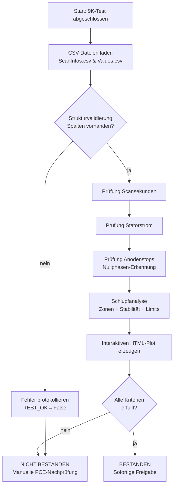
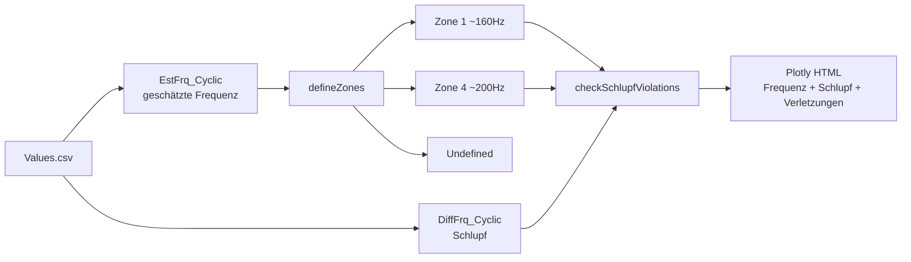

# Automatisierte Bewertung von 9K-Tests in der Röntgenstrahler-Fertigung

> Referenzprojekt · Prozessautomatisierung & medizintechnische Datenauswertung (IEC 62304)
> Idee #004616 – HPS Idea Management Deutschland · Status: **Angenommen**

---

## 1. Kurzfassung (Executive Summary)

In der Fertigung von Röntgenstrahlern durchläuft jeder Strahler einen sogenannten **9K-Test** – einen mehrstündigen Dauerlauf, bei dem das Bauteil unter definierten Bedingungen rund **9.000 Scansekunden** betrieben wird. Bisher wurden die dabei erzeugten Messdaten **manuell** durch die Abteilung PCE geprüft, bevor der Strahler für den nächsten Fertigungsschritt freigegeben werden konnte.

Dieses Projekt ersetzt die manuelle Prüfung durch eine **automatisierte Softwarelösung**, die die Rohdaten eines 9K-Tests einliest, anhand vordefinierter Grenzwerte bewertet und eine sofortige, nachvollziehbare und auditierbare Pass/Fail-Entscheidung trifft – inklusive einer interaktiven Visualisierung des Frequenz- und Schlupfverhaltens.

**Ergebnis:** Wegfall des manuellen Prüfaufwands (ca. 75 Minuten/Tag), Vermeidung von Stillstandszeiten von bis zu **24 Stunden pro Strahler** und eine kalkulierte Einsparung von **ca. 31.250 € pro Jahr** – bei gleichzeitig höherer und konsistenterer Prüfqualität.

| Kennzahl | Vorher (manuell) | Nachher (automatisiert) |
|---|---|---|
| Prüfaufwand pro Test | ~15 Minuten | nahezu 0 Minuten |
| Prüfungen pro Tag | ~5 | ~5 (vollautomatisch) |
| Täglicher Personalaufwand | ~75 Minuten | ~0 Minuten |
| Stillstand pro Strahler | bis zu 24 Stunden | entfällt |
| Schnittstelle „Strahlerpapiere" | manueller Papieraustausch | entfällt |
| Jährliche Einsparung | – | **~31.250 €** |

---

## 2. Ausgangslage & Problemstellung

Der 9K-Test ist ein sicherheitsrelevanter Qualifizierungsschritt. Vor der Automatisierung war der Prozess durch mehrere Schwachstellen geprägt:

- **Zeitaufwändige manuelle Validierung:** Jeder Test musste von einem PCE-Mitarbeiter einzeln gesichtet und gegen die Grenzwerte bewertet werden.
- **Medienbruch durch Papier:** Prüfpapiere wurden physisch zwischen Abteilungen ausgetauscht. Strahler mussten im Nachgang wieder gesucht und den Papieren zugeordnet werden.
- **Blockierende Freigabe:** Der Strahler durfte den nächsten Prüfprozess erst nach der manuellen Freigabe betreten – es entstanden **Stillstandszeiten von bis zu 24 Stunden**.
- **Schwankende Last:** Die Anzahl der täglich anfallenden Bewertungen und der jeweilige Bearbeitungsaufwand variierten stark, was zu Engpässen und Verzögerungen führte.
- **Subjektivität:** Die Bewertung hing von der Erfahrung und Tagesform der prüfenden Person ab – Risiko für inkonsistente Entscheidungen und menschliche Fehler.

**Kernproblem:** Eine wertvolle, qualifizierte Personalressource (PCE) wurde durch eine repetitive, regelbasierte Tätigkeit gebunden, die sich vollständig formalisieren lässt – während der eigentliche Engpass (die Stillstandszeit der Strahler) den Fertigungsdurchsatz limitierte.

---

## 3. Lösungsidee

Die Bewertung eines 9K-Tests folgt **eindeutigen, deterministischen Regeln**: Bestimmte Messgrößen müssen innerhalb fester Grenzwerte liegen, bestimmte Ereignisse (Anodenstops) müssen in definierter Anzahl und Dauer auftreten. Genau solche regelbasierten Entscheidungen sind ideal für eine Software automatisierbar.

Die entwickelte Lösung:

1. **Liest** die beim Test erzeugten CSV-Rohdaten automatisiert ein.
2. **Validiert** Struktur und Inhalt der Daten (Spaltenprüfung, Typkonvertierung).
3. **Bewertet** alle relevanten Prüfkriterien gegen hinterlegte Grenzwerte.
4. **Analysiert** das Frequenz- und Schlupfverhalten des Anodentellers über die gesamte Testdauer.
5. **Entscheidet** automatisch über Bestanden / Nicht bestanden.
6. **Dokumentiert** jede Entscheidung nachvollziehbar (Logging) und erzeugt eine **interaktive HTML-Visualisierung**.

Das Sicherheitsprinzip bleibt erhalten: Erfolgreich geprüfte Strahler werden **sofort** freigegeben, während die **manuelle Nachprüfung durch PCE nur noch im Ausnahmefall** (bei einer nicht bestandenen automatisierten Bewertung) als zusätzliche Absicherung greift. So werden Zeit- und Kostenersparnis maximiert, ohne die Qualitätssicherung zu gefährden.

---

## 4. Fachliche Prüfkriterien

Die Software bildet die vollständige Prüflogik eines 9K-Tests ab. Sie bezieht ihre Daten aus zwei Quelldateien:

- **`ScanInfos.csv`** – aggregierte Kennwerte des Tests (Scansekunden, Statorstrom, Zeitstempel).
- **`Values.csv`** – hochaufgelöste Zeitreihen der zyklischen Messvariablen.

### 4.1 Scansekunden (`TubeScanSeconds`)

| Bedingung | Bewertung |
|---|---|
| Maximalwert < 9.000 Ss | **Nicht bestanden** – Mindestlaufzeit nicht erreicht |
| 9.000 ≤ Maximalwert ≤ 11.000 Ss | **Bestanden** |
| Maximalwert > 11.000 Ss | **Bestanden mit Warnung** – Test gilt als bestanden, sofern alle übrigen Kriterien erfüllt sind; ein erneuter Start ist zu vermeiden, da sonst 20.000 Ss überschritten werden könnten |

### 4.2 Anodenstops (`MON_RAC_MeasFrq_Cyclic`)

Während des Tests muss die Anode definierte Stillstände durchlaufen. Die Software erkennt diese, indem sie zusammenhängende **Nullphasen** (Messfrequenz = 0) in der Zeitreihe identifiziert und deren Dauer berechnet.

- Erwartet werden genau **3 kurze Anodenstops** (Dauer 50–520 s)
- sowie genau **1 langer Anodenstop** (Dauer > 605 s).
- Abweichungen werden detailliert protokolliert (Start-/Endzeit und Dauer jedes erkannten Stops) und führen zu **Nicht bestanden**.

### 4.3 Statorstrom (`StatorCurrentEnd`)

| Bedingung | Bewertung |
|---|---|
| 4.500 mA ≤ Wert ≤ 8.000 mA | **Bestanden** |
| Wert < 4.500 mA oder > 8.000 mA | **Nicht bestanden** – jeder verletzende Wert wird einzeln ausgewiesen |

### 4.4 Schlupfanalyse (Frequenzverhalten der Anode)

Das technische Herzstück und der anspruchsvollste Teil der Auswertung. Der Anodenteller wird über ein Drehfeld angetrieben und läuft in zwei stabilen Betriebspunkten – **~160 Hz** und **~200 Hz**. Die Differenz zwischen Soll- und Ist-Drehfeld (der **Schlupf**) ist ein Indikator für den mechanischen Zustand des Lagers.

Die Analyse läuft mehrstufig:

1. **Zonen-Erkennung:** Jeder Messpunkt der geschätzten Frequenz (`MON_RAC_EstFrq_Cyclic`) wird einer Betriebszone zugeordnet:
   - **Zone 1** (≈ 160 Hz) bzw. **Zone 4** (≈ 200 Hz), wenn der Wert innerhalb einer Toleranz (`eps = 6 Hz`) um den Sollwert liegt **und** über ein Nachbarschaftsfenster hinweg **stabil** ist.
   - Andernfalls **„Undefined"** (Übergangs- bzw. Rampenphasen).
2. **Stabilitätsprüfung (`check_stability`):** Ein Punkt zählt nur dann als gültig zu einer Zone, wenn die umliegenden Messwerte innerhalb einer engen Schwankungsbreite (`stability_eps = 0.5 Hz`) liegen. Dadurch werden Übergangsbereiche sauber von stationären Betriebsphasen getrennt.
3. **Grenzwertprüfung des Schlupfs (`MON_RAC_DiffFrq_Cyclic`):**
   - In Zone 1 (160 Hz) darf der Betrag des Schlupfs **4 Hz** nicht überschreiten.
   - In Zone 4 (200 Hz) liegt das Limit bei **5 Hz**.
   - Jede Überschreitung wird als **Limit-Verletzung** markiert.

### 4.5 Gesamttestdauer

Aus den Zeitstempeln (`Date` + `Time`) wird die reale Gesamtlaufzeit des Tests rekonstruiert und in lesbarer Form (Tage/Stunden/Minuten sowie Dezimalstunden) ausgegeben – nützlich für die Plausibilisierung und Dokumentation.

---

## 5. Softwarearchitektur & Implementierung

### 5.1 Technologie-Stack

| Bereich | Technologie |
|---|---|
| Sprache | Python 3 |
| Datenverarbeitung | `pandas`, `numpy` |
| Visualisierung | `plotly` (interaktive HTML-Plots) |
| Nachvollziehbarkeit | `logging` (Standardbibliothek) |
| Datenformat | CSV (`;`-separiert, Dezimalkomma) |

### 5.2 Verarbeitungs-Pipeline

### 5.3 Modularer Aufbau

Die Lösung ist in klar abgegrenzte, einzeln testbare Funktionen gegliedert – jede Funktion kapselt genau eine Verantwortlichkeit:

| Funktion | Verantwortung |
|---|---|
| `load_csv_file()` | Robustes Einlesen inkl. Fehlerbehandlung (Datei fehlt, leer, Parsing-Fehler) |
| `pruefe_tube_scan_seconds()` | Grenzwertprüfung der Scansekunden |
| `ermittle_zero_phases()` / `ueberpruefe_anodenstops()` | Erkennung und Klassifikation der Anodenstops |
| `pruefe_statorstrom()` | Grenzwertprüfung des Statorstroms inkl. Typkonvertierung |
| `ermittle_testdauer()` | Rekonstruktion der Gesamtlaufzeit |
| `defineZones()` / `check_stability()` | Betriebszonen-Erkennung der Frequenz |
| `checkSchlupfViolations()` | Schlupf-Grenzwertprüfung je Zone |
| `plotFrequencies()` / `frequency_analysis()` | Interaktive Visualisierung |
| `main()` | Orchestrierung der gesamten Pipeline |

### 5.4 Datenfluss der Schlupfanalyse

### 5.5 Visualisierung

Die erzeugte interaktive HTML-Datei stellt auf einer gemeinsamen Zeitachse dar:

- die geschätzte Frequenz, farblich nach Betriebszone (Zone 1 rot, Zone 4 grün, Übergänge schwarz),
- den Schlupfverlauf auf einer zweiten Y-Achse,
- alle **Limit-Verletzungen** als deutlich hervorgehobene Marker.

Damit ist die Pass/Fail-Entscheidung nicht nur ein Wert, sondern für Prüfer und Auditoren **visuell unmittelbar nachvollziehbar**.

---

## 6. Qualität, Robustheit & Normkonformität (IEC 62304)

Da die Software im **medizintechnischen Fertigungsumfeld** eingesetzt wird, wurde sie von Beginn an an den Anforderungen der **IEC 62304** (Lebenszyklus von Medizingeräte-Software, Software-Sicherheitsklasse B) ausgerichtet:

- **Anforderungs-Rückverfolgbarkeit:** Jede Funktion ist im Code explizit mit Software-Requirements (`SWR-001` … `SWR-004`) und Testfällen (`TC-001` … `TC-005`) verknüpft – ein zentraler Nachweis für Audits.
- **Durchgängiges Logging:** Jeder Verarbeitungsschritt, jede Warnung und jeder Fehler wird mit Zeitstempel in eine Logdatei geschrieben. Prüfentscheidungen sind damit vollständig **auditierbar**.
- **Defensive Fehlerbehandlung:** Fehlende Dateien, leere Daten, fehlende Spalten und Parsing-Fehler werden gezielt abgefangen, protokolliert und führen kontrolliert zu einem „Nicht bestanden" – statt zu einem Programmabsturz.
- **Deterministische Bewertung:** Identische Eingabedaten liefern stets identische Ergebnisse. Subjektive Schwankungen menschlicher Prüfung entfallen vollständig.
- **Klare Trennung von Konfiguration und Logik:** Grenzwerte (z. B. Frequenz-Limits, Toleranzen) sind in zentralen `CONFIG`-/`LIMITS`-Strukturen hinterlegt und lassen sich ohne Eingriff in die Verarbeitungslogik anpassen.

---

## 7. Mehrwert & Nutzen

### 7.1 Zeitersparnis

- Wegfall von ca. **75 Minuten manuellem Prüfaufwand pro Tag** (≈ 5 Bewertungen × 15 Minuten) → reduziert auf **nahezu 0 Minuten**.
- Entscheidend: Vermeidung von **Stillstandszeiten von bis zu 24 Stunden pro Strahler**, da die Freigabe nicht mehr auf eine manuelle Prüfung warten muss.

### 7.2 Kosteneffizienz

- Bei einem PCE-Stundensatz von 100 €/h entspricht der manuelle Aufwand ca. **125 € pro Tag**.
- Hochgerechnet auf 250 Arbeitstage: **ca. 31.250 € jährliche Einsparung** – allein beim Prüfaufwand.
- Hinzu kommt die **Reduktion teurer Produktionsstillstände** durch die schnellere Strahlerfreigabe.
- Manuelle Nachprüfungen fallen nur noch im Ausnahmefall an, wodurch der Restaufwand gezielt minimiert wird.
- **Produktivitätspotenzial: ≥ 10.000 € (PUMA-Maßnahme).**

### 7.3 Qualität & Stabilität

- **Eliminierung menschlicher Fehler** in der Prüfentscheidung.
- **Standardisierte, konsistente Bewertung** ohne subjektive Abweichungen.
- **Vollständige Nachvollziehbarkeit** durch lückenloses Logging und Visualisierung – auditierbar nach IEC 62304.

### 7.4 Produktivitätssteigerung

- Keine Wartezeiten mehr bis zur manuellen Freigabe.
- **Wegfall einer Prozessschnittstelle** (kein Papieraustausch, kein Wiederzuordnen von Strahlern).
- Freigesetzte PCE-Kapazitäten stehen für höherwertige Tätigkeiten zur Verfügung.
- **Signifikante Reduktion der Fertigungsstillstände** und damit höherer Gesamtdurchsatz.

---

## 8. Eingesetzte Kompetenzen

Dieses Projekt verbindet **Domänenverständnis** (Strahlerfertigung, Prüfprozesse), **Datenanalyse** (Zeitreihen, Signalsegmentierung, Schlupfberechnung) und **Software-Engineering** unter regulatorischen Randbedingungen:

- Anforderungsanalyse gemeinsam mit der Fachabteilung und Übersetzung impliziter Prüfregeln in formale, testbare Kriterien.
- Entwurf einer robusten, wartbaren Verarbeitungs-Pipeline in Python.
- Entwicklung eines eigenen Algorithmus zur **stabilitätsbasierten Zonen-Erkennung** von Frequenz-Zeitreihen.
- Aufbereitung der Ergebnisse in interaktiven Visualisierungen für nicht-technische Stakeholder.
- Konsequente Ausrichtung an **IEC 62304** inkl. Requirements-Traceability, Logging und auditierbarer Fehlerbehandlung.

---

## 9. Eckdaten

| | |
|---|---|
| **Projekt** | Automatisierte Bewertung von 9K-Tests |
| **Idee-ID** | #004616 (HPS Idea Management Deutschland) |
| **Rolle** | Konzeption & Entwicklung |
| **Status** | Angenommen |
| **Wirkbereich** | SHS TC PV SCM FOR-PCE |
| **Technologien** | Python, pandas, numpy, plotly, logging |
| **Norm** | IEC 62304 (Software-Klasse B) |
| **Quantifizierter Nutzen** | ~31.250 €/Jahr · Wegfall von bis zu 24 h Stillstand pro Strahler |
